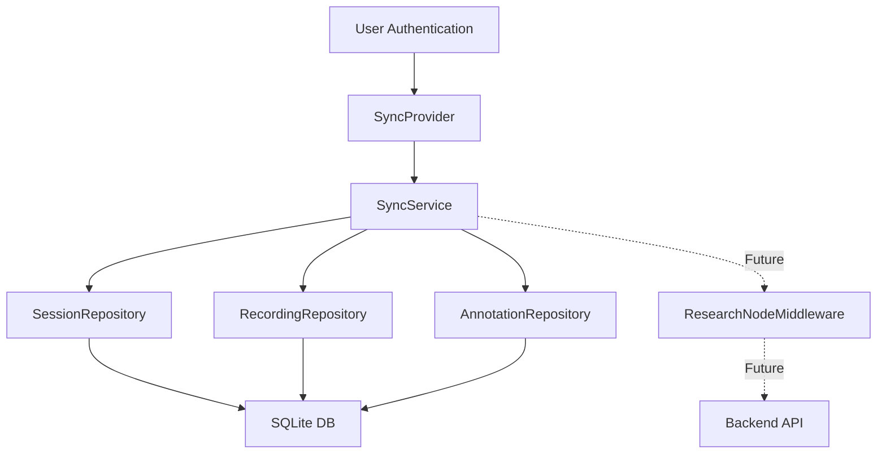

# Sync Service Implementation Summary

## US-025: Data Synchronization

Implementation of background data synchronization for the IRIS Mobile app.

## Overview

The Sync Service manages periodic synchronization of local SQLite data with the Research Node backend. It operates automatically in the background when the user is authenticated, ensuring clinical sessions, recordings, and annotations are synced without user intervention.

## Implementation Details

### Files Created

```
apps/mobile/
├── src/
│   ├── services/
│   │   ├── SyncService.ts                # Core service implementation
│   │   ├── SyncService.types.ts          # TypeScript type definitions
│   │   ├── SyncService.README.md         # Comprehensive documentation
│   │   ├── SyncService.test.ts           # Unit tests
│   │   └── index.ts                      # Updated barrel export
│   ├── context/
│   │   └── SyncContext.tsx               # React Context provider
│   └── hooks/
│       └── useSyncStatus.ts              # Convenience hook
└── App.tsx                                # Updated with SyncProvider
```

### Architecture



### Component Hierarchy

```
App
└── BluetoothContextProvider
    └── AuthProvider
        └── SessionProvider
            └── SyncProvider ◄── NEW
                └── NavigationContainer
                    └── RootNavigator
```

## Features

### Core Functionality

1. **Automatic Sync on Authentication**
   - SyncProvider starts periodic sync when user logs in
   - Stops automatically when user logs out
   - No user intervention required

2. **Periodic Background Sync**
   - Default interval: 60 seconds (configurable)
   - Syncs all pending sessions, recordings, and annotations
   - Runs in background without blocking UI

3. **Concurrent Sync Prevention**
   - Uses `isSyncing` flag to prevent overlapping sync cycles
   - Skips sync if already in progress

4. **Retry Logic** (Future)
   - Max retries: 5 (configurable)
   - Tracks retry count per entity
   - Marks as 'failed' after max retries

5. **Manual Sync Trigger**
   - Exposed via `syncNow()` method
   - Can be called from any component
   - Returns detailed sync report

### Sync Status Tracking

Each entity (session, recording, annotation) has a `syncStatus` field:

| Status | Description |
|--------|-------------|
| `pending` | Created locally, not yet synced |
| `synced` | Successfully synced to backend |
| `failed` | Permanently failed after max retries |

### Sync Report

After each sync cycle, a detailed report is generated:

```typescript
interface SyncReport {
    sessions: {
        synced: number;    // Successfully synced this cycle
        failed: number;    // Failed this cycle
        pending: number;   // Still pending after cycle
    };
    recordings: { ... };
    annotations: { ... };
    timestamp: string;     // ISO 8601
}
```

## Usage Examples

### Basic Usage (Automatic)

No code needed - sync automatically starts when user authenticates:

```typescript
// App.tsx (already configured)
<SyncProvider syncIntervalMs={60000} maxRetries={5}>
  <NavigationContainer>
    <RootNavigator />
  </NavigationContainer>
</SyncProvider>
```

### Manual Sync Trigger

```typescript
import { useSyncContext } from '@/context/SyncContext';

function SettingsScreen() {
  const { syncReport, syncNow, isRunning, isSyncing } = useSyncContext();

  const handleManualSync = async () => {
    try {
      const report = await syncNow();
      Alert.alert('Sync Complete',
        `Sessions: ${report.sessions.synced} synced\n` +
        `Recordings: ${report.recordings.synced} synced\n` +
        `Annotations: ${report.annotations.synced} synced`
      );
    } catch (error) {
      Alert.alert('Sync Failed', error.message);
    }
  };

  return (
    <View>
      <Text>Sync Status: {isRunning ? 'Running' : 'Stopped'}</Text>
      {syncReport && (
        <Text>Last sync: {new Date(syncReport.timestamp).toLocaleString()}</Text>
      )}
      <Button
        title={isSyncing ? 'Syncing...' : 'Sync Now'}
        onPress={handleManualSync}
        disabled={isSyncing}
      />
    </View>
  );
}
```

### Using the Hook

```typescript
import { useSyncStatus } from '@/hooks/useSyncStatus';

function DataScreen() {
  const { syncReport, syncNow, isRunning } = useSyncStatus();

  useEffect(() => {
    if (syncReport) {
      console.log('Last sync:', syncReport.timestamp);
      console.log('Sessions synced:', syncReport.sessions.synced);
    }
  }, [syncReport]);

  // ...
}
```

## Configuration

### SyncProvider Props

```typescript
interface SyncProviderProps {
    children: ReactNode;
    syncIntervalMs?: number;  // Default: 60000 (1 minute)
    maxRetries?: number;       // Default: 5
    enabled?: boolean;         // Default: true
}
```

### Custom Configuration

```typescript
<SyncProvider
  syncIntervalMs={30000}  // Sync every 30 seconds
  maxRetries={3}          // Max 3 retry attempts
  enabled={true}          // Enable/disable sync
>
  {children}
</SyncProvider>
```

## Current Implementation Status

### ✅ Complete

- [x] SyncService core implementation
- [x] SyncProvider context
- [x] Authentication-based lifecycle (start on login, stop on logout)
- [x] Periodic sync scheduler
- [x] Concurrent sync prevention
- [x] Repository integration (getPending, update)
- [x] Sync report generation
- [x] Manual sync trigger
- [x] TypeScript strict mode compliance
- [x] Comprehensive documentation
- [x] Unit tests

### 🚧 TODO: Backend Integration

Currently using **mock implementation** - backend endpoints don't exist yet.

#### Current (Mock)

```typescript
// Simulate network delay
await this.simulateNetworkDelay();

// Mark as synced
await this.sessionRepo.update(session.id, { syncStatus: 'synced' });
```

#### Future (Real)

```typescript
// Call backend via middleware
await middleware.invoke({
    method: 'POST',
    path: '/api/clinicalsession/new',
    payload: session
});

// Mark as synced on success
await this.sessionRepo.update(session.id, { syncStatus: 'synced' });
```

#### Required Backend Endpoints

1. **Session Sync**
   ```
   POST /api/clinicalsession/new
   Body: ClinicalSession + ClinicalData
   ```

2. **Recording Sync**
   ```
   POST /api/recording/upload
   Body: Recording (with file reference)
   ```

3. **Annotation Sync**
   ```
   POST /api/annotation/new
   Body: Annotation
   ```

### 📋 Future Enhancements

1. **Retry Count Tracking**
   - Add `retryCount` field to entities
   - Increment on failure
   - Mark as 'failed' after maxRetries

2. **Error Classification**
   - Transient errors (network): Retry
   - Permanent errors (validation): Mark as failed immediately

3. **Sync Metadata**
   ```typescript
   interface SyncMetadata {
       retryCount: number;
       lastAttempt: string;
       lastError?: string;
   }
   ```

4. **Conflict Resolution**
   - Handle cases where backend has newer data
   - Last-write-wins or merge strategies

5. **Partial Sync**
   - Sync only specific entity types
   - Priority-based sync (sessions > recordings > annotations)

6. **Observability**
   - Sync metrics (success rate, latency)
   - Error tracking
   - Sync history

## Testing

### Manual Testing

1. **Authentication-Based Start**
   ```bash
   # Start app
   npm run mobile:android

   # Log in with valid credentials
   # SyncProvider should start automatically
   # Check logs: [SyncContext] Starting sync service
   ```

2. **Create Pending Data**
   ```bash
   # Create a session (sync_status = 'pending')
   # Wait 60 seconds for periodic sync
   # Or trigger manual sync from settings

   # Check database
   sqlite3 iris.db "SELECT id, sync_status FROM clinical_sessions;"
   # Should show sync_status = 'synced'
   ```

3. **Manual Sync**
   ```bash
   # Go to Settings screen
   # Tap "Sync Now" button
   # Alert should show sync report
   ```

4. **Logout Stop**
   ```bash
   # Log out
   # Check logs: [SyncContext] Stopping sync service
   # No more periodic sync should occur
   ```

### Unit Tests

```bash
npm test src/services/SyncService.test.ts
```

**Test Coverage**:
- ✅ Start/stop sync
- ✅ Prevent concurrent sync
- ✅ Sync pending sessions
- ✅ Handle sync errors
- ✅ Return empty report when no pending items

## Dependencies

### Existing Dependencies
- `SessionRepository` - getPending(), update()
- `RecordingRepository` - getPending(), update()
- `AnnotationRepository` - getPending(), update()
- `AuthContext` - isAuthenticated

### Future Dependencies
- `ResearchNodeMiddleware` - invoke() method for backend calls

## Performance Considerations

1. **Concurrent Sync Prevention**
   - `isSyncing` flag prevents overlapping cycles
   - Skips sync if already in progress

2. **Batch Processing**
   - All pending items synced in single cycle
   - No per-item network overhead

3. **Background Execution**
   - Sync runs on timer without blocking UI
   - Fire-and-forget from user perspective

4. **Incremental Sync**
   - Only pending items processed
   - Already synced items skipped

## Known Limitations

1. **No Retry Count Tracking**
   - Currently all errors treated as transient
   - Items remain 'pending' indefinitely

2. **No Error Classification**
   - Can't distinguish network errors from validation errors
   - Should mark validation errors as 'failed' immediately

3. **No Conflict Resolution**
   - Assumes local data is authoritative
   - Backend conflicts not handled

4. **No Partial Sync**
   - Always syncs all entity types
   - Can't prioritize or skip certain types

5. **No Sync History**
   - Only tracks current sync status
   - No historical sync records

## Integration Points

### With AuthContext

```typescript
// SyncContext.tsx
const { isAuthenticated } = useAuth();

useEffect(() => {
    if (isAuthenticated) {
        syncService.start(syncIntervalMs);
    } else {
        syncService.stop();
    }
}, [isAuthenticated]);
```

### With Repositories

```typescript
// SyncService.ts
const pending = await this.sessionRepo.getPending();

for (const session of pending) {
    // Sync session...
    await this.sessionRepo.update(session.id, { syncStatus: 'synced' });
}
```

### With Middleware (Future)

```typescript
// SyncService.ts
import { middleware } from './middleware';

await middleware.invoke({
    method: 'POST',
    path: '/api/clinicalsession/new',
    payload: session
});
```

## Documentation

- **Main Documentation**: `src/services/SyncService.README.md`
- **Type Definitions**: `src/services/SyncService.types.ts`
- **Unit Tests**: `src/services/SyncService.test.ts`
- **Implementation Summary**: This file

## References

- **US-025**: Data Synchronization user story
- **Domain Models**: `packages/domain/src/models/`
- **Repositories**: `apps/mobile/src/data/repositories/`
- **Middleware**: `packages/middleware/src/service/ResearchNodeMiddleware.ts`
- **AuthContext**: `apps/mobile/src/context/AuthContext.tsx`

## Summary

The Sync Service implementation provides a robust foundation for background data synchronization in the IRIS Mobile app. The current mock implementation allows for immediate testing and development, while the architecture is designed to seamlessly integrate with the backend when endpoints become available.

**Key Benefits**:
- ✅ Automatic sync without user intervention
- ✅ Authentication-aware lifecycle
- ✅ Concurrent sync prevention
- ✅ Detailed sync reporting
- ✅ TypeScript strict compliance
- ✅ Well-documented and tested

**Next Steps**:
1. Implement backend endpoints
2. Replace mock sync with middleware calls
3. Add retry count tracking
4. Implement error classification
5. Add sync history and metrics
