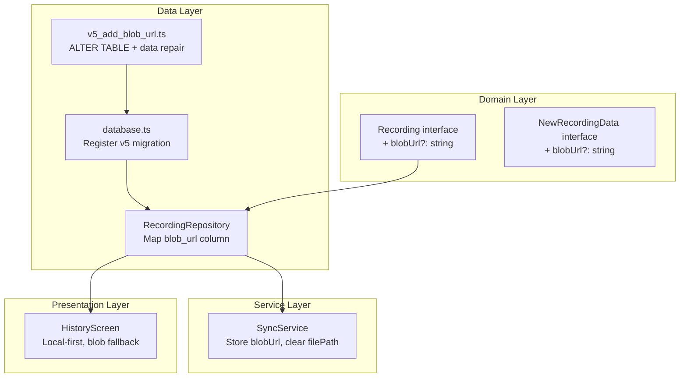
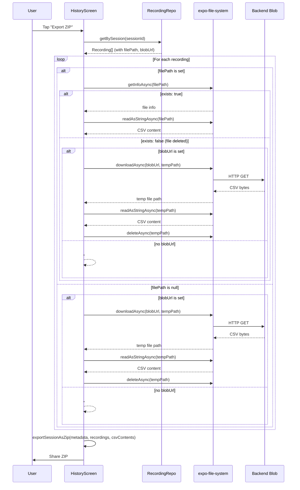
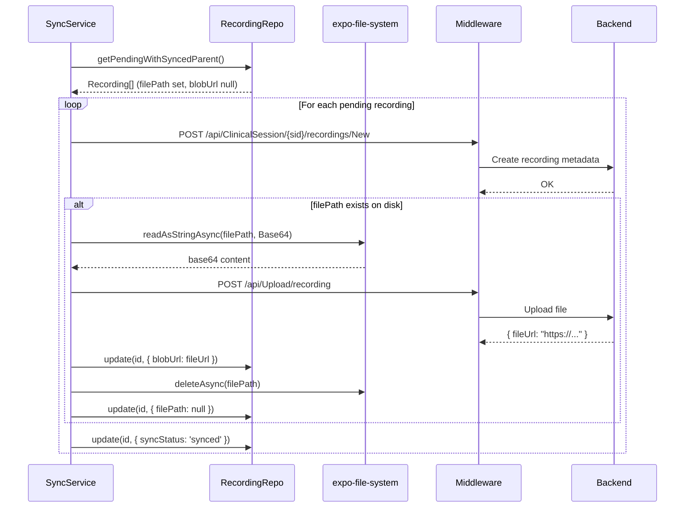

# Architecture Document: Fix Session Data Export for Synced Recordings

**Phase**: 16
**Date**: 2026-02-18
**Author**: TL (Tech Lead)
**Status**: IMPLEMENTED

> Implementation complete. All gates passed (VALIDATION_16.md, REVIEW_16.md, TEST_REPORT_16.md).
> 15/15 unit tests passing. See API_REFERENCE_16.md for the complete technical reference.

---

## 1. Problem Statement

After `SyncService.syncRecordings()` uploads a recording's CSV file to blob storage, it deletes the local file and overwrites `recording.filePath` with the blob URL. When `HistoryScreen.handleExportSession()` later calls `FileSystem.getInfoAsync()` on that URL string, it returns `exists: false`, producing a ZIP with `# File not found on disk` placeholder text instead of actual sEMG data.

The core issue is that `filePath` is overloaded to store both local filesystem paths and remote blob URLs, making it impossible to distinguish between them at export time.

---

## 2. Solution Overview

Introduce a dedicated `blob_url` column in the SQLite `recordings` table (migration v5) so that local file paths and remote blob URLs are stored independently. After sync, `filePath` is cleared to NULL and `blobUrl` holds the remote URL. At export time, the handler tries the local file first, then falls back to fetching from the blob URL.

---

## 3. Architecture

### 3.1 Data Model Change

```
recordings table (after v5 migration)
┌──────────────────┬──────────┬───────────────────────────────────────────┐
│ Column           │ Type     │ Semantics                                 │
├──────────────────┼──────────┼───────────────────────────────────────────┤
│ file_path        │ TEXT     │ Local filesystem path (NULL after sync)   │
│ blob_url  [NEW]  │ TEXT     │ Remote blob storage URL (NULL before sync)│
└──────────────────┴──────────┴───────────────────────────────────────────┘
```

**Invariants**:
- `file_path` always starts with `file:///` or is NULL. Never holds `http(s)://`.
- `blob_url` always starts with `http://` or `https://` or is NULL. Never holds a local path.
- After successful sync: `file_path = NULL`, `blob_url = <remote URL>`.
- Before sync: `file_path = <local path>`, `blob_url = NULL`.

### 3.2 Component Responsibilities



### 3.3 Export Flow (After Fix)



### 3.4 Sync Flow (After Fix)



---

## 4. Detailed Design

### 4.1 SQLite Migration v5 (`apps/mobile/src/data/migrations/v5_add_blob_url.ts`)

```sql
-- Add blob_url column
ALTER TABLE recordings ADD COLUMN blob_url TEXT DEFAULT NULL;

-- Retroactive repair: move blob URLs that were incorrectly stored in file_path
UPDATE recordings
   SET blob_url = file_path, file_path = NULL
 WHERE file_path LIKE 'http://%' OR file_path LIKE 'https://%';
```

The migration is safe because:
- `ALTER TABLE ADD COLUMN` is non-destructive in SQLite.
- The retroactive `UPDATE` only matches rows where `file_path` starts with `http://` or `https://`. Local paths always start with `file:///` or a relative path, so there is zero risk of false positives.
- Both statements are idempotent.

**Registration** in `database.ts`: Add `v5_add_blob_url` to the `MIGRATIONS` array at version 5.

### 4.2 Domain Type Update (`packages/domain/src/models/Recording.ts`)

Add `blobUrl?: string` to both `Recording` and `NewRecordingData` interfaces:

```typescript
export interface Recording {
    // ... existing fields ...
    filePath?: string;
    blobUrl?: string;       // NEW: remote blob storage URL
    recordedAt: string;
}

export interface NewRecordingData {
    // ... existing fields ...
    filePath?: string;
    blobUrl?: string;       // NEW
}
```

This is a non-breaking additive change. The field is optional, so all existing consumers remain valid.

### 4.3 RecordingRepository Updates (`apps/mobile/src/data/repositories/RecordingRepository.ts`)

**RecordingRow interface**: Add `blob_url: string | null`.

**mapRowToRecording()**: Map `blob_url` to `blobUrl`:
```typescript
private mapRowToRecording(row: RecordingRow): Recording {
    return {
        // ... existing fields ...
        filePath: row.file_path ?? undefined,
        blobUrl: row.blob_url ?? undefined,   // NEW
        recordedAt: row.recorded_at
    };
}
```

**update() method**: Add `blobUrl` to the dynamic field builder:
```typescript
if (data.blobUrl !== undefined) {
    fields.push('blob_url = ?');
    values.push(data.blobUrl ?? null);
}
```

**create() method**: Add `blob_url` to the INSERT statement:
```typescript
await db.runAsync(
    `INSERT INTO recordings
     (id, session_id, filename, duration_seconds, sample_count, data_type,
      sample_rate, sync_status, file_path, blob_url, recorded_at)
     VALUES (?, ?, ?, ?, ?, ?, ?, 'pending', ?, ?, ?)`,
    id, data.sessionId, data.filename, data.durationSeconds,
    data.sampleCount, data.dataType, data.sampleRate,
    data.filePath ?? null, data.blobUrl ?? null, recordedAt
);
```

### 4.4 SyncService Fix (`apps/mobile/src/services/SyncService.ts`)

Replace the current post-upload block (lines 259-268):

**Before** (broken):
```typescript
if (uploadResponse.fileUrl) {
    if (recording.filePath) {
        try {
            await FileSystem.deleteAsync(recording.filePath, { idempotent: true });
        } catch { /* ... */ }
    }
    await this.recordingRepo.update(recording.id, { filePath: uploadResponse.fileUrl });
}
```

**After** (fixed):
```typescript
if (uploadResponse.fileUrl) {
    await this.recordingRepo.update(recording.id, {
        blobUrl: uploadResponse.fileUrl,
    });
    if (recording.filePath) {
        try {
            await FileSystem.deleteAsync(recording.filePath, { idempotent: true });
        } catch { /* Non-fatal */ }
    }
    await this.recordingRepo.update(recording.id, {
        filePath: undefined,  // Clear local path (maps to NULL via repo)
    });
}
```

The two `update()` calls can be collapsed into one if the repository supports setting both fields simultaneously. However, keeping them separate makes the ordering explicit: blob URL is persisted **before** the local file is deleted, so a crash between the two operations leaves the recording in a recoverable state (both `filePath` and `blobUrl` are set, and the local file may or may not exist).

**Design decision**: Store `blobUrl` first, then delete local file, then clear `filePath`. This ordering ensures that if the process crashes at any point, at least one of `filePath` or `blobUrl` is available for export.

### 4.5 HistoryScreen Export Fix (`apps/mobile/src/screens/HistoryScreen.tsx`)

Replace the CSV content resolution loop (lines 219-234) in `handleExportSession()`:

```typescript
const csvContents: string[] = [];
for (const rec of recordings) {
    const content = await resolveRecordingContent(rec);
    csvContents.push(content);
}
```

The `resolveRecordingContent` helper (defined within the file or as a local function):

```typescript
async function resolveRecordingContent(rec: Recording): Promise<string> {
    // Case 1: Try local file first
    if (rec.filePath) {
        const fileInfo = await FileSystem.getInfoAsync(rec.filePath);
        if (fileInfo.exists) {
            return FileSystem.readAsStringAsync(rec.filePath, {
                encoding: FileSystem.EncodingType.UTF8,
            });
        }
    }

    // Case 2: Fetch from blob URL
    if (rec.blobUrl) {
        try {
            const tmpPath = FileSystem.cacheDirectory + `tmp_${rec.id}.csv`;
            const download = await FileSystem.downloadAsync(rec.blobUrl, tmpPath);
            if (download.status === 200) {
                const content = await FileSystem.readAsStringAsync(tmpPath, {
                    encoding: FileSystem.EncodingType.UTF8,
                });
                await FileSystem.deleteAsync(tmpPath, { idempotent: true });
                return content;
            }
            await FileSystem.deleteAsync(tmpPath, { idempotent: true });
            return '# Failed to download recording from server\n';
        } catch {
            return '# Recording data is on server (offline)\n';
        }
    }

    // Case 3: Neither available
    return '# No recording data available\n';
}
```

Key design points:
- Uses `FileSystem.downloadAsync()` to download to a temporary file in `cacheDirectory`, avoiding loading large CSVs into memory via `fetch()`.
- Temp file is immediately deleted after reading content.
- Distinguishes between network failure ("offline") and HTTP error ("failed to download").
- No authentication headers are needed for the blob download because the backend's `POST /api/Upload/recording` returns a publicly accessible blob URL (per project brief section 6).

### 4.6 Authentication for Blob Fetch

Per the project brief's dependency note: "Assumes the blob URL returned by `POST /api/Upload/recording` remains accessible via unauthenticated GET." The current backend implementation returns a direct blob storage URL that does not require authentication.

If this assumption changes in the future, the `downloadAsync` call would need custom headers. `expo-file-system`'s `downloadAsync` accepts an `options` parameter with a `headers` field. The middleware's session token could be injected as:

```typescript
const download = await FileSystem.downloadAsync(rec.blobUrl, tmpPath, {
    headers: { 'Authorization': `Bearer ${await getSessionToken()}` },
});
```

This is **not implemented** in the current design since unauthenticated access is confirmed. This note serves as a forward reference for future hardening.

---

## 5. File Change Summary

| File | Change Type | Description |
|------|-------------|-------------|
| `packages/domain/src/models/Recording.ts` | Modify | Add `blobUrl?: string` to `Recording` and `NewRecordingData` |
| `apps/mobile/src/data/migrations/v5_add_blob_url.ts` | **Create** | `ALTER TABLE ADD COLUMN` + retroactive URL repair |
| `apps/mobile/src/data/database.ts` | Modify | Import and register v5 migration |
| `apps/mobile/src/data/repositories/RecordingRepository.ts` | Modify | Add `blob_url` to row type, mapper, create, update |
| `apps/mobile/src/services/SyncService.ts` | Modify | Store `blobUrl` separately, clear `filePath` after delete |
| `apps/mobile/src/screens/HistoryScreen.tsx` | Modify | Add `resolveRecordingContent()` with local-first + blob fallback |

No new dependencies are introduced. `expo-file-system` (already a dependency) provides `downloadAsync`.

---

## 6. Error Handling

| Scenario | Behavior |
|----------|----------|
| Local file exists | Read from disk (current behavior, no change) |
| Local file missing, blob URL set, device online | Download from blob URL, include in ZIP |
| Local file missing, blob URL set, device offline | Include `# Recording data is on server (offline)\n` in ZIP |
| Local file missing, blob URL set, HTTP error (non-200) | Include `# Failed to download recording from server\n` in ZIP |
| Neither filePath nor blobUrl set | Include `# No recording data available\n` in ZIP |
| Download succeeds but temp file read fails | Caught by outer try/catch, falls through to offline message |
| Crash during sync (blobUrl saved, filePath not yet cleared) | Next export finds local file missing, uses blobUrl. Consistent state. |
| Crash during sync (blobUrl not yet saved, file already deleted) | **Not possible**: blobUrl is persisted before file deletion |

---

## 7. Migration Safety

The v5 migration consists of two SQL statements:

1. **`ALTER TABLE recordings ADD COLUMN blob_url TEXT DEFAULT NULL`** -- SQLite allows `ADD COLUMN` without rebuilding the table. All existing rows get `NULL` for the new column. No data loss.

2. **`UPDATE recordings SET blob_url = file_path, file_path = NULL WHERE file_path LIKE 'http://%' OR file_path LIKE 'https://%'`** -- Retroactively repairs recordings that were synced under the old behavior. The `LIKE` pattern is safe because:
   - Local filesystem paths on Android/iOS always start with `file:///` or `/data/...`
   - The app never stores relative paths starting with `http`
   - Only previously-synced recordings (where SyncService overwrote `filePath` with a URL) match this pattern

The migration runs within `DatabaseManager.runMigrations()` on app startup, before any screen renders or service executes. This guarantees the schema is consistent before any export or sync operation.

---

## 8. Testing Strategy

**Unit tests** (manual verification):
1. Fresh install: v1-v5 migrations run sequentially. `recordings` table has `blob_url` column. No data to repair.
2. Upgrade from v4: v5 migration adds column and repairs any recordings with URL in `file_path`.
3. Create a session and recording, verify `file_path` is local path, `blob_url` is NULL.
4. Trigger sync, verify `blob_url` is set to the upload response URL, `file_path` is NULL, local file is deleted.
5. Export the synced session, verify ZIP contains actual CSV data (not placeholder text).
6. Put device in airplane mode, export again, verify ZIP contains `# Recording data is on server (offline)` message.
7. Export an unsynced session (local file still present), verify it works identically to pre-fix behavior.

---

## 9. Risks

| Risk | Likelihood | Impact | Mitigation |
|------|-----------|--------|------------|
| Blob URL expires or becomes inaccessible | Low | Medium | Placeholder text in ZIP + user-visible error. Future: re-upload mechanism |
| Large CSV download causes OOM | Low | High | Using `downloadAsync` to temp file (not in-memory fetch) |
| SQLite migration fails mid-way | Very Low | High | Both statements are idempotent; re-running is safe |
| Concurrent sync + export race condition | Low | Low | Export reads snapshot of recording state; worst case gets placeholder |

---

## 10. Decisions Log

| Decision | Rationale |
|----------|-----------|
| Separate `blob_url` column vs. URL-detection at read time | Explicit schema is safer than runtime heuristics. Prevents the original bug class entirely. |
| Clear `filePath` to NULL after sync (don't keep stale path) | A stale path causes `getInfoAsync` to check a non-existent file on every export. NULL short-circuits to blob fetch. |
| Delete local file after sync (keep current behavior) | Reclaims device storage. Mobile devices have limited space. |
| Store `blobUrl` before deleting local file | Crash-safe ordering: at least one source is always available. |
| Use `FileSystem.downloadAsync` instead of `fetch()` | Avoids loading entire CSV into JS heap as a string. Streams to disk. |
| No authentication on blob download | Backend returns publicly accessible URLs. Documented as forward reference if this changes. |
| Inline `resolveRecordingContent` in HistoryScreen | Single call site, no need for a shared utility. Keeps change minimal. |
