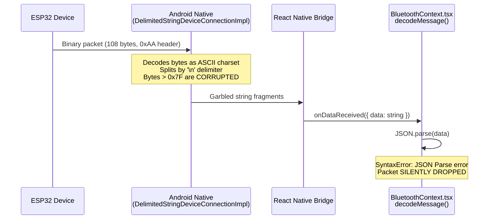
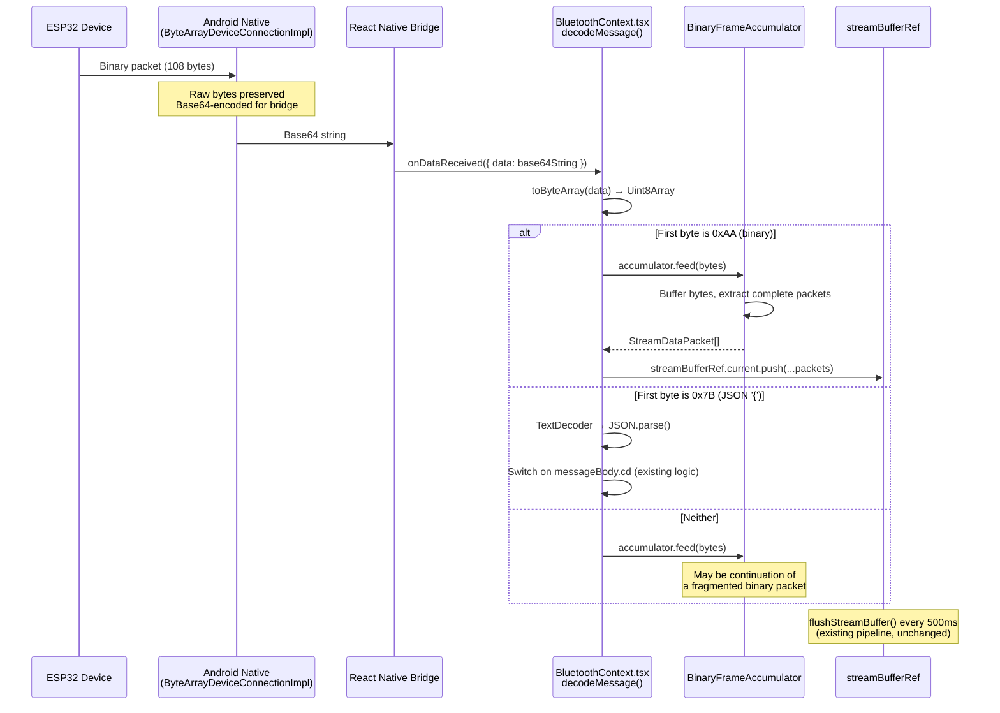

# Architecture: Bluetooth Binary Message Decoding

**Date**: 2026-02-17
**Author**: TL (Tech Lead)
**Status**: DRAFT
**Related**: `docs/PROJECT_BRIEF_BT_BINARY.md`

---

## 1. Current-State Analysis

### Problem Summary

The ESP32 device (firmware v3.1+) sends sEMG streaming data as 108-byte binary packets (magic byte `0xAA`, message code `0x0D`, 50 int16_t samples). The IRIS mobile app's `BluetoothContext.tsx` passes all incoming data through `JSON.parse()`, which throws `SyntaxError` on binary content. Every binary sEMG packet is silently dropped — the real-time visualization pipeline never receives actual device data.

### Current Data Flow



### Root Causes

There are **two** problems, not one:

1. **Connection type mismatch**: The current code connects with `{ secureSocket: false }`, using the library's default `DelimitedStringDeviceConnectionImpl`. This connection type decodes incoming bytes as ASCII strings and splits them by the `\n` (0x0A) delimiter. Since binary packets contain arbitrary byte values including 0x0A, the native layer **fragments and corrupts** binary data before it even reaches JavaScript.

2. **No binary detection in `decodeMessage()`**: Even if the bytes arrived intact, `decodeMessage()` blindly calls `JSON.parse()` on all incoming data, with no check for binary packet markers.

### Evidence from Library Source

The `react-native-bluetooth-classic` library registers two connection types in `RNBluetoothClassicPackage.java`:

- **`"delimited"` (default)**: `DelimitedStringDeviceConnectionImpl` — reads bytes, decodes via `Charset` (default ASCII), splits by delimiter (`\n`). Binary data is destroyed.
- **`"binary"`**: `ByteArrayDeviceConnectionImpl` — reads raw bytes, encodes as **Base64** for transfer across the React Native bridge. Binary data is preserved.

The current `connectBluetooth()` call at `BluetoothContext.tsx:320`:
```typescript
let connectedDevice = await RNBluetoothClassic.connectToDevice(address, {
    secureSocket: false
    // connectionType defaults to "delimited"
});
```

---

## 2. Target-State Architecture

### Design Overview

The solution has three layers:

1. **Connection layer**: Switch to `connectionType: "binary"` so the native side delivers raw bytes as Base64 strings, preserving binary integrity.
2. **Routing layer**: In `decodeMessage()`, decode Base64 to `Uint8Array`, inspect the first byte to route binary packets (`0xAA`) vs JSON messages (`0x7B` = `{`).
3. **Decoding layer**: A `BinaryFrameAccumulator` buffers incoming bytes across callbacks, extracts complete 108-byte packets, and produces `StreamDataPacket` objects that feed into the existing `streamBufferRef` pipeline.

### Target Data Flow



### Key Design Decisions

**D1: Use `connectionType: "binary"` instead of `"delimited"`**. The `"binary"` connection type delivers raw bytes as Base64, avoiding the ASCII charset corruption and newline-based fragmentation. This is the only reliable way to receive arbitrary byte values through `react-native-bluetooth-classic`.

**D2: Base64 decode with `react-native-quick-base64`**. The project already has this dependency (`"react-native-quick-base64": "^2.2.2"`). Its `toByteArray()` function decodes Base64 to `Uint8Array` using native C++ code, which is faster than pure-JS alternatives.

**D3: JSON messages also arrive as Base64 under `"binary"` connection**. Since the connection type change affects ALL incoming data, JSON command responses will also arrive as Base64-encoded bytes. The routing logic must decode Base64 first, then inspect the first byte to determine the protocol.

**D4: Accumulator as a class instance on a ref**. The `BinaryFrameAccumulator` maintains state (an internal byte buffer) across multiple `onDataReceived` callbacks. It must live on a React ref (`useRef`) to survive re-renders and avoid stale closures.

**D5: No changes to the batch-flush pipeline**. Decoded `StreamDataPacket` objects are pushed into the same `streamBufferRef` used by the existing 500ms `flushStreamBuffer()` interval. The visualization pipeline, CSV export, and `allStreamPacketsRef` remain unchanged.

---

## 3. Binary Packet Decoder Specification

### Packet Structure (from ESP32 `StreamingProtocol.h`)

```
Offset  Size    Type      Field          Value/Range
------  ------  --------  -------------- -------------------
0       1       uint8     magic          0xAA (fixed)
1       1       uint8     message_code   0x0D (fixed, decimal 13)
2       4       uint32_t  timestamp      LE, millis() since boot
6       2       uint16_t  sample_count   LE, always 50
8       100     int16_t[] samples[50]    LE, -4096 to +4096 (mV)
------
Total: 108 bytes
```

### Decoder Function Signature

```typescript
// File: apps/mobile/src/utils/binaryDecoder.ts

interface DecodedBinaryPacket {
    packet: StreamDataPacket;
    bytesConsumed: number;
}

/**
 * Attempts to decode a single binary sEMG packet starting at `offset`
 * within the provided buffer.
 *
 * Returns null if:
 * - Not enough bytes available (< BINARY_PACKET_TOTAL_SIZE)
 * - Magic byte mismatch at offset
 * - Message code mismatch
 * - Sample count validation fails
 */
function decodeBinaryPacket(
    buffer: Uint8Array,
    offset: number
): DecodedBinaryPacket | null;
```

### Decoding Steps

1. **Length check**: Verify `buffer.length - offset >= 108`.
2. **Magic byte**: Verify `buffer[offset] === 0xAA`.
3. **Message code**: Verify `buffer[offset + 1] === 0x0D`.
4. **Wrap in DataView**: Create `new DataView(buffer.buffer, buffer.byteOffset + offset, 108)`.
5. **Parse timestamp**: `view.getUint32(2, true)` (little-endian).
6. **Parse sample_count**: `view.getUint16(6, true)`. Validate equals 50.
7. **Parse samples**: Loop `i = 0..49`, `view.getInt16(8 + i * 2, true)`. Store as `number[]`.
8. **Construct StreamDataPacket**: `{ timestamp, values: samples }`.
9. **Return**: `{ packet, bytesConsumed: 108 }`.

Values are used directly as numbers (1 LSB = 1 mV per ESP32 firmware spec).

---

## 4. Buffer Accumulation Strategy

### Why Accumulation Is Needed

Bluetooth SPP does not guarantee message boundaries. A single `onDataReceived` callback may deliver:
- A partial packet (e.g., 54 bytes of a 108-byte packet)
- Exactly one packet
- Multiple concatenated packets (e.g., 216 bytes = 2 packets)
- A mix of the tail of one packet and the head of another

Additionally, under the `"binary"` connection type, the native side may batch multiple reads into a single Base64 delivery, or split a single binary packet across multiple deliveries.

### BinaryFrameAccumulator Class

```typescript
// File: apps/mobile/src/utils/binaryDecoder.ts

class BinaryFrameAccumulator {
    private buffer: Uint8Array;
    private writePos: number;
    private receivedCount: number;
    private droppedCount: number;

    constructor(initialCapacity?: number);

    /**
     * Feed incoming bytes into the accumulator.
     * Extracts and returns all complete StreamDataPacket objects.
     * Remaining partial data is retained for the next feed() call.
     */
    feed(data: Uint8Array): StreamDataPacket[];

    /** Reset internal buffer (call on stream stop or disconnect). */
    reset(): void;

    /** Debug counters. */
    getStats(): { received: number; dropped: number };
}
```

### Accumulation Algorithm

```
feed(data: Uint8Array) → StreamDataPacket[]:
    1. APPEND data to internal buffer (grow if needed)
    2. packets = []
    3. scanPos = 0
    4. WHILE (writePos - scanPos) >= BINARY_PACKET_TOTAL_SIZE:
        a. IF buffer[scanPos] !== 0xAA:
            // Not at a packet boundary — scan forward for next 0xAA
            nextMagic = findNextMagic(scanPos + 1)
            IF nextMagic === -1:
                // No magic byte found — discard everything up to last byte
                scanPos = writePos - 1
                droppedCount++
                BREAK
            ELSE:
                scanPos = nextMagic
                droppedCount++
                CONTINUE
        b. IF buffer[scanPos + 1] !== 0x0D:
            // Magic byte found but wrong message code — skip this byte
            scanPos++
            droppedCount++
            CONTINUE
        c. result = decodeBinaryPacket(buffer, scanPos)
        d. IF result !== null:
            packets.push(result.packet)
            scanPos += result.bytesConsumed
            receivedCount++
        e. ELSE:
            // Validation failed — skip past this 0xAA
            scanPos++
            droppedCount++
    5. COMPACT buffer: move bytes [scanPos..writePos) to position 0
    6. RETURN packets
```

### Buffer Management

- **Initial capacity**: 512 bytes (holds ~4.7 packets, plenty for normal operation).
- **Growth strategy**: Double capacity when `writePos + incoming.length > capacity`. Use `Uint8Array` copy.
- **Compaction**: After each `feed()`, shift remaining bytes to the front. This prevents unbounded growth.
- **Reset**: Called when streaming stops (`isStreaming` transitions to `false`) or on disconnect. Zeroes out `writePos`, resets counters.

---

## 5. Integration with Existing StreamDataPacket Pipeline

### Existing Pipeline (Unchanged)

The current batch-flush mechanism in `BluetoothContext.tsx` works as follows:

1. `streamBufferRef.current` (a `StreamDataPacket[]`) accumulates incoming packets.
2. Every 500ms, `flushStreamBuffer()` moves buffered packets into:
   - `streamData` state (capped at 500 for UI performance)
   - `allStreamPacketsRef.current` (unbounded, for CSV export)
3. Chart components read from `streamData` for real-time visualization.
4. `exportStreamData()` / `getAllStreamPackets()` read from `allStreamPacketsRef`.

### Integration Point

Binary packets decoded by the accumulator produce `StreamDataPacket` objects with the same shape as the existing JSON-decoded packets:

```typescript
// Both paths produce identical StreamDataPacket objects:

// JSON path (existing, for simulation/legacy):
const packet: StreamDataPacket = {
    timestamp: messageBody.bd.t,    // number
    values: messageBody.bd.v        // number[]
};

// Binary path (new):
const packet: StreamDataPacket = {
    timestamp: parsedTimestamp,      // uint32 from binary header
    values: parsedSamples           // int16[] from binary payload
};

// Both go to the same place:
streamBufferRef.current.push(packet);
```

No changes are needed to `flushStreamBuffer()`, `allStreamPacketsRef`, `setStreamData()`, `exportStreamData()`, `getAllStreamPackets()`, or any chart/visualization component.

---

## 6. Error Handling and Resync Strategy

### Error Categories

| Category | Cause | Action |
|----------|-------|--------|
| **Corrupted magic** | Byte at scan position is not `0xAA` | Scan forward for next `0xAA`, increment `droppedCount` |
| **Wrong message code** | `0xAA` found but next byte is not `0x0D` | Skip one byte, continue scanning |
| **Invalid sample count** | `sample_count !== 50` | Discard packet, log warning, skip 108 bytes |
| **Incomplete packet** | Buffer has `< 108` bytes after `0xAA` | Wait for next `feed()` call (data in flight) |
| **JSON parse failure** | Non-binary data fails `JSON.parse()` | Log at `console.warn`, do not crash (existing behavior) |
| **Base64 decode error** | Malformed Base64 string | Log error, skip this callback invocation |

### Resync Strategy

When the accumulator encounters invalid data (bytes that are neither a valid binary packet start nor valid JSON), it scans forward byte-by-byte looking for the next `0xAA` marker. This is a linear scan but operates on small buffers (typically < 512 bytes), so performance is not a concern.

If no `0xAA` is found in the entire buffer, all bytes except the last one are discarded (the last byte might be a partial `0xAA` arrival). The `droppedCount` is incremented for each discarded potential packet.

### Debug Counters

The accumulator tracks:
- `receivedCount`: Successfully decoded packets
- `droppedCount`: Packets discarded due to validation failure or resync

These counters are accessible via `accumulator.getStats()`. During development, a `console.warn` is emitted on every packet drop. In production, these can be sampled periodically or exposed in a debug UI.

---

## 7. Domain Constants for Binary Protocol

### New Constants in `packages/domain/src/models/Stream.ts`

```typescript
// --- Binary Streaming Protocol Constants ---
// Mirror ESP32 StreamingProtocol.h definitions

/** Binary packet start marker byte. */
export const BINARY_PACKET_MAGIC = 0xAA;

/** Binary packet message code (StreamData = 13 = 0x0D). */
export const BINARY_PACKET_CODE = 0x0D;

/** Binary packet header size in bytes (magic + code + timestamp + sample_count). */
export const BINARY_PACKET_HEADER_SIZE = 8;

/** Number of int16_t samples per binary packet. */
export const BINARY_PACKET_SAMPLES_PER_PACKET = 50;

/** Total binary packet size in bytes (header + 50 * 2 bytes). */
export const BINARY_PACKET_TOTAL_SIZE = 108;
```

These constants are exported from `@iris/domain` via the existing barrel export in `packages/domain/src/index.ts` (which already re-exports `./models/Stream`). No changes to `index.ts` needed.

---

## 8. Implementation Order and File-by-File Change Specification

### Implementation Order

The changes should be implemented in dependency order: domain constants first (shared), then the utility module (pure logic, testable in isolation), then the context integration (wiring).

### Phase 1: Domain Constants

**File: `packages/domain/src/models/Stream.ts`**

Add the five binary protocol constants after the existing `SIMULATION_SAMPLE_RATE_HZ` constant. No changes to existing types or exports.

Lines to add (appended after line 17):
```typescript
/** Binary packet start marker byte. */
export const BINARY_PACKET_MAGIC = 0xAA;

/** Binary packet message code (StreamData = 13 = 0x0D). */
export const BINARY_PACKET_CODE = 0x0D;

/** Binary packet header size in bytes. */
export const BINARY_PACKET_HEADER_SIZE = 8;

/** Number of int16_t samples per binary packet. */
export const BINARY_PACKET_SAMPLES_PER_PACKET = 50;

/** Total binary packet size in bytes. */
export const BINARY_PACKET_TOTAL_SIZE = 108;
```

### Phase 2: Binary Decoder Utility

**File: `apps/mobile/src/utils/binaryDecoder.ts`** (NEW)

This is a new file containing:

1. **`decodeBinaryPacket(buffer, offset)`** — Pure function, decodes one packet from a `Uint8Array` at a given offset. Returns `{ packet: StreamDataPacket, bytesConsumed: number } | null`.

2. **`BinaryFrameAccumulator` class** — Stateful accumulator with `feed(data)`, `reset()`, and `getStats()` methods.

Implementation details:

- Import `StreamDataPacket`, `BINARY_PACKET_MAGIC`, `BINARY_PACKET_CODE`, `BINARY_PACKET_HEADER_SIZE`, `BINARY_PACKET_SAMPLES_PER_PACKET`, `BINARY_PACKET_TOTAL_SIZE` from `@iris/domain`.
- Use `DataView` for little-endian binary parsing (available in Hermes engine).
- Internal buffer is a `Uint8Array` with dynamic growth (initial 512 bytes, doubles on overflow).
- `feed()` returns `StreamDataPacket[]` — zero or more complete packets extracted from accumulated bytes.

### Phase 3: BluetoothContext Integration

**File: `apps/mobile/src/context/BluetoothContext.tsx`**

#### Change 1: Add imports

```typescript
import { toByteArray } from 'react-native-quick-base64';
import { BinaryFrameAccumulator } from '@/utils/binaryDecoder';
```

#### Change 2: Add accumulator ref

After the existing `allStreamPacketsRef` declaration (around line 72), add:

```typescript
const binaryAccumulatorRef = React.useRef(new BinaryFrameAccumulator());
```

#### Change 3: Modify `connectBluetooth()` — connection options

Change the `connectToDevice` call to use `connectionType: "binary"`:

```typescript
let connectedDevice = await RNBluetoothClassic.connectToDevice(address, {
    secureSocket: false,
    connectionType: 'binary'
});
```

This is the critical change that switches from delimiter-based string reads to raw byte (Base64) reads.

#### Change 4: Reset accumulator on stream lifecycle

In `startStream()`, after resetting `streamBufferRef`:
```typescript
binaryAccumulatorRef.current.reset();
```

In the `disconnect()` function:
```typescript
binaryAccumulatorRef.current.reset();
```

#### Change 5: Rewrite `decodeMessage()`

The function signature stays `decodeMessage(message: string)` but the body changes:

```typescript
function decodeMessage(message: string) {
    try {
        // Step 1: Decode Base64 to raw bytes
        const bytes = toByteArray(message);

        if (bytes.length === 0) return;

        // Step 2: Route based on first byte
        if (bytes[0] === BINARY_PACKET_MAGIC) {
            // Binary sEMG packet(s)
            const packets = binaryAccumulatorRef.current.feed(bytes);
            for (const packet of packets) {
                streamBufferRef.current.push(packet);
            }
            return;
        }

        if (bytes[0] === 0x7B) { // '{' character
            // JSON command/control message
            const text = new TextDecoder().decode(bytes);
            const messageBody = JSON.parse(text) as BluetoothProtocolPayload;

            // ... existing switch(messageBody.cd) logic unchanged ...
            return;
        }

        // Neither binary header nor JSON — could be a fragment
        // of a binary packet that was split by the native layer.
        // Feed to accumulator for reassembly.
        const packets = binaryAccumulatorRef.current.feed(bytes);
        for (const packet of packets) {
            streamBufferRef.current.push(packet);
        }
    } catch (error) {
        console.warn('Error decoding message:', error);
    }
}
```

The existing `switch(messageBody.cd)` cases remain completely unchanged. The `StreamData` case (code 13) in the JSON switch also stays — it handles the legacy JSON streaming format from firmware v2.x and simulation mode.

#### Change 6: Import binary constant

Add `BINARY_PACKET_MAGIC` to the existing import from `@iris/domain`:

```typescript
import {
    // ... existing imports ...
    BINARY_PACKET_MAGIC
} from '@iris/domain';
```

---

## 9. Affected Files

| File | Type | Changes |
|------|------|---------|
| `packages/domain/src/models/Stream.ts` | MODIFY | Add 5 binary protocol constants |
| `apps/mobile/src/utils/binaryDecoder.ts` | NEW | `decodeBinaryPacket()` function + `BinaryFrameAccumulator` class |
| `apps/mobile/src/context/BluetoothContext.tsx` | MODIFY | Connection type change, accumulator ref, Base64 decode + binary routing in `decodeMessage()` |

### Files NOT Changed

| File | Reason |
|------|--------|
| `packages/domain/src/index.ts` | Already re-exports `./models/Stream` — new constants are automatically available |
| `packages/domain/src/models/Bluetooth.ts` | No changes to JSON protocol types or function codes |
| Any screen component | `streamData` state shape unchanged — charts, CSV export, history all work as-is |
| `apps/mobile/src/utils/csvExport.ts` | Consumes `StreamDataPacket[]` — same shape from both decoders |
| `apps/mobile/src/context/SessionContext.tsx` | No dependency on raw BT data |

---

## Appendix A: `TextDecoder` Availability

Hermes (the default React Native JS engine since RN 0.70) includes `TextDecoder` support. The IRIS mobile app uses React Native 0.76.9, so `TextDecoder` is available without polyfills.

## Appendix B: Base64 Overhead

The `"binary"` connection type encodes data as Base64, which adds ~33% overhead to the bridge transfer. For 108-byte packets at 4.3 packets/s, this means ~144 bytes per callback, totaling ~620 bytes/s across the bridge — negligible.

## Appendix C: `DataView` on Hermes

Hermes supports `DataView`, `Uint8Array`, `Int16Array`, and all typed array operations needed for binary parsing. The `getInt16()`, `getUint32()`, `getUint16()` methods with the `littleEndian` parameter are all available.
