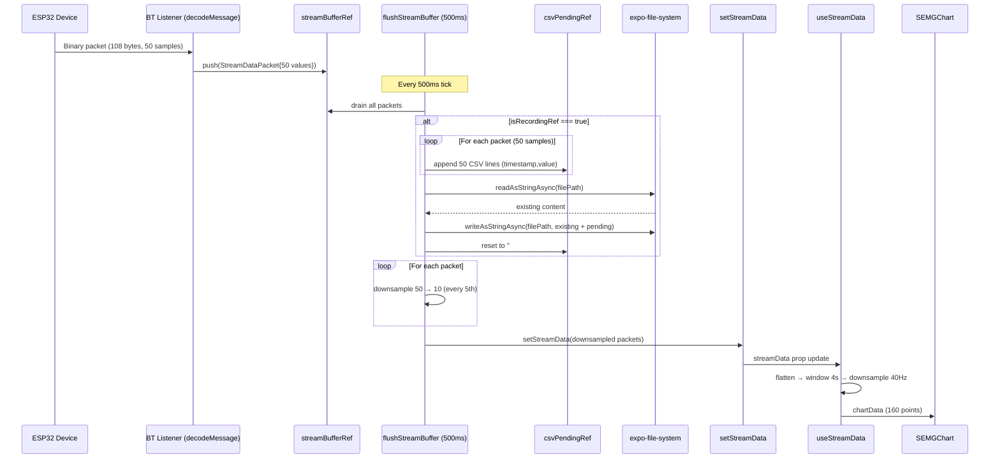
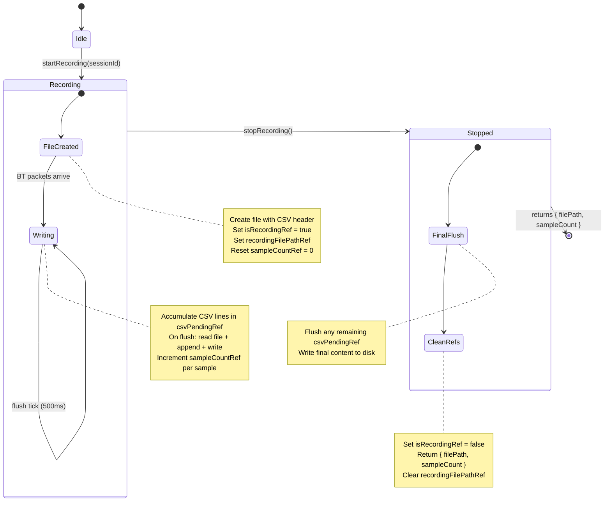

# Architecture: Incremental 215 Hz CSV Writing with Chart Downsample

**Date**: 2026-02-17
**Author**: TL (Tech Lead)
**Status**: APPROVED
**Implements**: PROJECT_BRIEF_CSV_HZ_FIX.md

---

## 1. Design Decisions

### D1. expo-file-system Append Strategy

**Finding**: `expo-file-system` v18 `writeAsStringAsync` does **not** support append. The native Android implementation calls `FileOutputStream(file)` without the `append=true` parameter, so every call overwrites the file. The `WritingOptions` type only exposes `encoding` -- no `append` flag exists.

**Alternatives evaluated**:

| Option | Mechanism | Throughput | Complexity |
|--------|-----------|-----------|------------|
| A. `writeAsStringAsync` overwrite-all each call | Read-back + concat + write | O(n) per packet, degrades over time | Low |
| B. `expo-file-system/next` `File.open()` FileHandle | `RandomAccessFile("rw")` + seek to end + `writeBytes` | O(1) per append | Medium (new API) |
| C. JS-side string accumulator, flush on batch interval | Accumulate CSV text, `writeAsStringAsync` whole file per flush | O(n) per flush, but only 2x/sec | Low |
| D. JS-side string accumulator, flush via `writeAsStringAsync` per chunk-file + merge on stop | Write chunk files, cat on stop | O(1) per flush, O(n) merge | High |

**Decision**: **Option C -- JS-side accumulator with read-concat-write per flush**.

**Rationale**: The existing `flushStreamBuffer()` runs every 500 ms, providing a natural batch point. A `csvPendingRef` string accumulates CSV lines as packets arrive (~4.3 packets x 50 lines = ~215 lines per flush). On each flush tick, the pending text is appended to the file using `readAsStringAsync` + string concatenation + `writeAsStringAsync`.

Option B (`expo-file-system/next` FileHandle) provides true O(1) append but uses an experimental API surface. Option D (chunk files + merge) offers O(1) writes but adds merge complexity. Option C has O(n) per-flush I/O (read + write the full file), making total session I/O quadratic. However, within practical recording durations this is acceptable:

| Duration | File Size | Per-Flush I/O | Flush Latency |
|----------|----------|--------------|---------------|
| 10 sec | ~58 KB | ~58 KB | <5 ms |
| 60 sec | ~350 KB | ~350 KB | <10 ms |
| 5 min | ~1.7 MB | ~1.7 MB | <20 ms |
| 10 min | ~3.5 MB | ~3.5 MB | <50 ms |

All latencies are well within the 500 ms flush budget. Flash storage on modern Android devices handles 50-100 MB/s sequential I/O.

**Crash safety**: The CSV file on disk contains all data up to the last completed flush. At most 500 ms (~1,075 samples) of pending data can be lost on crash.

**Future upgrade path**: If recordings exceeding 10 minutes are needed, the design can be upgraded to chunk files (option D) or `expo-file-system/next` FileHandle (option B) without changing the external API surface.

### D2. Where to Hook CSV Append

**Decision**: Append in `flushStreamBuffer()`, not in `decodeMessage()`.

**Rationale**: `decodeMessage()` runs synchronously inside the BT listener closure. Inserting async file I/O (`writeAsStringAsync` is async) into this path would require fire-and-forget promises, creating uncontrolled concurrency and making error handling difficult. By contrast, `flushStreamBuffer()` already runs on a 500 ms interval via `setInterval` + `requestAnimationFrame`, is naturally async-friendly, and batches the work.

The flow:
1. `decodeMessage()` decodes binary packet, pushes **full 50-sample packet** into `streamBufferRef` (unchanged).
2. `flushStreamBuffer()` drains `streamBufferRef`, and for each packet:
   - If recording is active: serialize 50 CSV lines and append to `csvPendingRef`.
   - Downsample 50 to 10 samples for chart pipeline.
3. After processing all packets in the flush batch: if recording is active and `csvPendingRef` has content, execute the file append (read + concat + write).
4. Push downsampled packets to `setStreamData()` for chart consumption.

### D3. Recording Lifecycle API

**Decision**: Three new refs + two new async methods + one state boolean, all in `BluetoothContext`.

```typescript
// Refs (accessible from stale closures)
const isRecordingRef = React.useRef(false);
const recordingFilePathRef = React.useRef<string | null>(null);
const sampleCountRef = React.useRef(0);
const csvPendingRef = React.useRef('');

// State (triggers re-render for UI)
const [isRecording, setIsRecording] = useState(false);

// Methods
async function startRecording(sessionId: string): Promise<string>;
async function stopRecording(): Promise<{ filePath: string; sampleCount: number }>;
```

These are exposed via the context provider. `CaptureScreen` calls `startRecording` on mount and `stopRecording` on stop.

### D4. Downsample Strategy

**Decision**: Simple decimation -- take every 5th sample (indices 0, 5, 10, 15, 20, 25, 30, 35, 40, 45).

**Rationale**: The chart is for visual feedback only. Scientific analysis uses the full 215 Hz CSV. Decimation is zero-cost (array indexing), introduces no latency, and produces exactly 10 samples per packet. At 4.3 packets/second, this yields ~43 samples/second, exceeding the chart's 40 Hz display rate. Averaging would add computation for no visual benefit since `useStreamData` already performs its own windowing and downsampling.

**Location**: Inside `flushStreamBuffer()`, after draining `streamBufferRef` and before pushing to `setStreamData()`.

### D5. CaptureScreen Integration

**Decision**: `CaptureScreen` calls `startRecording(sessionId)` in its mount `useEffect` (alongside `startStream`), and `stopRecording()` in `handleStopRecording` (replacing the bulk `getAllStreamPackets` + `createCSVContent` + `writeAsStringAsync` block).

The `createCSVContent` function at the bottom of `CaptureScreen.tsx` is removed. The `getAllStreamPackets()` call is removed from `handleStopRecording`. The `allStreamPacketsRef` dependency is severed.

### D6. Cleanup -- Removal of allStreamPacketsRef

**Decision**: Remove `allStreamPacketsRef`, `getAllStreamPackets()`, and the `allStreamPacketsRef.current.push(...)` line from `flushStreamBuffer()`.

**Rationale**: `allStreamPacketsRef` was created explicitly for CSV export (the comment on line 76 says so). With incremental CSV writing, the CSV file on disk replaces this in-memory buffer entirely. No other consumer reads `allStreamPacketsRef` -- only `CaptureScreen.handleStopRecording` uses `getAllStreamPackets()`, and `clearStreamData()` clears it.

`exportStreamData()` in BluetoothContext currently exports `streamData` (the capped 500-packet state), not `allStreamPacketsRef`. It is used by `StreamingScreen`. This function is unrelated to the recording flow and remains unchanged.

### D7. Impact on StreamingScreen

**Decision**: No breaking changes to StreamingScreen.

**Analysis**: `StreamingScreen` uses:
- `streamData` (React state, capped 500 packets) -- still populated via `setStreamData()` in `flushStreamBuffer()`, but now with downsampled packets (10 samples each instead of 50). Since `useStreamData` flattens all packet values and re-downsamples to 40 Hz anyway, smaller packets just mean less work in the flatten step. Chart output is identical.
- `exportStreamData()` -- calls `exportStreamDataSimpleCSV(streamData)` which exports the capped UI state. This is a debug/dev tool, not the recording path. Unaffected.
- `clearStreamData()` -- clears `streamData` state and `allStreamPacketsRef`. After removing `allStreamPacketsRef`, it just clears `streamData` state and `lastStreamTimestamp`.
- `startStream`, `stopStream`, `configureStream` -- unchanged.

The only behavioral difference: `StreamingScreen`'s chart now receives 10-sample packets instead of 50-sample packets. Since `useStreamData` processes them identically (flatten + window + downsample), the visual output is unchanged. The `processed.totalSamples` count will be lower (reflects downsampled count, not raw count), but this is a debug display and the lower number is actually more accurate for what the chart is showing.

---

## 2. Data Flow Diagram



## 3. Recording Lifecycle



## 4. Component Changes

### 4.1 BluetoothContext.tsx

**New refs** (after line 80):

```typescript
// Recording state — refs readable from stale BT listener closure
const isRecordingRef = React.useRef(false);
const recordingFilePathRef = React.useRef<string | null>(null);
const sampleCountRef = React.useRef(0);
const csvPendingRef = React.useRef('');

// Recording state — triggers UI re-render
const [isRecording, setIsRecording] = useState(false);
```

**New import** (top of file):

```typescript
import * as FileSystem from 'expo-file-system';
import { DEVICE_SAMPLE_RATE_HZ, BINARY_PACKET_SAMPLES_PER_PACKET } from '@iris/domain';
```

(`DEVICE_SAMPLE_RATE_HZ` is already imported; add `BINARY_PACKET_SAMPLES_PER_PACKET` if not present.)

**New helper -- CSV line serialization** (module-level pure function):

```typescript
function serializePacketToCSV(packet: StreamDataPacket, sampleRate: number): string {
    const intervalMs = 1000 / sampleRate;
    let csv = '';
    for (let i = 0; i < packet.values.length; i++) {
        const ts = packet.timestamp + i * intervalMs;
        csv += `${ts.toFixed(2)},${packet.values[i]}\n`;
    }
    return csv;
}
```

**New helper -- downsample** (module-level pure function):

```typescript
const DOWNSAMPLE_FACTOR = 5; // 50 samples → 10 samples

function downsamplePacket(packet: StreamDataPacket): StreamDataPacket {
    const downsampled: number[] = [];
    for (let i = 0; i < packet.values.length; i += DOWNSAMPLE_FACTOR) {
        downsampled.push(packet.values[i]);
    }
    return { timestamp: packet.timestamp, values: downsampled };
}
```

**Modified `flushStreamBuffer()`**:

```typescript
const flushStreamBuffer = React.useCallback(async () => {
    if (streamBufferRef.current.length === 0) return;

    const packets = [...streamBufferRef.current];
    streamBufferRef.current = [];

    // CSV accumulation (if recording)
    if (isRecordingRef.current) {
        for (const packet of packets) {
            csvPendingRef.current += serializePacketToCSV(packet, DEVICE_SAMPLE_RATE_HZ);
            sampleCountRef.current += packet.values.length;
        }

        // Flush pending CSV to disk
        const filePath = recordingFilePathRef.current;
        const pending = csvPendingRef.current;
        if (filePath && pending.length > 0) {
            try {
                const existing = await FileSystem.readAsStringAsync(filePath);
                await FileSystem.writeAsStringAsync(
                    filePath,
                    existing + pending,
                    { encoding: FileSystem.EncodingType.UTF8 }
                );
                csvPendingRef.current = '';
            } catch (error) {
                console.warn('[CSV] Flush error:', error);
                // Pending data retained for next flush attempt
            }
        }
    }

    // Downsample for chart pipeline
    const downsampledPackets = packets.map(downsamplePacket);

    setStreamData(prev => {
        const updated = [...prev, ...downsampledPackets];
        if (updated.length > 500) {
            return updated.slice(-500);
        }
        return updated;
    });

    const lastPacket = downsampledPackets[downsampledPackets.length - 1];
    if (lastPacket) {
        setLastStreamTimestamp(lastPacket.timestamp);
    }
}, []);
```

**New `startRecording` method**:

```typescript
async function startRecording(sessionId: string): Promise<string> {
    // Guard: close any stale recording
    if (isRecordingRef.current && recordingFilePathRef.current) {
        console.warn('[CSV] Closing stale recording before starting new one');
        await stopRecording();
    }

    const timestamp = new Date().toISOString().replace(/[:.]/g, '-');
    const filename = `recording_${timestamp}.csv`;
    const filePath = `${FileSystem.documentDirectory}${filename}`;

    // Write CSV header
    await FileSystem.writeAsStringAsync(filePath, 'timestamp,value\n', {
        encoding: FileSystem.EncodingType.UTF8,
    });

    // Set recording refs
    recordingFilePathRef.current = filePath;
    sampleCountRef.current = 0;
    csvPendingRef.current = '';
    isRecordingRef.current = true;
    setIsRecording(true);

    console.log('[CSV] Recording started:', filePath);
    return filePath;
}
```

**New `stopRecording` method**:

```typescript
async function stopRecording(): Promise<{ filePath: string; sampleCount: number }> {
    isRecordingRef.current = false;
    setIsRecording(false);

    const filePath = recordingFilePathRef.current;
    const sampleCount = sampleCountRef.current;

    if (!filePath) {
        throw new Error('No active recording to stop');
    }

    // Final flush of any pending CSV lines
    const pending = csvPendingRef.current;
    if (pending.length > 0) {
        try {
            const existing = await FileSystem.readAsStringAsync(filePath);
            await FileSystem.writeAsStringAsync(
                filePath,
                existing + pending,
                { encoding: FileSystem.EncodingType.UTF8 }
            );
        } catch (error) {
            console.error('[CSV] Final flush error:', error);
        }
        csvPendingRef.current = '';
    }

    // Clear refs
    recordingFilePathRef.current = null;
    sampleCountRef.current = 0;

    console.log(`[CSV] Recording stopped: ${filePath}, ${sampleCount} samples`);
    return { filePath, sampleCount };
}
```

**Remove**: `allStreamPacketsRef`, `getAllStreamPackets()`, the `allStreamPacketsRef.current.push(...)` line in old `flushStreamBuffer`, and the `allStreamPacketsRef.current = []` lines in `startStream()` and `clearStreamData()`.

**Update `clearStreamData()`**:

```typescript
function clearStreamData(): void {
    setStreamData([]);
    setLastStreamTimestamp(0);
}
```

**Update context provider value** -- add `startRecording`, `stopRecording`, `isRecording`; remove `getAllStreamPackets`:

```typescript
<BluetoothContext.Provider value={{
    // ... existing ...
    isRecording,
    startRecording,
    stopRecording,
    // Remove: getAllStreamPackets
    // Keep: clearStreamData, exportStreamData (used by StreamingScreen)
}}>
```

**Update `BluetoothContextData` interface** -- add new members, remove `getAllStreamPackets`:

```typescript
interface BluetoothContextData {
    // ... existing ...
    isRecording: boolean;
    startRecording: (sessionId: string) => Promise<string>;
    stopRecording: () => Promise<{ filePath: string; sampleCount: number }>;
    // Remove: getAllStreamPackets: () => StreamDataPacket[];
}
```

### 4.2 CaptureScreen.tsx

**Updated imports** -- remove `FileSystem` (no longer writes CSV directly):

```typescript
// Remove: import * as FileSystem from 'expo-file-system';
// Update context destructuring:
const {
    selectedDevice,
    streamData,
    streamConfig,
    startStream,
    stopStream,
    isStreaming,
    startRecording,
    stopRecording: stopBtRecording,
} = useBluetoothContext();
```

(`stopRecording` aliased to `stopBtRecording` to avoid name collision with local function.)

**Updated mount effect** -- start recording alongside streaming:

```typescript
useEffect(() => {
    const initializeStreaming = async () => {
        if (selectedDevice && !isStreaming) {
            console.log('[CaptureScreen] Starting stream and recording...');
            await startRecording(sessionId);
            await startStream();
        } else if (!selectedDevice) {
            console.log('[CaptureScreen] No device, simulation mode');
            startSimulation();
        }
    };

    initializeStreaming();

    return () => {
        if (simulationIntervalRef.current) {
            clearInterval(simulationIntervalRef.current);
            simulationIntervalRef.current = null;
        }
    };
}, []);
```

**Updated `handleStopRecording`**:

```typescript
const handleStopRecording = useCallback(async () => {
    console.log('[CaptureScreen] Stopping recording...');

    if (selectedDevice) {
        await stopStream();
        await new Promise(resolve => setTimeout(resolve, 200));
    } else if (simulationIntervalRef.current) {
        clearInterval(simulationIntervalRef.current);
        simulationIntervalRef.current = null;
    }

    setSavingModalVisible(true);
    setSavingStatus('saving');
    setSavingError(undefined);

    try {
        let filePath: string;
        let totalSamples: number;
        const sampleRate = selectedDevice ? DEVICE_SAMPLE_RATE_HZ : SIMULATION_SAMPLE_RATE_HZ;

        if (selectedDevice) {
            // Incremental CSV already on disk
            const result = await stopBtRecording();
            filePath = result.filePath;
            totalSamples = result.sampleCount;
        } else {
            // Simulation mode: bulk export (unchanged)
            const csvContent = createSimulationCSVContent(simulationData, sampleRate);
            const timestamp = new Date().toISOString().replace(/[:.]/g, '-');
            const filename = `recording_${timestamp}.csv`;
            filePath = `${FileSystem.documentDirectory}${filename}`;
            await FileSystem.writeAsStringAsync(filePath, csvContent, {
                encoding: FileSystem.EncodingType.UTF8,
            });
            totalSamples = simulationData.reduce((sum, p) => sum + p.values.length, 0);
        }

        const filename = filePath.split('/').pop() || 'recording.csv';

        const recordingData: NewRecordingData = {
            sessionId,
            filename,
            durationSeconds: elapsedSeconds,
            sampleCount: totalSamples,
            dataType: selectedDevice ? streamConfig.type : 'filtered',
            sampleRate,
            filePath,
        };

        await addRecording(recordingData);
        setSavingStatus('success');

        setTimeout(() => {
            setSavingModalVisible(false);
            navigation.goBack();
        }, 1000);
    } catch (error) {
        console.error('[CaptureScreen] Save failed:', error);
        setSavingStatus('error');
        setSavingError(error instanceof Error ? error.message : 'Unknown error');
    }
}, [
    selectedDevice,
    stopStream,
    stopBtRecording,
    simulationData,
    sessionId,
    elapsedSeconds,
    streamConfig.type,
    addRecording,
    navigation,
]);
```

**Rename `createCSVContent` to `createSimulationCSVContent`** (keep for simulation mode only, exact same logic):

```typescript
function createSimulationCSVContent(packets: StreamDataPacket[], sampleRate: number): string {
    const intervalMs = 1000 / sampleRate;
    const lines: string[] = ['timestamp,value'];
    for (const packet of packets) {
        for (let i = 0; i < packet.values.length; i++) {
            const sampleTimestamp = packet.timestamp + i * intervalMs;
            lines.push(`${sampleTimestamp.toFixed(2)},${packet.values[i]}`);
        }
    }
    return lines.join('\n') + '\n';
}
```

Note: Keep `import * as FileSystem from 'expo-file-system'` in CaptureScreen since simulation mode still uses it directly.

### 4.3 useStreamData.ts

**No changes required.** The hook receives `StreamDataPacket[]` and flattens all `values` arrays. With 10-sample packets instead of 50-sample packets, the flatten loop runs with smaller arrays but produces the same windowed output. The `sampleRate` parameter controls timestamp interpolation and windowing, and is passed as `DEVICE_SAMPLE_RATE_HZ` by both CaptureScreen and StreamingScreen.

**Important note**: After downsampling, the effective sample rate of the data entering `useStreamData` is ~43 Hz (10 samples x 4.3 packets/s), but the `sampleRate` parameter is still passed as 215 Hz. This is correct because `useStreamData` uses `sampleRate` to compute `intervalMs = 1000 / sampleRate` for timestamp interpolation within each packet. With 10 samples per packet, the interpolated timestamps will be spaced at `1000/215 = 4.65 ms` apart, covering only the first 10 samples' time range (~46.5 ms of the ~232 ms packet interval). This means the chart will show small clusters of 10 points per packet with gaps between clusters -- which is acceptable for visual feedback and mirrors how the chart already behaves when packets are buffered.

If smooth interpolation is preferred, the caller could pass `sampleRate / DOWNSAMPLE_FACTOR` (i.e., 43 Hz) and adjust the windowing. However, this is unnecessary for the current use case and is deferred as a non-blocking enhancement.

### 4.4 CaptureScreen.test.ts

Update the `createCSVContent` tests to reference the renamed `createSimulationCSVContent`. Since the function is module-private (not exported), the test file already duplicates the function locally. The tests remain valid -- rename the local copy to match.

---

## 5. File I/O Performance Analysis

| Recording Duration | CSV File Size | Read+Write per Flush | Flush Count | Total I/O |
|-------------------|--------------|---------------------|-------------|-----------|
| 10 seconds | ~58 KB | ~58 KB | 20 | ~1.1 MB |
| 60 seconds | ~350 KB | ~350 KB | 120 | ~42 MB |
| 5 minutes | ~1.7 MB | ~1.7 MB | 600 | ~1.02 GB |
| 10 minutes | ~3.5 MB | ~3.5 MB | 1,200 | ~4.2 GB |

The per-flush I/O grows linearly with file size, making total session I/O quadratic. For typical use cases (1-5 minute recordings), this is well within device capabilities. Flash storage on modern Android devices handles 50-100 MB/s sequential writes. Even at the 10-minute mark, each 3.5 MB write takes <50 ms.

If longer recordings become needed in the future, the design can be upgraded to the chunk-file approach (D1 option D) or to the `expo-file-system/next` `FileHandle` API without changing the external API surface.

---

## 6. API Surface Summary

### New BluetoothContext API

```typescript
// State
isRecording: boolean                    // UI-reactive recording indicator

// Methods
startRecording(sessionId: string): Promise<string>
    // Creates CSV file with header, sets recording refs
    // Returns file path

stopRecording(): Promise<{ filePath: string; sampleCount: number }>
    // Final-flushes pending CSV, clears refs
    // Returns path and total 215 Hz sample count
```

### Removed BluetoothContext API

```typescript
getAllStreamPackets(): StreamDataPacket[]  // REMOVED — replaced by on-disk CSV
```

### Unchanged API

```typescript
exportStreamData(): Promise<void>  // StreamingScreen still uses this
clearStreamData(): void            // Still clears streamData state
streamData: StreamDataPacket[]     // Still populated, now with 10-sample packets
```

---

## 7. Migration Checklist

1. Add `isRecordingRef`, `recordingFilePathRef`, `sampleCountRef`, `csvPendingRef` refs to BluetoothContext.
2. Add `isRecording` state to BluetoothContext.
3. Add `serializePacketToCSV()` and `downsamplePacket()` helper functions.
4. Modify `flushStreamBuffer()` to accumulate CSV + downsample + flush to disk.
5. Add `startRecording()` and `stopRecording()` methods.
6. Remove `allStreamPacketsRef` and `getAllStreamPackets()`.
7. Update `clearStreamData()` to remove `allStreamPacketsRef` reference.
8. Update `startStream()` to remove `allStreamPacketsRef` reset.
9. Update BluetoothContext provider value and `BluetoothContextData` interface.
10. Update CaptureScreen to call `startRecording`/`stopRecording`.
11. Remove `createCSVContent` from CaptureScreen (rename to `createSimulationCSVContent` for sim mode).
12. Update `CaptureScreen.test.ts` function name.
13. Verify StreamingScreen still works (no API changes needed).

---

## 8. Risks and Mitigations

| Risk | Mitigation |
|------|-----------|
| `readAsStringAsync` + `writeAsStringAsync` latency for large files (>3 MB) | Monitor flush duration; if >100 ms, switch to chunk-file strategy |
| `flushStreamBuffer` becomes async (was sync) | Already called from `requestAnimationFrame` callback; async is safe. Verify no callers depend on synchronous completion |
| `csvPendingRef` data loss on app crash between flushes | At most 500 ms of data (~1,075 samples) lost. Acceptable for research use; the CSV file on disk contains all data up to the last flush |
| `stopRecording` called before any flush completes | Final flush in `stopRecording` writes all pending data. File always has at minimum the CSV header |
| StreamingScreen `totalSamples` count changes (10-sample packets) | Cosmetic only; StreamingScreen is a debug screen. Count reflects chart-pipeline samples, not raw samples |
