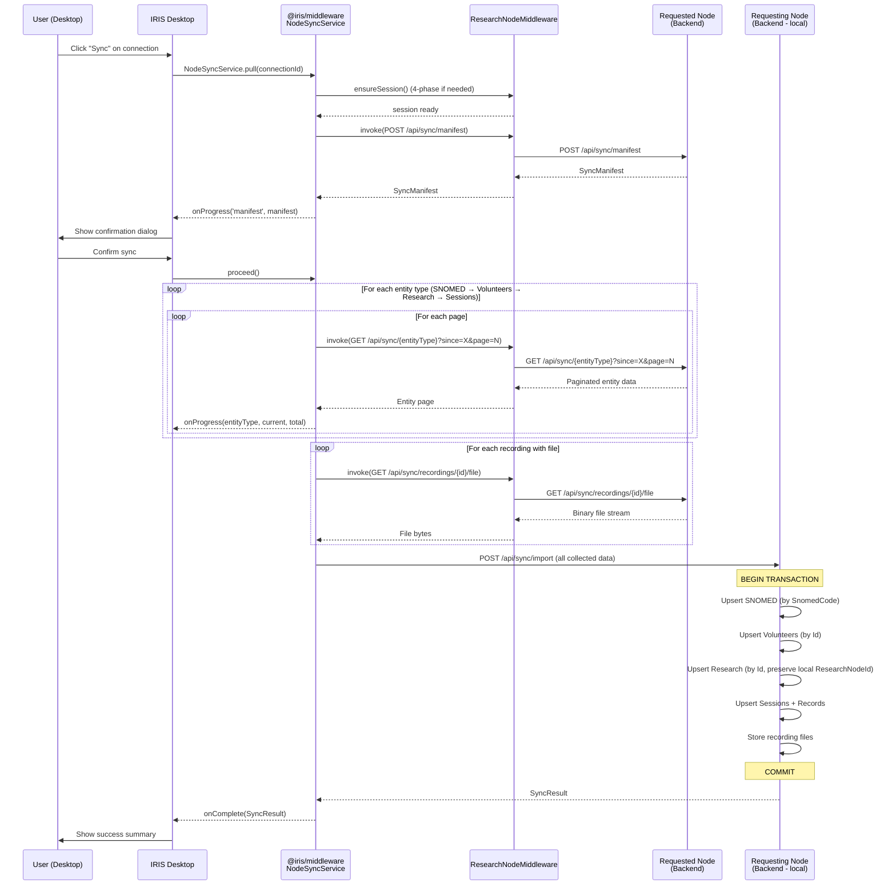
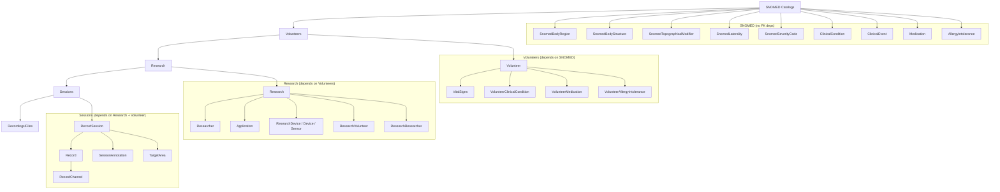

# Architecture: Node-to-Node Data Synchronization (Phase 17)

**Date**: 2026-02-18
**Author**: Tech Lead
**Status**: APPROVED
**Phase**: 17
**Project Brief**: `docs/PROJECT_BRIEF_NODE_SYNC.md`

---

## 1. Executive Summary

Phase 17 introduces one-way incremental data pull between authorized PRISM nodes. A requesting node (running the IRIS desktop app) pulls data from a requested node (running the InteroperableResearchNode backend) through the existing encrypted channel infrastructure. The design adds six sync export endpoints on the backend, a `SyncImportService` for transactional upsert, a middleware `NodeSyncService` for orchestration, and desktop UI wiring for the existing sync button stub.

The architecture intentionally avoids event sourcing, vector clocks, and bidirectional sync. Timestamp-based watermarks with "newer wins" resolution are sufficient for the one-way pull model described in the project brief.

---

## 2. Architectural Decisions

### ADR-1: Sync Direction — Pull Model

**Decision**: The requesting node pulls data from the requested node. The requested node exposes read-only export endpoints; the requesting node handles import.

**Rationale**: The pull model matches the existing `NodeChannelClient` / `ResearchNodeMiddleware.invoke()` pattern where the desktop app initiates all communication. The requested node never needs to reach back to the requester, avoiding NAT/firewall complications and keeping the security boundary simple.

**Consequence**: Every backend node must expose the sync export endpoints. The requesting node's `SyncImportService` handles all persistence logic.

### ADR-2: Conflict Resolution — Newer Wins by UpdatedAt

**Decision**: When a record exists on both nodes (matched by primary key), the version with the more recent `UpdatedAt` timestamp wins. No user-facing conflict resolution UI.

**Rationale**: All syncable entities already carry `UpdatedAt` columns (verified: `Research`, `Volunteer`, `RecordSession`, `Record`, `SnomedBodyStructure`, `SnomedBodyRegion`, `ResearchNode`, etc.). Clock skew risk is low for institutions using NTP and acceptable for this first version.

**Consequence**: Requires NTP-synced clocks across nodes. A future phase can add vector clocks if bidirectional sync is introduced.

### ADR-3: Transaction Boundary — Single EF Core Transaction per Sync

**Decision**: All upserts within a single sync operation execute inside one `IDbContextTransaction`. If any step fails (including recording file downloads), the entire transaction is rolled back.

**Rationale**: The project brief explicitly requires "no partial data" on failure. EF Core supports long-running transactions with `BeginTransactionAsync()`. The alternative (saga pattern with compensating actions) adds significant complexity for a batch import that runs on a single node.

**Trade-off**: Long-running transactions may hold locks. Mitigated by the fact that sync is manual, infrequent, and runs on the requesting node's own database where contention is minimal.

### ADR-4: Rate Limiting — Exempt Sync Endpoints

**Decision**: Sync endpoints use a dedicated rate limit of 600 requests/minute instead of the standard 60 req/min applied by `PrismAuthenticatedSessionAttribute`.

**Rationale**: A sync with paginated responses (100 records/page) across 5 entity categories could easily exceed 60 requests. The `SessionService.RecordRequestAsync()` currently applies a flat `MaxRequestsPerMinute = 60`. Rather than modifying the core rate limiter, the sync controller will use a custom `[PrismSyncRateLimit]` attribute that allows 600 req/min for sync-tagged sessions.

**Implementation**: Add an `IsSyncRequest` flag to `SessionContext` and check it in `RecordRequestAsync`. Sync endpoints set this flag via a new `[PrismSyncEndpoint]` marker attribute read by `PrismAuthenticatedSessionAttribute`.

### ADR-5: NodeChannelClient Extension — InvokeAsync<T>

**Decision**: Extend `INodeChannelClient` with a generic `InvokeAsync<TResponse>(string channelId, string sessionToken, HttpMethod method, string path, object? body = null)` method for arbitrary authenticated requests through the encrypted channel.

**Rationale**: The existing `NodeChannelClient` only handles the 4-phase handshake (OpenChannel, Identify, Challenge, Authenticate). Post-handshake API calls are currently only possible through the middleware's `ResearchNodeMiddleware.invoke()` (TypeScript). The backend needs its own equivalent for server-to-server sync. The method reuses the existing `_encryptionService`, `_channelStore`, and `_httpClientFactory` infrastructure.

**Consequence**: This is the only new method on the interface. All sync export endpoints will be consumed through it.

---

## 3. System Architecture

### 3.1 Data Flow



### 3.2 Component Diagram

```
┌─────────────────────────────────────────────────────────────────┐
│ IRIS Desktop App                                                 │
│                                                                   │
│  ┌─────────────────────┐   ┌──────────────────────────────────┐ │
│  │ NodeConnectionsScreen│   │ SyncProgressModal                │ │
│  │  - Sync button       │──▶│  - Progress bar                  │ │
│  │  - Last sync status  │   │  - Entity counts                 │ │
│  │  - Connection table  │   │  - Error display                 │ │
│  └─────────┬───────────┘   └──────────────┬───────────────────┘ │
│            │                               │                      │
│  ┌─────────▼───────────────────────────────▼───────────────────┐ │
│  │ NodeSyncService (new)                                        │ │
│  │  - pull(connectionId): Promise<SyncResult>                   │ │
│  │  - onProgress callback                                       │ │
│  │  - Collects all entities in memory before import             │ │
│  └─────────┬───────────────────────────────────────────────────┘ │
│            │ uses                                                  │
│  ┌─────────▼───────────────────────────────────────────────────┐ │
│  │ ResearchNodeMiddleware (existing)                             │ │
│  │  - invoke<TPayload, TResponse>(options)                      │ │
│  │  - ensureSession() → 4-phase handshake                       │ │
│  └─────────────────────────────────────────────────────────────┘ │
└─────────────────────────────────────────────────────────────────┘

┌─────────────────────────────────────────────────────────────────┐
│ InteroperableResearchNode (Backend)                               │
│                                                                   │
│  ┌─────────────────────────────────────────────────────────────┐ │
│  │ SyncController (new)                                         │ │
│  │  POST /api/sync/manifest                                     │ │
│  │  GET  /api/sync/snomed/{entityType}?since=&page=&pageSize=   │ │
│  │  GET  /api/sync/volunteers?since=&page=&pageSize=            │ │
│  │  GET  /api/sync/research?since=&page=&pageSize=              │ │
│  │  GET  /api/sync/sessions?since=&page=&pageSize=              │ │
│  │  GET  /api/sync/recordings/{id}/file                         │ │
│  │                                                               │ │
│  │  [PrismEncryptedChannelConnection]                           │ │
│  │  [PrismAuthenticatedSession(RequiredCapability = ReadWrite)] │ │
│  └─────────┬───────────────────────────────────────────────────┘ │
│            │                                                      │
│  ┌─────────▼───────────────────────────────────────────────────┐ │
│  │ SyncExportService (new)                                      │ │
│  │  - GetManifest(since?)                                       │ │
│  │  - GetSnomedEntities(entityType, since, page, pageSize)      │ │
│  │  - GetVolunteers(since, page, pageSize)                      │ │
│  │  - GetResearch(since, page, pageSize)                        │ │
│  │  - GetSessions(since, page, pageSize)                        │ │
│  │  - GetRecordingFile(recordingId)                             │ │
│  └─────────┬───────────────────────────────────────────────────┘ │
│            │ reads from                                           │
│  ┌─────────▼───────────────────────────────────────────────────┐ │
│  │ Existing Repositories (read-only for export)                 │ │
│  │  IResearchRepository, IVolunteerRepository, etc.             │ │
│  └─────────────────────────────────────────────────────────────┘ │
│                                                                   │
│  ┌─────────────────────────────────────────────────────────────┐ │
│  │ SyncImportService (new)                                      │ │
│  │  - ImportAsync(SyncImportPayload): SyncResult                │ │
│  │  - Uses PrismDbContext.Database.BeginTransactionAsync()      │ │
│  │  - Upserts via EF Core ExecuteUpdateAsync / AddAsync         │ │
│  └─────────┬───────────────────────────────────────────────────┘ │
│            │                                                      │
│  ┌─────────▼───────────────────────────────────────────────────┐ │
│  │ SyncLog (new entity + repository)                            │ │
│  │  - Tracks sync history per remote node                       │ │
│  │  - last_synced_at watermark for incremental queries          │ │
│  └─────────────────────────────────────────────────────────────┘ │
└─────────────────────────────────────────────────────────────────┘
```

---

## 4. Backend Design

### 4.1 New Entity: SyncLog

```csharp
// Bioteca.Prism.Domain/Entities/Sync/SyncLog.cs
namespace Bioteca.Prism.Domain.Entities.Sync;

public class SyncLog
{
    public Guid Id { get; set; }
    public Guid RemoteNodeId { get; set; }
    public DateTime StartedAt { get; set; }
    public DateTime? CompletedAt { get; set; }
    public string Status { get; set; } = "in_progress"; // in_progress, completed, failed, rolled_back
    public DateTime? LastSyncedAt { get; set; }  // watermark for next incremental sync
    public string? EntitiesReceived { get; set; } // JSON: {"snomed":42,"volunteers":10,...}
    public string? ErrorMessage { get; set; }

    // Navigation
    public Node.ResearchNode RemoteNode { get; set; } = null!;
}
```

**EF Core Migration**: `AddSyncLog` migration adds `sync_logs` table with FK to `research_nodes(id)`. Also adds `UpdatedAt` columns to any entities currently missing them (audit reveals all key entities already have `UpdatedAt`).

### 4.2 SyncController — Export Endpoints

The `SyncController` exposes data from the **requested node** (data source). All endpoints require `[PrismEncryptedChannelConnection]` + `[PrismAuthenticatedSession(RequiredCapability = NodeAccessTypeEnum.ReadWrite)]`.

```csharp
// Bioteca.Prism.InteroperableResearchNode/Controllers/SyncController.cs
[ApiController]
[Route("api/sync")]
[PrismEncryptedChannelConnection]
[PrismAuthenticatedSession(RequiredCapability = NodeAccessTypeEnum.ReadWrite)]
public class SyncController : ControllerBase
{
    private readonly ISyncExportService _syncExportService;

    // POST /api/sync/manifest
    // Body: { "since": "2026-02-01T00:00:00Z" } (optional)
    // Returns: SyncManifest with entity counts and latest timestamps
    [HttpPost("manifest")]
    public async Task<IActionResult> GetManifest([FromBody] SyncManifestRequest request) { ... }

    // GET /api/sync/snomed/{entityType}?since=ISO8601&page=1&pageSize=100
    // entityType: body-regions, body-structures, topographical-modifiers,
    //             lateralities, clinical-conditions, clinical-events,
    //             medications, allergy-intolerances, severity-codes
    [HttpGet("snomed/{entityType}")]
    public async Task<IActionResult> GetSnomedEntities(
        string entityType,
        [FromQuery] DateTime? since,
        [FromQuery] int page = 1,
        [FromQuery] int pageSize = 100) { ... }

    // GET /api/sync/volunteers?since=ISO8601&page=1&pageSize=100
    // Returns volunteers with nested clinical sub-entities
    [HttpGet("volunteers")]
    public async Task<IActionResult> GetVolunteers(
        [FromQuery] DateTime? since,
        [FromQuery] int page = 1,
        [FromQuery] int pageSize = 100) { ... }

    // GET /api/sync/research?since=ISO8601&page=1&pageSize=100
    // Returns research projects with applications, devices, sensors, researchers
    [HttpGet("research")]
    public async Task<IActionResult> GetResearch(
        [FromQuery] DateTime? since,
        [FromQuery] int page = 1,
        [FromQuery] int pageSize = 100) { ... }

    // GET /api/sync/sessions?since=ISO8601&page=1&pageSize=100
    // Returns sessions with records, annotations, target areas, record channels
    [HttpGet("sessions")]
    public async Task<IActionResult> GetSessions(
        [FromQuery] DateTime? since,
        [FromQuery] int page = 1,
        [FromQuery] int pageSize = 100) { ... }

    // GET /api/sync/recordings/{id}/file
    // Returns binary file stream (recording data)
    [HttpGet("recordings/{id:guid}/file")]
    public async Task<IActionResult> GetRecordingFile(Guid id) { ... }
}
```

**Pagination**: The sync controller does NOT use `BaseController` / `IApiContext` / `HandleQueryParameters()` because those only support `page`/`pageSize` without `since` filtering. Instead, the sync controller receives pagination directly as query parameters and passes them to `SyncExportService`, which constructs the queries manually.

**Response Format**: Each paginated endpoint returns:

```json
{
    "data": [...],
    "page": 1,
    "pageSize": 100,
    "totalRecords": 342,
    "totalPages": 4
}
```

### 4.3 SyncExportService

Reads entities from the database with `UpdatedAt > since` filtering and eager-loads related entities.

```csharp
// Bioteca.Prism.Service/Services/Sync/SyncExportService.cs
public class SyncExportService : ISyncExportService
{
    private readonly PrismDbContext _context;

    public async Task<SyncManifestResponse> GetManifestAsync(DateTime? since)
    {
        // Query counts and max UpdatedAt per entity type
        // where UpdatedAt > since (or all if since is null)
    }

    public async Task<PagedSyncResult<T>> GetSnomedEntitiesAsync<T>(
        string entityType, DateTime? since, int page, int pageSize)
        where T : class
    {
        // Map entityType string to DbSet<T>
        // Apply .Where(e => e.UpdatedAt > since) if since provided
        // Apply .Skip/.Take pagination
        // Return with total count
    }

    public async Task<PagedSyncResult<VolunteerSyncDTO>> GetVolunteersAsync(
        DateTime? since, int page, int pageSize)
    {
        // Include ClinicalConditions, Medications, Allergies, VitalSigns
        // Filter by UpdatedAt > since
    }

    public async Task<PagedSyncResult<ResearchSyncDTO>> GetResearchAsync(
        DateTime? since, int page, int pageSize)
    {
        // Include Applications, ResearchDevices.Device, ResearchResearchers
        // Filter by UpdatedAt > since
    }

    public async Task<PagedSyncResult<SessionSyncDTO>> GetSessionsAsync(
        DateTime? since, int page, int pageSize)
    {
        // Include Records.RecordChannels, SessionAnnotations, TargetAreas
        // Filter by UpdatedAt > since
    }

    public async Task<(byte[] data, string contentType, string fileName)?> GetRecordingFileAsync(Guid recordingId)
    {
        // Read from local file storage or Azurite blob
    }
}
```

**Sync DTOs**: New DTO classes that include nested sub-entities in a flat structure suitable for transport. These differ from the existing DTOs (which are designed for CRUD screens) by including all related entities needed for a complete import.

### 4.4 SyncImportService

Receives the collected data and persists it within a single database transaction.

```csharp
// Bioteca.Prism.Service/Services/Sync/SyncImportService.cs
public class SyncImportService : ISyncImportService
{
    private readonly PrismDbContext _context;
    private readonly ILogger<SyncImportService> _logger;

    public async Task<SyncResult> ImportAsync(SyncImportPayload payload, Guid remoteNodeId)
    {
        await using var transaction = await _context.Database.BeginTransactionAsync();
        try
        {
            // 1. Create SyncLog entry (status: in_progress)
            var syncLog = CreateSyncLog(remoteNodeId);

            // 2. Upsert in dependency order
            var counts = new Dictionary<string, int>();
            counts["snomed"] = await UpsertSnomedEntities(payload.Snomed);
            counts["volunteers"] = await UpsertVolunteers(payload.Volunteers);
            counts["research"] = await UpsertResearch(payload.Research);
            counts["sessions"] = await UpsertSessions(payload.Sessions);
            counts["recordings"] = await StoreRecordingFiles(payload.Recordings);

            // 3. Update SyncLog (status: completed, watermark)
            syncLog.Status = "completed";
            syncLog.CompletedAt = DateTime.UtcNow;
            syncLog.LastSyncedAt = payload.ManifestGeneratedAt;
            syncLog.EntitiesReceived = JsonSerializer.Serialize(counts);

            await _context.SaveChangesAsync();
            await transaction.CommitAsync();

            return new SyncResult
            {
                Status = "completed",
                EntitiesReceived = counts
            };
        }
        catch (Exception ex)
        {
            await transaction.RollbackAsync();

            // Update SyncLog with error
            // (new transaction for the error log)
            await LogSyncFailure(remoteNodeId, ex.Message);

            return new SyncResult
            {
                Status = "rolled_back",
                ErrorMessage = ex.Message
            };
        }
    }
}
```

**Upsert Strategy**: For each entity type, the service:

1. Queries existing records by primary key (batch `WHERE Id IN (...)`)
2. For existing records: compares `UpdatedAt` — if remote is newer, updates all columns via `_context.Entry(entity).CurrentValues.SetValues(remote)`
3. For new records: `_context.Add(entity)`
4. Calls `_context.SaveChangesAsync()` after each entity type batch

**SNOMED Natural Keys**: SNOMED entities use `SnomedCode` (string) as their PK, not GUID. Upsert matches on `SnomedCode`.

**ResearchNodeId Preservation**: When upserting `Research` and `Volunteer` entities, the `ResearchNodeId` FK is set to the **local** node's own ID (not the remote node's), since these entities are now owned by the local node. The original `ResearchNodeId` from the remote node is discarded.

### 4.5 NodeChannelClient.InvokeAsync Extension

```csharp
// Added to INodeChannelClient interface
Task<TResponse> InvokeAsync<TResponse>(
    string channelId,
    string sessionToken,
    HttpMethod method,
    string path,
    object? body = null);

// Added to NodeChannelClient implementation
public async Task<TResponse> InvokeAsync<TResponse>(
    string channelId,
    string sessionToken,
    HttpMethod method,
    string path,
    object? body = null)
{
    var channelContext = await _channelStore.GetChannelAsync(channelId)
        ?? throw new InvalidOperationException($"Channel {channelId} not found or expired");

    var httpClient = _httpClientFactory.CreateClient();
    httpClient.DefaultRequestHeaders.Add("X-Channel-Id", channelId);
    httpClient.DefaultRequestHeaders.Add("X-Session-Id", sessionToken);

    HttpRequestMessage request;
    if (body != null)
    {
        var encryptedPayload = _encryptionService.EncryptPayload(body, channelContext.SymmetricKey);
        request = new HttpRequestMessage(method, $"{channelContext.RemoteNodeUrl}{path}")
        {
            Content = JsonContent.Create(encryptedPayload)
        };
    }
    else
    {
        request = new HttpRequestMessage(method, $"{channelContext.RemoteNodeUrl}{path}");
    }

    var response = await httpClient.SendAsync(request);

    if (!response.IsSuccessStatusCode)
    {
        var error = await response.Content.ReadFromJsonAsync<Error>();
        throw new Exception($"Sync request failed [{response.StatusCode}]: {error?.ErrorDetail?.Message}");
    }

    var encryptedResponse = await response.Content.ReadFromJsonAsync<EncryptedPayload>();
    if (encryptedResponse == null)
        throw new Exception("Failed to deserialize encrypted response");

    return _encryptionService.DecryptPayload<TResponse>(encryptedResponse, channelContext.SymmetricKey);
}
```

**Note on file streaming**: For recording file downloads (`GET /api/sync/recordings/{id}/file`), an additional `InvokeStreamAsync` overload returns the raw `Stream` instead of decrypting JSON. Binary files are encrypted with the channel's symmetric key and streamed chunk-by-chunk.

### 4.6 SyncLog Query Endpoint

```csharp
// GET /api/sync/log?remoteNodeId={guid}&page=1&pageSize=10
// Returns paginated sync history for a given remote node
// Used by the desktop UI to display sync history on the connection details screen
[HttpGet("log")]
public async Task<IActionResult> GetSyncLog(
    [FromQuery] Guid remoteNodeId,
    [FromQuery] int page = 1,
    [FromQuery] int pageSize = 10) { ... }
```

### 4.7 Rate Limiting Approach

Rather than modifying the core `SessionService.RecordRequestAsync()` or `PrismAuthenticatedSessionAttribute`, the sync controller uses an elevated rate limit through a marker attribute:

```csharp
// New attribute: marks an endpoint as a sync endpoint for rate limit purposes
[AttributeUsage(AttributeTargets.Method | AttributeTargets.Class)]
public class PrismSyncEndpointAttribute : Attribute { }
```

The `PrismAuthenticatedSessionAttribute` is modified to check for `[PrismSyncEndpoint]` on the action/controller. If present, it uses 600 req/min instead of 60:

```csharp
// In PrismAuthenticatedSessionAttribute.OnActionExecutionAsync:
var isSyncEndpoint = context.ActionDescriptor.EndpointMetadata
    .Any(m => m is PrismSyncEndpointAttribute);
var rateLimit = isSyncEndpoint ? 600 : MaxRequestsPerMinute;
```

This approach keeps the core rate limiter untouched and scopes the elevated limit to sync endpoints only.

### 4.8 DI Registration

```csharp
// In NativeInjectorBootStrapper.RegisterServices():
services.AddScoped<ISyncExportService, SyncExportService>();
services.AddScoped<ISyncImportService, SyncImportService>();
services.AddScoped<ISyncLogRepository, SyncLogRepository>();
```

### 4.9 EF Core Migration

Migration `AddSyncLog`:
- Creates `sync_logs` table with columns: `id`, `remote_node_id`, `started_at`, `completed_at`, `status`, `last_synced_at`, `entities_received` (jsonb), `error_message`
- FK: `remote_node_id` → `research_nodes(id)`
- Index: `IX_sync_logs_remote_node_id` on `remote_node_id`
- Index: `IX_sync_logs_status` on `status`

---

## 5. Middleware Design

### 5.1 NodeSyncService

A new class in `@iris/middleware` that orchestrates the sync flow from the desktop app's perspective.

```typescript
// packages/middleware/src/sync/NodeSyncService.ts

export interface SyncProgressCallback {
    (progress: SyncProgress): void;
}

export interface NodeSyncServiceOptions {
    middleware: ResearchNodeMiddleware;
    onProgress?: SyncProgressCallback;
}

export class NodeSyncService {
    constructor(private readonly options: NodeSyncServiceOptions) {}

    async pull(since?: string): Promise<SyncResult> {
        const { middleware, onProgress } = this.options;

        // 1. Fetch manifest
        onProgress?.({ phase: 'manifest', current: 0, total: 1, entityType: 'manifest' });
        const manifest = await middleware.invoke<Record<string, unknown>, SyncManifest>({
            path: '/api/sync/manifest',
            method: 'POST',
            payload: { since: since ?? null }
        });
        onProgress?.({ phase: 'manifest', current: 1, total: 1, entityType: 'manifest' });

        // Return manifest for UI confirmation — caller decides whether to proceed
        return { manifest, proceed: () => this.executePull(manifest, since) };
    }

    private async executePull(manifest: SyncManifest, since?: string): Promise<SyncResult> {
        const collected: SyncImportPayload = {
            snomed: [],
            volunteers: [],
            research: [],
            sessions: [],
            recordings: [],
            manifestGeneratedAt: manifest.generatedAt
        };

        // 2. Pull SNOMED catalogs (9 sub-types)
        const snomedTypes = [
            'body-regions', 'body-structures', 'topographical-modifiers',
            'lateralities', 'clinical-conditions', 'clinical-events',
            'medications', 'allergy-intolerances', 'severity-codes'
        ];
        for (const entityType of snomedTypes) {
            const entities = await this.fetchAllPages(
                `/api/sync/snomed/${entityType}`, since, 'snomed', manifest
            );
            collected.snomed.push(...entities);
        }

        // 3. Pull Volunteers (with clinical sub-entities)
        collected.volunteers = await this.fetchAllPages(
            '/api/sync/volunteers', since, 'volunteers', manifest
        );

        // 4. Pull Research (with sub-entities)
        collected.research = await this.fetchAllPages(
            '/api/sync/research', since, 'research', manifest
        );

        // 5. Pull Sessions (with records, annotations, target areas)
        collected.sessions = await this.fetchAllPages(
            '/api/sync/sessions', since, 'sessions', manifest
        );

        // 6. Pull Recording files
        // Extract recording IDs from sessions that have file references
        const recordingIds = this.extractRecordingIdsWithFiles(collected.sessions);
        for (let i = 0; i < recordingIds.length; i++) {
            const fileData = await this.middleware.invoke<Record<string, unknown>, RecordingFileResponse>({
                path: `/api/sync/recordings/${recordingIds[i]}/file`,
                method: 'GET',
                payload: {}
            });
            collected.recordings.push({ id: recordingIds[i], ...fileData });
            this.options.onProgress?.({
                phase: 'recordings',
                current: i + 1,
                total: recordingIds.length,
                entityType: 'recordings'
            });
        }

        // 7. Submit to local backend for transactional import
        const result = await this.middleware.invoke<SyncImportPayload, SyncResult>({
            path: '/api/sync/import',
            method: 'POST',
            payload: collected
        });

        return result;
    }

    private async fetchAllPages(
        basePath: string,
        since: string | undefined,
        phase: SyncProgress['phase'],
        manifest: SyncManifest
    ): Promise<unknown[]> {
        const all: unknown[] = [];
        let page = 1;
        const pageSize = 100;
        let totalPages = 1;

        do {
            const params = new URLSearchParams({ page: String(page), pageSize: String(pageSize) });
            if (since) params.set('since', since);

            const response = await this.options.middleware.invoke<
                Record<string, unknown>,
                PaginatedSyncResponse
            >({
                path: `${basePath}?${params.toString()}`,
                method: 'GET',
                payload: {}
            });

            all.push(...response.data);
            totalPages = response.totalPages;

            this.options.onProgress?.({
                phase,
                current: all.length,
                total: response.totalRecords,
                entityType: phase
            });

            page++;
        } while (page <= totalPages);

        return all;
    }
}
```

**Import Path**: The middleware collects ALL entities in memory before sending a single `POST /api/sync/import` to the **local** backend. This differs from the project brief's sequence diagram which shows the import happening within the middleware — the actual import must go through the backend's `SyncImportService` because only the backend has direct database access. The middleware acts as an orchestrator, not a persistence layer.

**Alternative considered**: Having the middleware send entities to the local backend incrementally (per entity type). Rejected because the project brief requires atomic rollback — if sessions fail, volunteers must roll back too. A single import payload ensures one transaction boundary.

**Memory concern**: For very large datasets, the in-memory collection could be large. Mitigated by pagination (100 records/page) and the fact that sync is manual and infrequent. A future optimization could stream entities directly to the local backend using chunked transfer.

### 5.2 Type Exports

New types added to `@iris/middleware`:

```typescript
// packages/middleware/src/sync/types.ts
export { SyncManifest, SyncProgress, SyncResult } from './NodeSyncService';
```

Re-exported from `packages/middleware/src/index.ts`.

---

## 6. Domain Types

### 6.1 New Types in @iris/domain

```typescript
// packages/domain/src/models/NodeSync.ts

export interface SyncManifest {
    nodeId: string;
    nodeName: string;
    generatedAt: string;
    lastSyncedAt: string | null;
    entities: {
        snomed: SyncEntitySummary;
        volunteers: SyncEntitySummary;
        research: SyncEntitySummary;
        sessions: SyncEntitySummary;
        recordings: SyncRecordingSummary;
    };
}

export interface SyncEntitySummary {
    count: number;
    latestUpdate: string;
}

export interface SyncRecordingSummary {
    count: number;
    totalSizeBytes: number;
}

export interface SyncProgress {
    phase: 'manifest' | 'snomed' | 'volunteers' | 'research' | 'sessions' | 'recordings';
    current: number;
    total: number;
    entityType: string;
}

export interface SyncResult {
    status: 'completed' | 'failed' | 'rolled_back';
    startedAt: string;
    completedAt: string;
    entitiesReceived: Record<string, number>;
    errorMessage?: string;
}

export interface SyncLogEntry {
    id: string;
    remoteNodeId: string;
    startedAt: string;
    completedAt: string | null;
    status: string;
    lastSyncedAt: string | null;
    entitiesReceived: Record<string, number> | null;
    errorMessage: string | null;
}

export interface PaginatedSyncResponse<T = unknown> {
    data: T[];
    page: number;
    pageSize: number;
    totalRecords: number;
    totalPages: number;
}
```

### 6.2 ResearchNodeConnection Extension

Add optional sync metadata to the existing `ResearchNodeConnection` interface:

```typescript
// In packages/domain/src/models/Research.ts
export interface ResearchNodeConnection {
    // ... existing fields ...
    lastSyncedAt?: string;
    lastSyncStatus?: string;
}
```

---

## 7. Desktop UI Design

### 7.1 Sync Button Wiring

The existing sync button stub in `NodeConnectionsScreen.tsx:229` currently does `console.log('Sync', connection)`. Replace with:

```typescript
const handleSync = async (connection: ResearchNodeConnection) => {
    if (connection.nodeAccessLevel === NodeAccessLevel.READ_ONLY) {
        setError('Sync requires ReadWrite access level. This connection is ReadOnly.');
        return;
    }
    setSyncConnection(connection);
    setShowSyncModal(true);
};
```

### 7.2 SyncProgressModal

New component: `apps/desktop/src/screens/NodeConnections/SyncProgressModal.tsx`

States:
1. **Confirmation** — Shows manifest summary (entity counts, estimated size). Buttons: "Start Sync" / "Cancel".
2. **In Progress** — Progress bar with current phase label ("Syncing SNOMED catalogs... 42/120"). Cancel button disabled during active sync.
3. **Success** — Summary of synced entities. Button: "Close".
4. **Error** — Error message with transaction rollback confirmation. Button: "Close".

Uses the existing `Modal` component from the design system. Progress bar implemented with a simple `<div>` with percentage width (no new dependencies needed).

### 7.3 Sync History in Connection Details

The connection table's "Sync" column shows the last sync status badge (green "Synced 2h ago" / red "Failed" / gray "Never synced"). Data source: `GET /api/sync/log?remoteNodeId={id}&page=1&pageSize=1` fetched alongside connection data in `loadData()`.

---

## 8. Entity Sync Order and Dependencies



Within each phase, sub-entities are processed **after** their parent entity to satisfy FK constraints:
- `SnomedBodyStructure` after `SnomedBodyRegion` (FK: `BodyRegionCode`)
- `VolunteerClinicalCondition` after `Volunteer` AND `ClinicalCondition`
- `RecordSession` after `Research` AND `Volunteer`
- `Record` after `RecordSession`
- `RecordChannel` after `Record`

---

## 9. File Structure — New and Modified Files

### Backend (InteroperableResearchNode)

```
New files:
  Bioteca.Prism.Domain/Entities/Sync/SyncLog.cs
  Bioteca.Prism.Domain/DTOs/Sync/SyncManifestRequest.cs
  Bioteca.Prism.Domain/DTOs/Sync/SyncManifestResponse.cs
  Bioteca.Prism.Domain/DTOs/Sync/VolunteerSyncDTO.cs
  Bioteca.Prism.Domain/DTOs/Sync/ResearchSyncDTO.cs
  Bioteca.Prism.Domain/DTOs/Sync/SessionSyncDTO.cs
  Bioteca.Prism.Domain/DTOs/Sync/SyncImportPayload.cs
  Bioteca.Prism.Domain/DTOs/Sync/SyncResultDTO.cs
  Bioteca.Prism.Domain/DTOs/Sync/PagedSyncResult.cs
  Bioteca.Prism.Data/Interfaces/Sync/ISyncLogRepository.cs
  Bioteca.Prism.Data/Repositories/Sync/SyncLogRepository.cs
  Bioteca.Prism.Data/Persistence/Configurations/SyncLogConfiguration.cs
  Bioteca.Prism.Data/Migrations/{timestamp}_AddSyncLog.cs
  Bioteca.Prism.Service/Interfaces/Sync/ISyncExportService.cs
  Bioteca.Prism.Service/Interfaces/Sync/ISyncImportService.cs
  Bioteca.Prism.Service/Services/Sync/SyncExportService.cs
  Bioteca.Prism.Service/Services/Sync/SyncImportService.cs
  Bioteca.Prism.InteroperableResearchNode/Controllers/SyncController.cs
  Bioteca.Prism.InteroperableResearchNode/Middleware/PrismSyncEndpointAttribute.cs

Modified files:
  Bioteca.Prism.Core/Middleware/Node/INodeChannelClient.cs      — Add InvokeAsync<T>
  Bioteca.Prism.Core/Middleware/Node/NodeChannelClient.cs        — Implement InvokeAsync<T>
  Bioteca.Prism.Data/Persistence/Contexts/PrismDbContext.cs      — Add DbSet<SyncLog>
  Bioteca.Prism.CrossCutting/NativeInjectorBootStrapper.cs       — Register sync services
  Bioteca.Prism.InteroperableResearchNode/Middleware/
    PrismAuthenticatedSessionAttribute.cs                        — Check PrismSyncEndpoint for rate limit
```

### Middleware (IRIS/packages/middleware)

```
New files:
  src/sync/NodeSyncService.ts
  src/sync/types.ts

Modified files:
  src/index.ts                                                   — Re-export sync types
```

### Domain (IRIS/packages/domain)

```
New files:
  src/models/NodeSync.ts

Modified files:
  src/models/Research.ts                                         — Add lastSyncedAt/lastSyncStatus
  src/index.ts                                                   — Export NodeSync module
```

### Desktop (IRIS/apps/desktop)

```
New files:
  src/screens/NodeConnections/SyncProgressModal.tsx
  src/services/NodeSyncServiceAdapter.ts

Modified files:
  src/screens/NodeConnections/NodeConnectionsScreen.tsx          — Wire sync button
```

---

## 10. Technical Risk Assessment

| # | Risk | Likelihood | Impact | Mitigation | Residual Risk |
|---|------|-----------|--------|------------|---------------|
| 1 | Long-running transaction holds DB locks during large sync | Med | Med | Sync is manual and infrequent; runs on requester's own DB with minimal contention. Max lock duration bounded by page-size limits. | Low |
| 2 | Memory pressure from collecting all entities before import | Low | Med | Paginated fetching (100/page). Worst case: ~1000 records across all types = ~10MB JSON. Acceptable for desktop. | Low |
| 3 | Rate limit (600/min) still insufficient for massive datasets | Low | Med | 600 req/min allows ~60,000 records/min (100/page). Far exceeds expected dataset sizes. Can increase if needed. | Negligible |
| 4 | Clock skew causes incorrect "newer wins" resolution | Low | Med | Document NTP requirement. For one-way pull, the risk is limited: the remote node's timestamps are used as-is, and the local node only compares against its own previous import. | Low |
| 5 | Network interruption during multi-page fetch | Med | Low | The middleware collects data in memory before import. If a page fetch fails, no data has been written. User sees error and can retry. | Low |
| 6 | InvokeAsync binary streaming for large recording files | Med | Med | Stream files one at a time. Set `HttpClient.Timeout` to 5 minutes (already configured). If a file fails, the entire sync fails and rolls back. | Med |
| 7 | FK constraint violations during upsert | Low | High | Strict dependency ordering (Section 8). Sub-entities always processed after parents. Within a transaction, EF Core defers FK checks until SaveChanges. | Low |

---

## 11. Story-to-Architecture Mapping

| Story | Architecture Component | Section |
|-------|----------------------|---------|
| US-007: SyncLog table + migration | SyncLog entity, EF migration | 4.1, 4.9 |
| US-008: SyncDeltaQueryService | SyncExportService with `since` filtering | 4.3 |
| US-009: POST /api/sync/push | SyncController + SyncImportService | 4.2, 4.4 |
| US-010: NodeSyncService desktop | NodeSyncService in middleware | 5.1 |
| US-011: Wire Sync button | NodeConnectionsScreen modification | 7.1 |
| US-012: SyncProgressModal | SyncProgressModal component | 7.2 |
| US-013: Sync history display | SyncLog query + connection table | 7.3 |
| US-014: GET /api/sync/log | SyncController.GetSyncLog | 4.6 |
| US-015: Integration tests | End-to-end NodeA→NodeB sync test | Section 10 risks |

**Note on US-001 through US-006**: These stories relate to the mobile `blob_url` column and export fixes from Phase 16. They are not directly related to the node sync architecture but may share the `SyncLog` infrastructure for future mobile-to-node sync.

---

## 12. Implementation Order

The recommended implementation order follows the dependency chain:

1. **Domain types** (US-related: domain package) — `NodeSync.ts`, `ResearchNodeConnection` extension
2. **Backend: SyncLog entity + migration** (US-007) — Entity, config, migration, DbSet, DI
3. **Backend: SyncExportService + SyncController export endpoints** (US-008) — Manifest + 5 entity endpoints
4. **Backend: NodeChannelClient.InvokeAsync** — Enable server-to-server authenticated requests
5. **Backend: SyncImportService** (US-009) — Transactional upsert with dependency ordering
6. **Backend: Rate limit exemption** — PrismSyncEndpoint attribute
7. **Backend: SyncLog query endpoint** (US-014) — GET /api/sync/log
8. **Middleware: NodeSyncService** (US-010) — Orchestration, progress callbacks
9. **Desktop: SyncProgressModal** (US-012) — Confirmation, progress, result states
10. **Desktop: Wire sync button** (US-011) — Replace console.log stub
11. **Desktop: Sync history** (US-013) — Last sync badge on connection table
12. **Integration tests** (US-015) — End-to-end NodeA→NodeB Docker test

Steps 1-7 can be parallelized across backend developers. Steps 8-11 depend on backend endpoints being available but can start with mocks. Step 12 requires all previous steps.

---

## 13. Open Questions

None — all questions were resolved during codebase investigation:

- **UpdatedAt coverage**: Verified all key entities (`Research`, `Volunteer`, `RecordSession`, `Record`, `SnomedBodyStructure`, `SnomedBodyRegion`, `ResearchNode`) have `UpdatedAt` columns.
- **BaseController limitation**: Confirmed `HandleQueryParameters()` only supports `page`/`pageSize` — sync endpoints bypass it with direct query parameters.
- **Rate limiter**: Confirmed `MaxRequestsPerMinute = 60` is hardcoded in `SessionService`. The `PrismSyncEndpoint` marker attribute approach avoids modifying the core constant.
- **Middleware invoke()**: Confirmed `ResearchNodeMiddleware.invoke()` already supports arbitrary `GET`/`POST` requests with automatic session management — `NodeSyncService` builds on top of it.
- **Sync button stub**: Confirmed at `NodeConnectionsScreen.tsx:229` — `onClick={() => console.log('Sync', connection)}`.
- **SNOMED PKs**: Confirmed SNOMED entities use string `SnomedCode` as PK (natural key), not GUID.

---

## 14. Implementation Notes

This section documents deviations from the original design and fixes applied during the implementation review cycle (Phase 17, 2026-02-18).

### B-001 Fix: SyncLog Transaction Boundary

**Original design (Section 4.4)** showed the SyncLog entry being created at the start of `ImportAsync` followed by `BeginTransactionAsync()`. During review, the implementation had the SyncLog write (`_syncLogRepository.AddAsync()`) occurring **before** `BeginTransactionAsync()`, which caused the row to be committed outside the transaction's scope. On failure, the SyncLog was left with `status = "in_progress"` permanently, and the error-logging path in the `catch` block operated on a potentially degraded `DbContext`.

**Fix applied**: `BeginTransactionAsync()` was moved to the top of `ImportAsync`, before the SyncLog creation. Inside the `try` block, the SyncLog is inserted directly via `_context.SyncLogs.Add(syncLog)` + `SaveChangesAsync()` rather than routing through `_syncLogRepository.AddAsync()`, avoiding the implicit commit that the repository method issues internally. In the `catch` block, `ChangeTracker.Clear()` is called after `RollbackAsync()` to discard all stale in-memory entity state, followed by a fresh `SaveChangesAsync()` that creates a new `status = "failed"` SyncLog entry in its own implicit transaction. The failure logger wraps its own body in a `try/catch` and swallows exceptions so the original exception is not masked.

**Final structure**:
```csharp
await using var transaction = await _context.Database.BeginTransactionAsync();
try {
    _context.SyncLogs.Add(syncLog); // inside transaction
    await _context.SaveChangesAsync();
    // ... upserts ...
    syncLog.Status = "completed";
    await _context.SaveChangesAsync();
    await transaction.CommitAsync();
}
catch {
    await transaction.RollbackAsync();
    // LogSyncFailureAsync: ChangeTracker.Clear() + new SaveChangesAsync (independent implicit tx)
    await LogSyncFailureAsync(remoteNodeId, ex.Message);
    throw;
}
```

### B-002 Fix: Recording File Returns Base64 JSON Instead of Binary FileResult

**Original design (Section 4.5)** specified `InvokeStreamAsync` for recording file downloads, implying a binary streaming response. The implementation in `SyncController.GetRecordingFile()` returned `File(data, contentType, fileName)` — a binary `FileResult`. However, `NodeSyncService.ts` called the endpoint via `ResearchNodeMiddleware.invoke()`, which always expects an encrypted JSON envelope. A binary `FileResult` body cannot be deserialized as an encrypted JSON envelope, causing a runtime failure for all syncs that include recording files.

**Fix applied**: `GetRecordingFile()` was changed to return a standard `ObjectResult` with the file bytes base64-encoded:

```csharp
return Ok(new
{
    ContentBase64 = Convert.ToBase64String(data),
    ContentType = contentType,
    FileName = fileName
});
```

This JSON response is wrapped in the standard `PrismEncryptedChannelConnection` envelope and decrypted by `invoke()` on the TypeScript side, matching the `{ contentBase64, contentType, fileName }` shape the client already expected. The `InvokeStreamAsync` path on `INodeChannelClient` is preserved for potential future server-to-server binary streaming but is not used for the TypeScript middleware path.

**Note**: ASP.NET Core's default camelCase JSON naming policy (`JsonNamingPolicy.CamelCase`) must be confirmed as globally configured in `Program.cs` to ensure the anonymous object properties serialize as `contentBase64` (camelCase) rather than `ContentBase64` (PascalCase), matching the TypeScript interface field names.

### S-005 Fix: NodeSyncServiceAdapter Creates Connection-Specific Remote Middleware

**Original design** described `NodeSyncService` as receiving separate `remoteMiddleware` and `localMiddleware` instances. The initial implementation of `NodeSyncServiceAdapter` passed `this.middleware` (the local singleton) for both, meaning the sync fetched from the local backend instead of the target remote node — a self-sync no-op.

**Fix applied**: The `preview()` method signature was changed to accept `connection: ResearchNodeConnection` as a required first parameter. Inside `preview()`, a connection-specific `remoteMiddleware` is constructed:

- `FetchHttpClient` is initialized with `connection.nodeUrl` as the base URL, targeting the remote node's actual address.
- A fresh `ChannelManager`, `SessionManager`, and `WebCryptoDriver` are created using the remote-targeted client.
- `ResearchNodeMiddleware` is constructed with the local node's certificate and signing capability (`signChallenge: this.middleware.signChallenge`) but the remote-targeted managers.

`NodeSyncService` is then wired with this connection-specific `remoteMiddleware` and the singleton `localMiddleware: this.middleware` for the import step. `NodeConnectionsScreen.tsx:handleStartSync` was updated to pass `syncConnection` (the active `ResearchNodeConnection`) to `nodeSyncServiceAdapter.preview()`.

### Other Deviations from Original Design

- **`SnomedLaterality` and `SnomedTopographicalModifier` missing `UpdatedAt`/`CreatedAt`**: The codebase audit during design stated all key entities had `UpdatedAt`. Implementation revealed `SnomedLaterality` and `SnomedTopographicalModifier` lacked both `UpdatedAt` and `CreatedAt`, and `RecordChannel` lacked `UpdatedAt`. The `AddSyncLog` migration was extended to add these columns, restoring incremental sync correctness for those entity types.

- **`ISyncLogRepository` service locator in `SyncController.GetSyncLog`**: The `GetSyncLog` action resolves `ISyncLogRepository` from `HttpContext.RequestServices` rather than constructor injection. This is a known open suggestion (S-001) from the code review. The service-locator pattern is non-blocking but should be refactored to constructor injection in a follow-up cleanup.

- **Integration tests run on InMemory provider, not PostgreSQL**: The design specified an end-to-end NodeA→NodeB Docker integration test (US-015). Due to InMemory provider limitations (transactions are no-ops), the B-001 transaction correctness assertion (Test 6) was skipped. The fix was validated by code review rather than automated test. The `SyncImportServiceTests.cs` file provides unit-level coverage for all other sync scenarios.

- **Import endpoint authentication**: The `POST /api/sync/import` endpoint has no `[PrismEncryptedChannelConnection]` attribute (by design, since it is called from the local desktop middleware, not through a remote encrypted channel). The class-level `[PrismAuthenticatedSession]` applies to all actions except import, which opts out. This creates an unauthenticated surface (S-002 from the review). Documented as a known risk; mitigation (e.g., `[Authorize]` or localhost IP filter) is deferred to a production-hardening phase.
