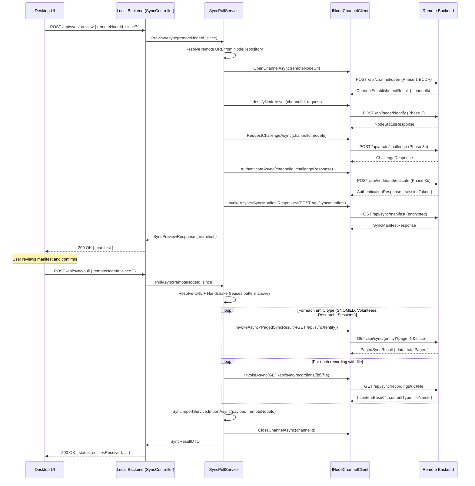
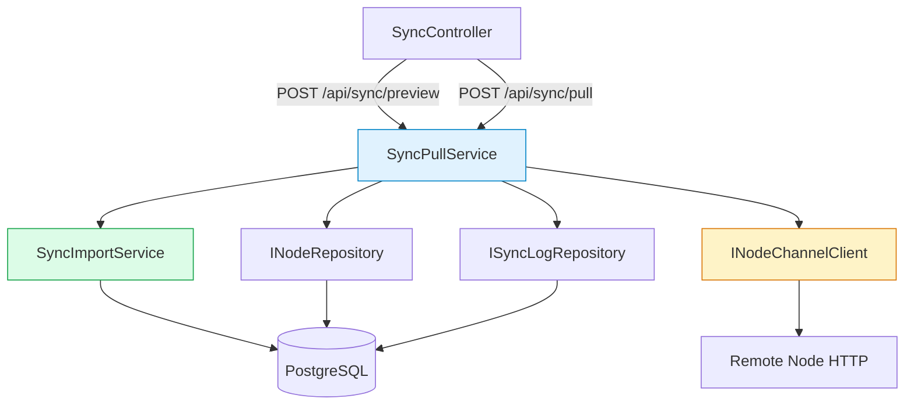
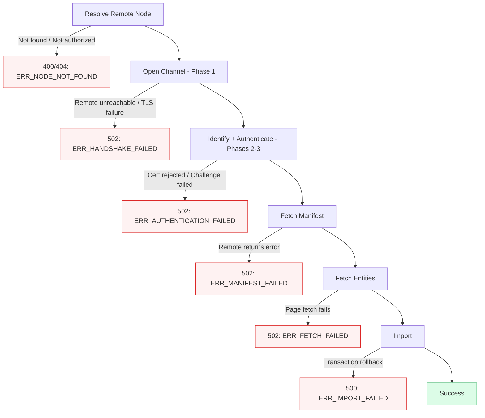
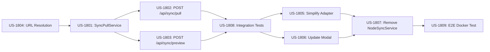

# Architecture Document: Phase 18 — Backend-to-Backend Sync Orchestration

**Date**: 2026-02-22
**Author**: TL (Tech Lead)
**Status**: APPROVED
**Phase**: 18

---

## 1. System Overview

Phase 18 moves sync orchestration from the desktop UI layer into the backend. The desktop app transitions from a full orchestrator (creating middleware instances, performing handshakes, fetching entity pages) to a thin trigger-and-monitor client that issues a single HTTP call to the local backend.



---

## 2. Tech Stack

No new technologies. Phase 18 reuses the existing stack entirely:

| Layer | Technology | Usage |
|-------|-----------|-------|
| Backend | ASP.NET Core 8.0, C# 12 | New service + endpoints |
| Node Communication | INodeChannelClient (singleton) | Full 4-phase handshake + InvokeAsync |
| Import | SyncImportService (scoped) | Unchanged transactional upsert |
| Export | SyncExportService (scoped) | Unchanged (remote node serves data) |
| Persistence | PostgreSQL 18 + Redis 7.2 | Node registry for URL lookup, SyncLog |
| Desktop | Electron + React + TypeScript | Simplified adapter, same UI components |

---

## 3. New Components

### 3.1 Backend — ISyncPullService Interface

**Location**: `Bioteca.Prism.Service/Interfaces/Sync/ISyncPullService.cs`

```csharp
namespace Bioteca.Prism.Service.Interfaces.Sync;

public interface ISyncPullService
{
    /// <summary>
    /// Performs the 4-phase handshake with the remote node and fetches the manifest
    /// without importing any data. Returns a preview for user confirmation.
    /// </summary>
    Task<SyncPreviewResponse> PreviewAsync(
        Guid remoteNodeId, DateTime? since,
        CancellationToken cancellationToken = default);

    /// <summary>
    /// Performs the full sync: handshake → manifest → fetch all entities → import.
    /// Returns the import result. Channel is closed on completion or failure.
    /// </summary>
    Task<SyncResultDTO> PullAsync(
        Guid remoteNodeId, DateTime? since,
        CancellationToken cancellationToken = default);
}
```

### 3.2 Backend — SyncPullService Implementation

**Location**: `Bioteca.Prism.Service/Services/Sync/SyncPullService.cs`

**Dependencies** (constructor injection):
- `INodeChannelClient` (singleton) — 4-phase handshake + encrypted HTTP
- `INodeRepository` (scoped) — resolve remote node URL from registry
- `ISyncLogRepository` (scoped) — auto-resolve `since` watermark
- `ISyncImportService` (scoped) — transactional import
- `IConfiguration` — local node identity (nodeId, certificate, sign function)
- `ILogger<SyncPullService>` — structured logging

**DI Registration**: Scoped (in `NativeInjectorBootStrapper.RegisterServices()`):

```csharp
services.AddScoped<ISyncPullService, SyncPullService>();
```

Scoped is correct because `SyncPullService` depends on scoped services (`PrismDbContext` via `ISyncImportService`, `INodeRepository`). Injecting the singleton `INodeChannelClient` into a scoped service is supported by ASP.NET Core.

### 3.3 Backend — New DTOs

**Location**: `Bioteca.Prism.Domain/DTOs/Sync/`

```csharp
// SyncPullRequest.cs
public class SyncPullRequest
{
    /// <summary>
    /// ID of the remote research node to pull data from.
    /// Must match a node in the local registry with Status = Authorized.
    /// </summary>
    public Guid RemoteNodeId { get; set; }

    /// <summary>
    /// Optional watermark for incremental sync. When null, the service
    /// auto-resolves from the last successful SyncLog entry.
    /// </summary>
    public DateTime? Since { get; set; }
}
```

```csharp
// SyncPreviewResponse.cs
public class SyncPreviewResponse
{
    public SyncManifestResponse Manifest { get; set; } = new();
    public DateTime? AutoResolvedSince { get; set; }
    public Guid RemoteNodeId { get; set; }
}
```

No new `SyncPullResponse` DTO is needed — the existing `SyncResultDTO` serves as the pull response.

---

## 4. Component Architecture

### 4.1 Interaction Diagram



### 4.2 SyncPullService Internal Flow

The service encapsulates the full handshake orchestration that was previously split across `NodeSyncService.ts` and `NodeSyncServiceAdapter.ts`. The key internal method sequence:

1. **ResolveRemoteNode(remoteNodeId)** — queries `INodeRepository` by `Id`, validates `Status == Authorized`, extracts `NodeUrl`.

2. **PerformHandshake(remoteNodeUrl)** — calls `INodeChannelClient` methods in sequence:
   - `OpenChannelAsync(remoteNodeUrl)` → Phase 1 (ECDH key exchange)
   - `IdentifyNodeAsync(channelId, identifyRequest)` → Phase 2
   - `RequestChallengeAsync(channelId, localNodeId)` → Phase 3a
   - `AuthenticateAsync(channelId, challengeResponse)` → Phase 3b

   Returns `(channelId, sessionToken)`.

   **Challenge signing**: The local node's private key must sign the challenge. `SyncPullService` needs access to the local node's RSA private key and sign function. This is available from `IConfiguration` (certificate PEM path) and the existing `IChallengeService` or a new helper. The exact signing mechanism mirrors what `NodeChannelClient` already uses in the test suite.

3. **FetchManifest(channelId, sessionToken, since)** — calls `InvokeAsync<SyncManifestResponse>(channelId, sessionToken, HttpMethod.Post, "/api/sync/manifest", { since })`.

4. **FetchAllEntities(channelId, sessionToken, since)** — fetches entity pages in dependency order using `InvokeAsync<PagedSyncResult<T>>`:
   - 9 SNOMED sub-types via `GET /api/sync/snomed/{type}?page=N&pageSize=100&since=...`
   - Volunteers via `GET /api/sync/volunteers?...`
   - Research via `GET /api/sync/research?...`
   - Sessions via `GET /api/sync/sessions?...`
   - Recording files via `GET /api/sync/recordings/{id}/file` for each channel with a file URL

   Each entity type is paginated. The service loops `page = 1..totalPages` and accumulates results.

5. **ImportLocally(payload, remoteNodeId)** — calls `ISyncImportService.ImportAsync()` directly (same process, no HTTP). The assembled `SyncImportPayload` is identical to what the middleware previously built.

6. **CloseChannel(channelId)** — always called in a `finally` block to clean up the encrypted channel, regardless of success or failure.

### 4.3 DI Registration

Add to `NativeInjectorBootStrapper.RegisterServices()`:

```csharp
// Sync services
services.AddScoped<ISyncExportService, SyncExportService>();
services.AddScoped<ISyncImportService, SyncImportService>();
services.AddScoped<ISyncPullService, SyncPullService>();  // NEW
```

### 4.4 New Endpoints in SyncController

The two new endpoints use `[Authorize]` (user JWT) instead of `[PrismAuthenticatedSession]` (node session). They are added as separate actions on `SyncController` with distinct attribute overrides to bypass the controller-level node session requirement.

**Implementation approach**: The existing `SyncController` has class-level `[PrismAuthenticatedSession]` which requires node session headers. The new pull/preview endpoints need user JWT auth instead. Two options:

**Option A (recommended)**: Create a new `SyncPullController` with `[Authorize]` at class level, keeping the export-focused `SyncController` unchanged. Route prefix: `api/sync`.

**Option B**: Add `[AllowAnonymous]` override on the new actions and manually validate user JWT. This is fragile and not recommended.

We go with **Option A**: a new `SyncPullController`.

```csharp
[ApiController]
[Route("api/sync")]
[Authorize]  // User JWT authentication
public class SyncPullController : ControllerBase
{
    private readonly ISyncPullService _syncPullService;
    private readonly ILogger<SyncPullController> _logger;

    [HttpPost("preview")]
    public async Task<IActionResult> Preview([FromBody] SyncPullRequest request) { ... }

    [HttpPost("pull")]
    public async Task<IActionResult> Pull([FromBody] SyncPullRequest request) { ... }
}
```

Note: ASP.NET Core allows multiple controllers to share the same route prefix. The `[PrismAuthenticatedSession]` on `SyncController` only applies to that controller's actions, not to `SyncPullController`'s. There is no conflict.

---

## 5. Data Flow

### 5.1 Preview Flow (POST /api/sync/preview)

```
1. SyncPullController receives request { remoteNodeId, since? }
2. Validates user JWT via [Authorize]
3. Calls SyncPullService.PreviewAsync(remoteNodeId, since)
   a. Resolves remote node URL from INodeRepository (by Id, Status=Authorized)
   b. If since is null, auto-resolves from ISyncLogRepository.GetLatestCompletedAsync()
   c. Performs 4-phase handshake via INodeChannelClient
   d. Fetches manifest via InvokeAsync<SyncManifestResponse>
   e. Closes channel
4. Returns SyncPreviewResponse { manifest, autoResolvedSince, remoteNodeId }
```

### 5.2 Pull Flow (POST /api/sync/pull)

```
1. SyncPullController receives request { remoteNodeId, since? }
2. Validates user JWT via [Authorize]
3. Calls SyncPullService.PullAsync(remoteNodeId, since)
   a. Resolves remote node URL from INodeRepository
   b. If since is null, auto-resolves from ISyncLogRepository.GetLatestCompletedAsync()
   c. Performs 4-phase handshake (Phases 1-4)
   d. Fetches manifest
   e. Fetches all entity pages in dependency order:
      - SNOMED (9 types) → Volunteers → Research → Sessions → Recordings
   f. Assembles SyncImportPayload
   g. Calls SyncImportService.ImportAsync(payload, remoteNodeId)
      - Transactional upsert (all-or-nothing)
      - SyncLog created inside transaction
   h. Closes channel (in finally block)
4. Returns SyncResultDTO { status, startedAt, completedAt, entitiesReceived }
```

### 5.3 Entity Fetch Pagination

Each entity type is fetched in pages of 100 records. The loop:

```
page = 1
do:
    response = InvokeAsync<PagedSyncResult<JsonElement>>(GET /api/sync/{entity}?page={page}&pageSize=100&since={since})
    collect response.data
    page++
while page <= response.totalPages
```

The `InvokeAsync<T>` method handles encryption/decryption transparently via the channel's symmetric key.

---

## 6. API Contracts

### 6.1 POST /api/sync/preview

**Authentication**: User JWT (`Authorization: Bearer {jwt}`)

**Request**:
```json
{
    "remoteNodeId": "3fa85f64-5717-4562-b3fc-2c963f66afa6",
    "since": "2026-02-18T00:00:00Z"
}
```

**Response (200 OK)**:
```json
{
    "manifest": {
        "nodeId": "node-b-guid",
        "nodeName": "Research Node B",
        "generatedAt": "2026-02-22T14:30:00Z",
        "lastSyncedAt": null,
        "snomed": { "count": 42, "latestUpdate": "2026-02-20T10:00:00Z" },
        "volunteers": { "count": 10, "latestUpdate": "2026-02-21T15:00:00Z" },
        "research": { "count": 5, "latestUpdate": "2026-02-19T12:00:00Z" },
        "sessions": { "count": 8, "latestUpdate": "2026-02-22T09:00:00Z" },
        "recordings": { "count": 3, "totalSizeBytes": 1048576 }
    },
    "autoResolvedSince": "2026-02-18T00:00:00Z",
    "remoteNodeId": "3fa85f64-5717-4562-b3fc-2c963f66afa6"
}
```

**Error Responses**:
- `400 Bad Request`: Invalid `remoteNodeId`
- `401 Unauthorized`: Missing or invalid JWT
- `404 Not Found`: Remote node not in registry
- `502 Bad Gateway`: Handshake failed (remote node unreachable or rejected)

### 6.2 POST /api/sync/pull

**Authentication**: User JWT (`Authorization: Bearer {jwt}`)

**Request**: Same as preview.

**Response (200 OK)**:
```json
{
    "status": "completed",
    "startedAt": "2026-02-22T14:31:00Z",
    "completedAt": "2026-02-22T14:31:45Z",
    "entitiesReceived": {
        "snomed": 42,
        "volunteers": 10,
        "research": 5,
        "sessions": 8,
        "recordings": 3
    }
}
```

**Error Responses**:
- `400 Bad Request`: Invalid request body
- `401 Unauthorized`: Missing or invalid JWT
- `404 Not Found`: Remote node not in registry or not authorized
- `502 Bad Gateway`: Handshake failed, remote node unreachable
- `500 Internal Server Error`: Import failed (all changes rolled back)

---

## 7. Frontend Changes

### 7.1 NodeSyncServiceAdapter Simplification

The current `NodeSyncServiceAdapter` creates `FetchHttpClient`, `WebCryptoDriver`, `ChannelManager`, `SessionManager`, and `ResearchNodeMiddleware` instances to perform the handshake from the UI layer. All of this is removed.

**New implementation**:

```typescript
export class NodeSyncServiceAdapter extends BaseService {
    async preview(
        connection: ResearchNodeConnection,
        since?: string
    ): Promise<SyncPreviewResponse> {
        await this.ensureSession();
        return this.middleware.invoke<SyncPullRequest, SyncPreviewResponse>({
            path: '/api/sync/preview',
            method: 'POST',
            payload: { remoteNodeId: connection.id, since: since ?? null }
        });
    }

    async pull(
        connection: ResearchNodeConnection,
        since?: string
    ): Promise<SyncResult> {
        await this.ensureSession();
        return this.middleware.invoke<SyncPullRequest, SyncResult>({
            path: '/api/sync/pull',
            method: 'POST',
            payload: { remoteNodeId: connection.id, since: since ?? null }
        });
    }

    // getLatestSyncLog() and getSyncLogs() remain unchanged
}
```

**Removed imports**: `ChannelManager`, `SessionManager`, `WebCryptoDriver`, `FetchHttpClient`, `NodeSyncService` from `@iris/middleware`.

### 7.2 SyncProgressModal Adaptation

The modal state machine changes:

| Phase | Before (Phase 17) | After (Phase 18) |
|-------|-------------------|-------------------|
| **Open** | Fetch manifest from remote via UI middleware | Call `POST /api/sync/preview` on local backend |
| **Confirmation** | Show manifest, user clicks "Start Sync" | Same: show manifest from preview response |
| **In Progress** | UI orchestrates paginated fetch with progress callbacks | Call `POST /api/sync/pull`, show spinner (no per-entity progress) |
| **Success** | Show result from local import response | Same: show result from pull response |
| **Error** | Show error, offer retry | Same behavior |

Key changes to `SyncProgressModal.tsx`:

1. **`onStartSync` prop** changes signature: instead of receiving a progress callback and returning `SyncPullPreview`, it returns `Promise<SyncPreviewResponse>` from the backend preview endpoint.

2. **`handleConfirm`** calls `adapter.pull(connection, since)` instead of `preview.proceed()`. No progress callback during the pull (Phase 18 limitation — accepted per project brief).

3. **In-progress state** shows a spinner with "Syncing..." text and no progress bar (since the backend does not stream progress). The `InProgressContent` component is simplified.

4. **`SyncProgress` type** from `@iris/middleware` is no longer used in the modal.

### 7.3 NodeSyncService Removal from @iris/middleware

The `NodeSyncService` class in `IRIS/packages/middleware/src/sync/NodeSyncService.ts` is removed entirely. No other consumers exist — only `NodeSyncServiceAdapter` uses it.

**Files to delete**:
- `IRIS/packages/middleware/src/sync/NodeSyncService.ts`

**Files to update** (remove re-exports):
- `IRIS/packages/middleware/src/index.ts` — remove `NodeSyncService` export

---

## 8. Error Handling Strategy

### 8.1 Failure Points and Handling



### 8.2 SyncLog Status Tracking

| Scenario | SyncLog Status | Notes |
|----------|---------------|-------|
| Handshake fails | `failed` | SyncLog created before handshake, updated on failure |
| Fetch fails mid-sync | `failed` | Channel closed, SyncLog records which stage failed |
| Import transaction rolls back | `failed` | SyncImportService handles rollback + failure logging |
| Success | `completed` | `LastSyncedAt` set to `manifest.GeneratedAt` |

### 8.3 Channel Cleanup

The `SyncPullService` wraps the entire flow in a `try/finally` block:

```csharp
string? channelId = null;
try
{
    var handshakeResult = await PerformHandshakeAsync(remoteNodeUrl);
    channelId = handshakeResult.ChannelId;
    // ... fetch + import
}
finally
{
    if (channelId != null)
        await _nodeChannelClient.CloseChannelAsync(channelId);
}
```

### 8.4 Error Response Format

All error responses follow the existing PRISM error envelope:

```json
{
    "error": "ERR_HANDSHAKE_FAILED",
    "message": "Failed to establish encrypted channel with remote node: Connection refused",
    "stage": "phase1_channel"
}
```

The `stage` field is new and indicates which step failed, enabling the UI to display a meaningful message.

---

## 9. Security Considerations

### 9.1 Authentication Model

The new endpoints use a **dual-authentication model**:

- **Outer layer (user-facing)**: Standard JWT `[Authorize]` attribute on `SyncPullController`. The requesting user must be an authenticated researcher. This protects against unauthorized sync triggers.

- **Inner layer (node-to-node)**: `INodeChannelClient` performs the full 4-phase handshake internally. The remote node validates the local node's certificate and challenge signature. No node credentials are exposed to the UI.

### 9.2 Data Sovereignty

Biomedical data (volunteer PII, clinical records) never passes through the UI layer. The backend-to-backend transfer keeps all sensitive data within the node trust boundary. The UI only receives aggregate metadata (entity counts, timestamps) via the preview endpoint.

### 9.3 No Sensitive Data Exposed to UI

| Endpoint | Data Returned to UI | Sensitive Data Flow |
|----------|-------------------|-------------------|
| `POST /api/sync/preview` | Entity counts, timestamps, node name | No PII, no clinical data |
| `POST /api/sync/pull` | Status, timing, aggregate counts | All entity data stays in backend |

### 9.4 Remote Node Authorization

`SyncPullService` validates that the remote node has `Status == Authorized` before attempting the handshake. Nodes with `Status == Pending`, `Revoked`, or `Unknown` are rejected with a `404` response.

### 9.5 Existing Security Properties Preserved

All existing security properties from the 4-phase handshake remain intact:
- Perfect Forward Secrecy (ephemeral ECDH keys)
- AES-256-GCM authenticated encryption for all sync data in transit
- RSA-2048 challenge-response for mutual authentication
- Rate limiting (600 req/min for sync endpoints via `[PrismSyncEndpoint]`)
- Session token TTL (1 hour) with one-time use challenges

---

## 10. Technical Risk Assessment

### 10.1 Risk: Full Handshake Chain in SyncPullService

**Risk**: `INodeChannelClient` methods (Open → Identify → Challenge → Authenticate → Invoke) have only been tested individually, not as a chained sequence within a single service method.

**Likelihood**: Medium | **Impact**: High

**Mitigation**: The handshake chain is the same sequence used in `test-phase4.sh` and `NodeChannelClientTests.cs`. The key concern is **challenge signing** — `SyncPullService` must have access to the local node's RSA private key to sign the challenge. This requires loading the PEM certificate from `IConfiguration["NodeSecurity:PrivateKeyPath"]` and performing the RSA-SHA256 signature. Verify this works in an integration test before proceeding with entity fetch logic.

**Action**: US-1808 (integration test) should test the full handshake chain first, before testing entity fetch and import.

### 10.2 Risk: Long-Running HTTP Request Timeout

**Risk**: Large datasets may cause the `POST /api/sync/pull` request to exceed the default HTTP timeout on the desktop-to-local-backend connection.

**Likelihood**: Medium | **Impact**: Medium

**Mitigation**: The backend's `HttpClient.TimeoutSeconds` is already 300 (5 minutes). The desktop app's `FetchHttpClient` should be configured with a matching timeout for the pull endpoint. For Phase 18, synchronous request-response is acceptable. Future phases can add `202 Accepted` + polling if needed.

### 10.3 Risk: Scoped Service Lifetime with Singleton Dependency

**Risk**: `SyncPullService` (scoped) depends on `INodeChannelClient` (singleton).

**Likelihood**: Low | **Impact**: Low

**Mitigation**: ASP.NET Core explicitly supports injecting singletons into scoped services. This is a well-documented pattern. No action needed beyond standard DI registration.

### 10.4 NodeUrl Already Stored in Registry

**Confirmed**: The `ResearchNode` entity already has a `NodeUrl` property (`D:\Repos\Faculdade\PRISM\InteroperableResearchNode\Bioteca.Prism.Domain\Entities\Node\ResearchNode.cs:34`). No migration is needed. The URL is populated during Phase 2 node registration. Risk #2 from the project brief is resolved.

---

## 11. Implementation Order

The stories should be implemented in this order due to dependencies:



| Order | Story | Dependency |
|-------|-------|-----------|
| 1 | US-1804 | None (verify URL resolution works) |
| 2 | US-1801 | US-1804 |
| 3 | US-1802 + US-1803 | US-1801 (parallel) |
| 4 | US-1808 | US-1802 + US-1803 |
| 5 | US-1805 + US-1806 | US-1808 (parallel) |
| 6 | US-1807 | US-1805 + US-1806 |
| 7 | US-1809 | US-1807 |

---

## 12. Files Changed Summary

### New Files

| File | Layer | Purpose |
|------|-------|---------|
| `Bioteca.Prism.Service/Interfaces/Sync/ISyncPullService.cs` | Service | Pull service interface |
| `Bioteca.Prism.Service/Services/Sync/SyncPullService.cs` | Service | Pull orchestration implementation |
| `Bioteca.Prism.Domain/DTOs/Sync/SyncPullRequest.cs` | Domain | Request DTO for preview + pull |
| `Bioteca.Prism.Domain/DTOs/Sync/SyncPreviewResponse.cs` | Domain | Preview response DTO |
| `Bioteca.Prism.InteroperableResearchNode/Controllers/SyncPullController.cs` | API | User-authenticated pull/preview endpoints |

### Modified Files

| File | Change |
|------|--------|
| `Bioteca.Prism.CrossCutting/NativeInjectorBootStrapper.cs` | Add `ISyncPullService` → `SyncPullService` scoped registration |
| `IRIS/apps/desktop/src/services/NodeSyncServiceAdapter.ts` | Replace complex middleware setup with single HTTP calls |
| `IRIS/apps/desktop/src/screens/NodeConnections/SyncProgressModal.tsx` | Adapt to preview/pull API, remove progress callbacks |
| `IRIS/packages/middleware/src/index.ts` | Remove `NodeSyncService` re-export |

### Deleted Files

| File | Reason |
|------|--------|
| `IRIS/packages/middleware/src/sync/NodeSyncService.ts` | Orchestration moved to backend |

### Unchanged Files

| File | Reason |
|------|--------|
| `SyncController.cs` | Export endpoints remain unchanged |
| `SyncExportService.cs` | No changes needed |
| `SyncImportService.cs` | No changes needed |
| `INodeChannelClient.cs` | Already supports full handshake + InvokeAsync |
| `NodeChannelClient.cs` | Already supports full handshake + InvokeAsync |
| `SyncLog.cs` | Schema is sufficient |
