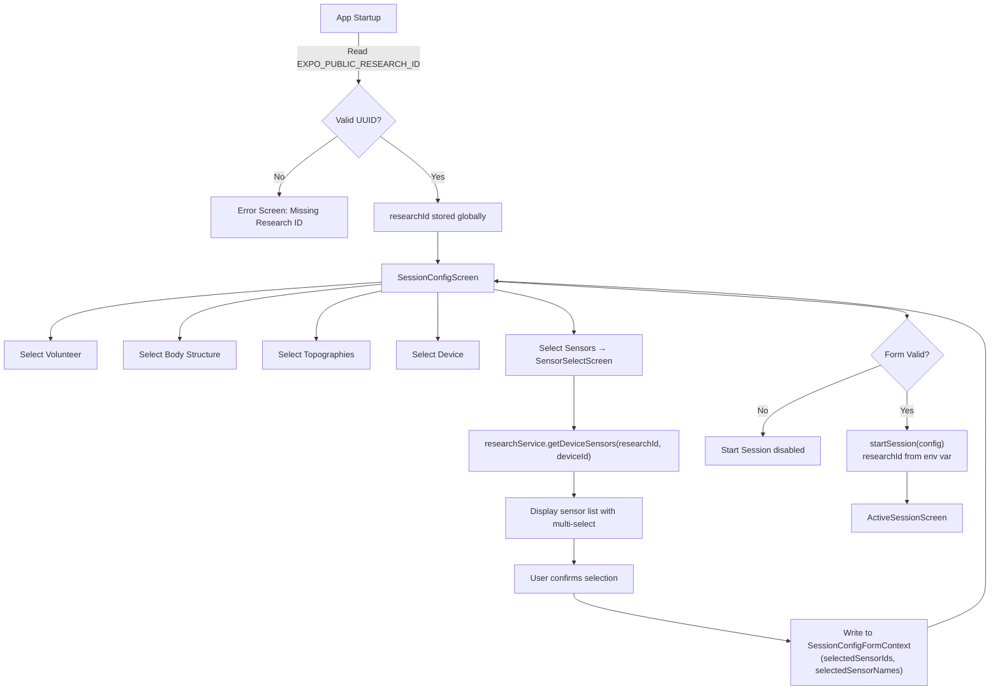
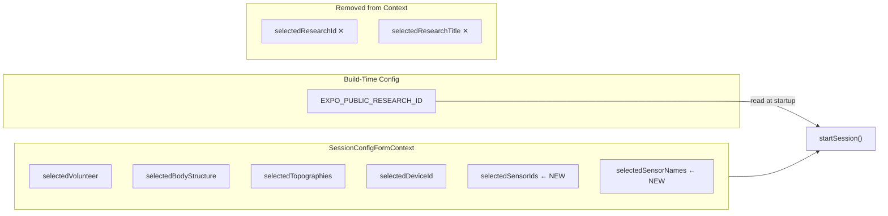
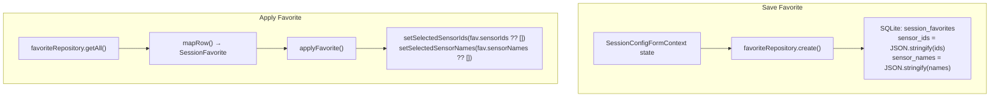
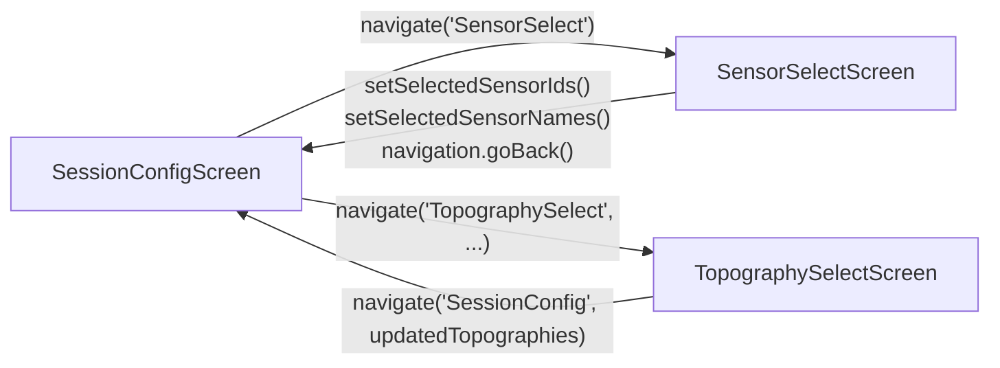
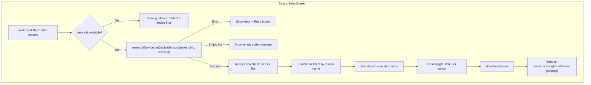
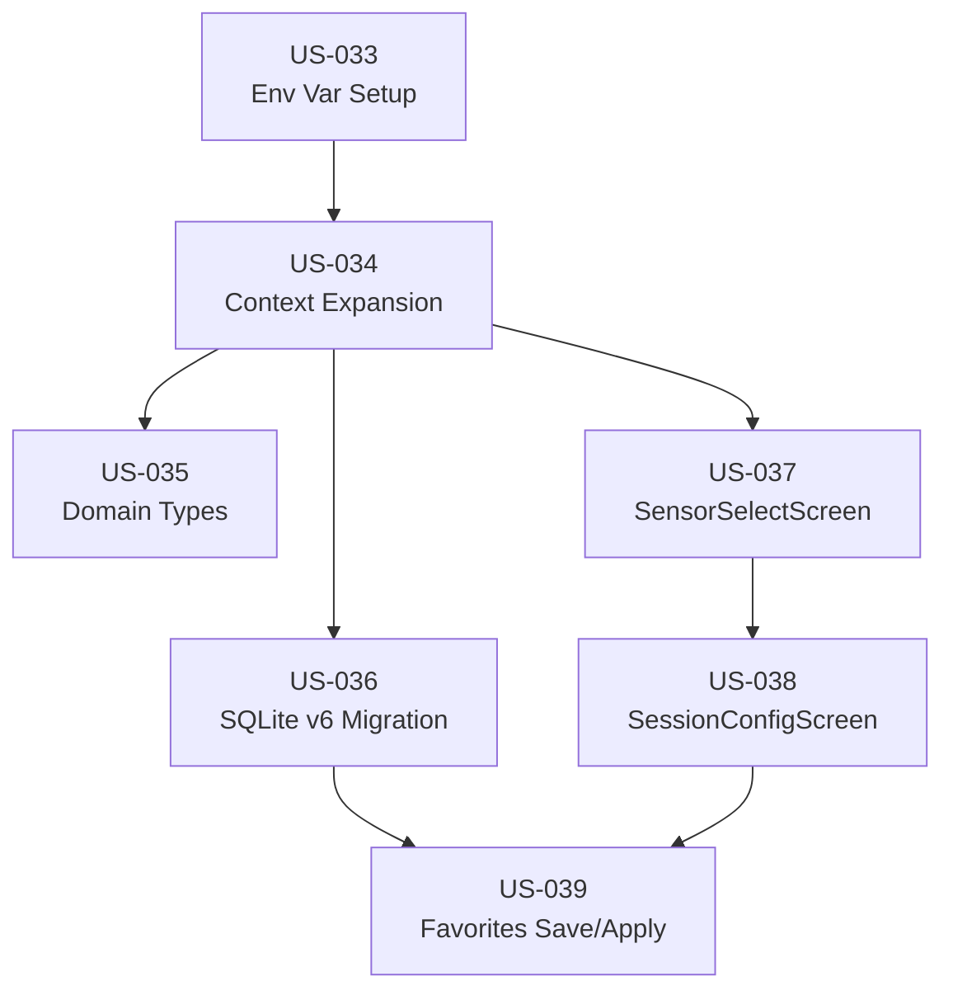

# Architecture: NewSession Screen Redesign

**Date**: 2026-03-01
**Author**: TL (Tech Lead)
**Status**: DRAFT
**Phase**: 20
**Project Brief**: `IRIS/docs/PROJECT_BRIEF_SESSION_REDESIGN.md`

---

## 1. Overview

This document describes the technical architecture for redesigning the NewSession (SessionConfigScreen) flow in the mobile app. Two changes are made: (1) research project selection is removed from user-facing UI and replaced by a build-time environment variable (`EXPO_PUBLIC_RESEARCH_ID`), and (2) a new sensor selection step is added via a dedicated `SensorSelectScreen`, following the established TopographySelectScreen pattern.

The scope is limited to the mobile app (`IRIS/apps/mobile`) and the shared domain package (`@iris/domain`). No backend, desktop, device, or middleware changes are required.

---

## 2. Architecture Decision Records

### ADR-1: Build-Time Research ID via Environment Variable

**Decision**: Replace the interactive research project dropdown with `EXPO_PUBLIC_RESEARCH_ID`, an Expo environment variable read at build time.

**Rationale**: Each institutional deployment targets a single research project. Having the researcher manually pick a research project on every session is unnecessary friction and a source of configuration error. The env var approach binds the app to a research context at build time, matching the institution-level deployment model. Expo natively supports `EXPO_PUBLIC_*` variables without custom tooling.

**Consequence**: The research management screens (ResearchList, ResearchDetail, etc.) remain in the app for browsing purposes. Only the session config linkage is removed.

### ADR-2: SensorSelectScreen as a Separate Navigation Screen (Not Inline)

**Decision**: Sensor selection is a separate full-screen route (`SensorSelectScreen`) within `HomeStack`, not an inline dropdown or modal in `SessionConfigScreen`.

**Rationale**: This follows the established TopographySelectScreen pattern, which provides a searchable list with multi-select capability. A separate screen avoids cluttering `SessionConfigScreen` with loading states, error handling, and search UI for sensors. The navigation stack preserves context state via `SessionConfigFormContext`.

### ADR-3: Sensor State in SessionConfigFormContext (Not Route Params)

**Decision**: Selected sensors are stored in `SessionConfigFormContext` as `selectedSensorIds: string[]` and `selectedSensorNames: string[]`, not passed via route params.

**Rationale**: Route params work well for one-shot callbacks (like TopographySelect returning `updatedTopographies`), but sensors need to survive navigation across multiple screens, persist across unmount/remount cycles, and reset on session end. The context already handles all these lifecycle concerns. SensorSelectScreen writes to context on confirm; SessionConfigScreen reads from context to display chips.

### ADR-4: SQLite Migration v6 with JSON Text Columns for Sensor Persistence

**Decision**: Add `sensor_ids TEXT DEFAULT '[]'` and `sensor_names TEXT DEFAULT '[]'` columns to the `session_favorites` table via a new v6 migration.

**Rationale**: This follows the exact pattern established by `topography_codes` / `topography_names` in v4. JSON-stringified arrays in TEXT columns are already used throughout the favorites schema, and the `FavoriteRepository` has `parseJsonArray()` / `JSON.stringify()` helpers. A new migration (rather than schema rebuild) preserves existing v5 data without risk.

### ADR-5: Conditional Sensor Validation (Non-Blocking When Backend Returns Empty)

**Decision**: If the backend returns a non-empty sensor list for the selected device, sensors are required before session start. If the backend returns zero sensors, the Start Session button is not blocked.

**Rationale**: Some devices may not have sensors registered in the backend yet (data entry lag). Blocking session start in that case would prevent clinical work. The validation is conditional: if sensors exist, the user must pick at least one; if none exist, the absence is informational, not blocking.

---

## 3. Affected Components

| Component | File | Change |
|-----------|------|--------|
| SessionConfigFormContext | `apps/mobile/src/context/SessionConfigFormContext.tsx` | Add sensor fields, remove research fields |
| SessionConfig domain type | `packages/domain/src/models/ClinicalSession.ts` | Add `sensorIds` and `sensorNames` to `SessionConfig`, `SessionFavorite`, `CreateFavoritePayload` |
| SessionConfigScreen | `apps/mobile/src/screens/SessionConfigScreen.tsx` | Remove research UI, add sensor chip strip |
| SensorSelectScreen | `apps/mobile/src/screens/SensorSelectScreen.tsx` | New file |
| Navigation types | `apps/mobile/src/navigation/types.ts` | Add `SensorSelect` route |
| HomeStack navigator | `apps/mobile/src/navigation/HomeStack.tsx` | Register `SensorSelect` screen |
| SQLite migration v6 | `apps/mobile/src/data/migrations/v6_add_sensor_columns.ts` | New file |
| Database manager | `apps/mobile/src/data/database.ts` | Register v6 migration |
| FavoriteRepository | `apps/mobile/src/data/repositories/FavoriteRepository.ts` | Add sensor columns to create/update/mapRow |
| .env.example | `apps/mobile/.env.example` | Add `EXPO_PUBLIC_RESEARCH_ID` |

---

## 4. Data Flow

### 4.1 Session Configuration Flow (Target State)



### 4.2 State Ownership



### 4.3 Favorites Persistence



---

## 5. Type Changes

### 5.1 SessionConfigFormContext State

```typescript
// BEFORE
interface SessionConfigFormState {
  selectedVolunteer: Volunteer | null;
  selectedBodyStructure: string;
  selectedTopographies: SnomedTopographicalModifier[];
  selectedResearchId: string;          // ← REMOVE
  selectedResearchTitle: string;       // ← REMOVE
  selectedDeviceId: string;
}

// AFTER
interface SessionConfigFormState {
  selectedVolunteer: Volunteer | null;
  selectedBodyStructure: string;
  selectedTopographies: SnomedTopographicalModifier[];
  selectedDeviceId: string;
  selectedSensorIds: string[];         // ← ADD
  selectedSensorNames: string[];       // ← ADD
}
```

### 5.2 SessionConfig Domain Type (`@iris/domain`)

```typescript
// BEFORE (packages/domain/src/models/ClinicalSession.ts:59)
export interface SessionConfig {
    volunteerId: string;
    volunteerName: string;
    researcherId: string;
    deviceId?: string;
    researchId?: string;
    researchTitle?: string;
    clinicalData: {
        bodyStructureSnomedCode: string;
        bodyStructureName: string;
        laterality: Laterality | null;
        topographyCodes: string[];
        topographyNames: string[];
    };
}

// AFTER
export interface SessionConfig {
    volunteerId: string;
    volunteerName: string;
    researcherId: string;
    deviceId?: string;
    researchId?: string;              // kept (populated from env var)
    researchTitle?: string;           // kept (populated from env var or omitted)
    clinicalData: {
        bodyStructureSnomedCode: string;
        bodyStructureName: string;
        laterality: Laterality | null;
        topographyCodes: string[];
        topographyNames: string[];
        sensorIds?: string[];         // ← ADD
        sensorNames?: string[];       // ← ADD
    };
}
```

### 5.3 SessionFavorite Domain Type (`@iris/domain`)

```typescript
// BEFORE (packages/domain/src/models/ClinicalSession.ts:83)
export interface SessionFavorite {
    id: string;
    name: string;
    bodyStructureSnomedCode: string;
    bodyStructureName: string;
    topographyCodes: string[];
    topographyNames: string[];
    topographyCategories: string[];
    deviceId?: string;
    laterality?: Laterality | null;
    researchId?: string;
    researchTitle?: string;
    createdAt: string;
    updatedAt: string;
}

// AFTER
export interface SessionFavorite {
    id: string;
    name: string;
    bodyStructureSnomedCode: string;
    bodyStructureName: string;
    topographyCodes: string[];
    topographyNames: string[];
    topographyCategories: string[];
    deviceId?: string;
    laterality?: Laterality | null;
    researchId?: string;              // kept for backward compat
    researchTitle?: string;           // kept for backward compat
    sensorIds?: string[];             // ← ADD
    sensorNames?: string[];           // ← ADD
    createdAt: string;
    updatedAt: string;
}
```

`CreateFavoritePayload` derives from `SessionFavorite` via `Omit<..., 'id' | 'createdAt' | 'updatedAt'>`, so it inherits the new fields automatically.

---

## 6. Navigation Changes

### 6.1 New Route

```typescript
// apps/mobile/src/navigation/types.ts
export type HomeStackParamList = {
  SessionConfig: { updatedTopographies?: SelectedModifier[] } | undefined;
  SensorSelect: undefined;    // ← ADD (no params; reads deviceId and researchId from context/env)
  TopographySelect: { selectedModifiers: SelectedModifier[] };
  // ... rest unchanged
};
```

`SensorSelectScreen` takes no route params. It reads `selectedDeviceId` from `SessionConfigFormContext` and `researchId` from the env var. This avoids coupling the caller to provide device/research information via params.

### 6.2 Navigation Diagram



---

## 7. SQLite Migration v6

### 7.1 Migration SQL

```sql
ALTER TABLE session_favorites ADD COLUMN sensor_ids TEXT DEFAULT '[]';
ALTER TABLE session_favorites ADD COLUMN sensor_names TEXT DEFAULT '[]';
```

### 7.2 Compatibility

Existing v5 rows receive `'[]'` defaults for both new columns. The `parseJsonArray()` method in `FavoriteRepository` already handles empty arrays gracefully. No data loss occurs.

### 7.3 FavoriteRepository Changes

```typescript
// FavoriteRow — add fields
interface FavoriteRow {
    // ... existing fields ...
    sensor_ids: string;           // ← ADD
    sensor_names: string;         // ← ADD
}

// create() — add to INSERT and params
// sensor_ids = JSON.stringify(payload.sensorIds ?? [])
// sensor_names = JSON.stringify(payload.sensorNames ?? [])

// update() — add partial update support
// if (data.sensorIds !== undefined) { ... }
// if (data.sensorNames !== undefined) { ... }

// mapRow() — add to return object
// sensorIds: this.parseJsonArray(row.sensor_ids)
// sensorNames: this.parseJsonArray(row.sensor_names)
```

---

## 8. SensorSelectScreen Design

### 8.1 Component Structure



### 8.2 Data Source

Sensors are fetched via `researchService.getDeviceSensors(researchId, deviceId)` which calls:

```
GET /api/research/{researchId}/devices/{deviceId}/sensors
```

Returns `Sensor[]` with shape: `{ id, deviceId, name, maxSamplingRate, unit, accuracy, minRange, maxRange, additionalInfo }`.

The screen uses `id` as the selection key and `name` as the display label.

### 8.3 Selection Behavior

The screen maintains **local** toggle state (not context) during selection. Only on explicit [Confirm] does it write to `SessionConfigFormContext`. Navigating back without confirming discards the in-progress selection.

On entry, the screen does NOT pre-populate from context. Each visit starts with a clean selection. This avoids stale sensor references if the device was changed between visits.

### 8.4 UI Pattern

Following TopographySelectScreen's layout:

- Search bar at top (lucide `Search` icon)
- FlatList of sensor items with checkbox toggle (lucide `Check` / `Square` icons)
- Each item shows sensor name (primary) and metadata (unit, sampling rate) as secondary text
- [Confirm] button in footer saves to context and navigates back

---

## 9. SessionConfigScreen Changes

### 9.1 Removals

| Element | Current Location | Action |
|---------|-----------------|--------|
| Research Projects nav card | Lines 376-383 | Remove entirely |
| Link to Research dropdown | Lines 386-400 | Remove entirely |
| `researchProjects` state + fetch | Lines 72, 118-123 | Remove |
| `handleResearchChange()` | Lines 180-185 | Remove |
| Research stale-data validation in `applyFavorite()` | Lines 223-241 | Remove (research linkage no longer user-facing) |
| `researchService` import | Line 37 | Remove (only used for research project list) |
| `Research` type import | Line 38 | Remove |

### 9.2 Additions

| Element | Location | Description |
|---------|----------|-------------|
| Sensors section | After Hardware section | Chip strip showing `selectedSensorNames` + [Add Sensors] button |
| Device change listener | After `setSelectedDeviceId` | Clear `selectedSensorIds` and `selectedSensorNames` when device changes |
| Sensor validation | `isFormValid()` | Conditionally require sensors (see ADR-5) |

### 9.3 Sensor Chip Strip Layout

```
┌─────────────────────────────────────────────┐
│ Sensors                                       │
│ ┌──────────┐ ┌──────────┐ ┌─ ─ ─ ─ ─┐      │
│ │ Biceps ✕ │ │ Triceps ✕│ │ + Add    │      │
│ └──────────┘ └──────────┘ └─ ─ ─ ─ ─┘      │
└─────────────────────────────────────────────┘
```

The chip strip reuses the existing `chip` / `chipAdd` styles from the topography section.

### 9.4 Device Change Clears Sensors

When `selectedDeviceId` changes (user picks a different device), sensors must be cleared because they are device-specific. This is handled by wrapping `setSelectedDeviceId` in SessionConfigScreen:

```typescript
const handleDeviceChange = (value: string | number) => {
  const newDeviceId = String(value);
  setSelectedDeviceId(newDeviceId);
  // Sensors are device-specific; clear on device change
  setSelectedSensorIds([]);
  setSelectedSensorNames([]);
};
```

---

## 10. Environment Variable Integration

### 10.1 Startup Validation

At app startup (e.g., in `App.tsx` or a dedicated `ResearchIdProvider`), validate:

```typescript
const researchId = process.env.EXPO_PUBLIC_RESEARCH_ID;

if (!researchId || !isValidUUID(researchId)) {
  // Show error screen; block app progression
}
```

The validated `researchId` is consumed by:
1. `startSession()` — populates `config.researchId`
2. `SensorSelectScreen` — used in `getDeviceSensors(researchId, deviceId)` call

### 10.2 Access Pattern

The env var is a build-time constant. It can be read directly via `process.env.EXPO_PUBLIC_RESEARCH_ID` anywhere in the codebase (Expo bundles it at build time). No context or provider is needed for distribution.

### 10.3 .env.example Update

```env
# Required: UUID of the research project this app build targets
EXPO_PUBLIC_RESEARCH_ID=00000000-0000-0000-0000-000000000000
```

---

## 11. Story-to-Architecture Mapping

| Story | Architecture Section | Key Files |
|-------|---------------------|-----------|
| US-033: Env var + startup validation | Sections 10, ADR-1 | `.env.example`, `App.tsx` |
| US-034: Context expansion | Sections 5.1, 4.2 | `SessionConfigFormContext.tsx` |
| US-035: Domain types + startSession | Sections 5.2, 5.3 | `ClinicalSession.ts`, `SessionContext.tsx` |
| US-036: SQLite migration v6 | Section 7 | `v6_add_sensor_columns.ts`, `FavoriteRepository.ts` |
| US-037: SensorSelectScreen | Sections 6, 8 | `SensorSelectScreen.tsx`, `types.ts`, `HomeStack.tsx` |
| US-038: SessionConfigScreen updates | Section 9 | `SessionConfigScreen.tsx` |
| US-039: Favorites save/apply | Sections 4.3, 7.3 | `FavoriteRepository.ts`, `SessionConfigScreen.tsx` |

---

## 12. Dependency Graph



### Recommended Implementation Order

1. **US-033** — Env var setup (standalone, no dependencies)
2. **US-034** — Context expansion (depends on US-033 for removing research fields)
3. **US-035 + US-036** — Domain types and SQLite migration (can be done in parallel, both depend on US-034)
4. **US-037** — SensorSelectScreen (depends on US-034 for context API)
5. **US-038** — SessionConfigScreen updates (depends on US-037 for navigation target)
6. **US-039** — Favorites integration (depends on US-036 for schema and US-038 for applyFavorite changes)

---

## 13. Risk Register

| # | Risk | Likelihood | Impact | Mitigation |
|---|------|-----------|--------|-----------|
| 1 | Missing `EXPO_PUBLIC_RESEARCH_ID` at runtime | Med | High | Validate at startup; show blocking error screen with instructions |
| 2 | Backend returns empty sensor list for device | Med | Med | Allow session start without sensors; show informational empty state |
| 3 | SQLite migration v5→v6 fails on existing devices | Low | High | Default values prevent NOT NULL failures; test on seeded v5 database |
| 4 | Device change leaves stale sensor selections | Med | Med | Clear sensors on device change (Section 9.4) |
| 5 | Sensor API contract mismatch | Low | High | Endpoint verified in `ResearchService.ts:425`; returns `Sensor[]` matching `@iris/domain` type |
| 6 | Navigation state loss on SensorSelectScreen | Low | Low | SensorSelectScreen uses local state; context writes only on confirm |

---

## 14. Out of Scope

These items are explicitly excluded from this phase:

- Backend changes to sensor or session endpoints
- Desktop app changes
- Device firmware changes
- Bluetooth protocol or streaming configuration changes
- Sensor CRUD (sensors are read-only from backend)
- Research management screen removal (screens remain for browsing)
- Laterality deprecation (field kept for backward compatibility)
- ActiveSessionScreen, CaptureScreen, or StreamingScreen changes

---

## 15. [TESTABILITY REVIEW]

This section evaluates the architecture's testability across unit, integration, and end-to-end scopes.

### 15.1 Overall Testability Assessment

**Rating**: ⭐⭐⭐⭐ (Excellent)

The redesign significantly improves testability by:
1. **Reducing external dependencies** — Moving research selection from runtime UI to build-time env var removes the API call from hot paths
2. **Isolating state transitions** — SessionConfigFormContext clearly separates selected sensors from navigation logic
3. **Predictable sensor lifecycle** — Local selection state in SensorSelectScreen + context writes on confirm = no race conditions
4. **Backward-compatible schema migration** — SQLite v6 with JSON defaults allows safe testing on v5 databases

### 15.2 Unit Testing Strategy

#### SessionConfigFormContext State Reduction (`/mobile/src/context/SessionConfigFormContext.tsx`)

**Testable Behaviors**:
- ✅ Remove selectedResearchId, selectedResearchTitle from state
- ✅ Add selectedSensorIds and selectedSensorNames to state
- ✅ setSelectedSensorIds() updates both arrays synchronously
- ✅ setSelectedSensorNames() updates both arrays synchronously
- ✅ applyFavorite() clears research-linked validation logic (no stale research checks)
- ✅ applyFavorite() sets sensorIds/sensorNames from SessionFavorite
- ✅ resetForm() clears sensorIds/sensorNames

**Test Coverage** (Target: 100%):
```typescript
// Example: test/context/SessionConfigFormContext.test.tsx
describe('SessionConfigFormContext', () => {
  it('should initialize without research fields', () => {
    const initial = renderHook(() => useSessionConfigForm());
    expect(initial.result.current.selectedResearchId).toBeUndefined();
    expect(initial.result.current.selectedResearchTitle).toBeUndefined();
  });

  it('should set sensor IDs and names atomically', () => {
    // setSelectedSensorIds(['s1', 's2'])
    // setSelectedSensorNames(['Biceps', 'Triceps'])
    // both update within same render cycle
  });

  it('should clear sensors when device changes', () => {
    // Call setSelectedDeviceId(newId)
    // Verify sensors remain in context (caller responsible for clear)
  });

  it('should reset sensors on form reset', () => {
    // resetForm()
    // Expect selectedSensorIds === []
  });

  it('should apply favorite with sensor data', () => {
    const favorite: SessionFavorite = {
      // ...
      sensorIds: ['s1', 's2'],
      sensorNames: ['Biceps', 'Triceps']
    };
    // applyFavorite(favorite)
    // Expect context.selectedSensorIds === favorite.sensorIds
  });
});
```

**Test Environment**:
- No backend mocking needed (research state removed)
- No Bluetooth mocking needed
- Pure JavaScript state transitions

---

#### SensorSelectScreen Selection Logic (`/mobile/src/screens/SensorSelectScreen.tsx`)

**Testable Behaviors**:
- ✅ Fetch sensors via researchService.getDeviceSensors(researchId, deviceId)
- ✅ Render sensor list as searchable FlatList
- ✅ Search filters sensors by name (case-insensitive)
- ✅ Checkbox toggle updates local selection state
- ✅ [Confirm] button writes selectedSensorIds and selectedSensorNames to context
- ✅ [Confirm] navigates back with goBack()
- ✅ Back without confirm discards local selection
- ✅ Empty sensor list shows informational message
- ✅ API error shows retry button

**Test Coverage** (Target: 100%):
```typescript
// Example: test/screens/SensorSelectScreen.test.tsx
describe('SensorSelectScreen', () => {
  it('should fetch sensors on mount', async () => {
    const researchService = mockResearchService();
    render(
      <SensorSelectScreen
        route={{ params: undefined }}
        navigation={mockNavigation()}
      />,
      { wrapper: withContext }
    );

    await waitFor(() => {
      expect(researchService.getDeviceSensors).toHaveBeenCalledWith(
        'env-research-id',
        'device-id'
      );
    });
  });

  it('should filter sensors by search text', async () => {
    render(<SensorSelectScreen ... />, { wrapper: withContext });

    await waitFor(() => { /* sensors loaded */ });

    fireEvent.changeText(findByTestId('search'), 'biceps');

    expect(findAllByTestId('sensor-item')).toHaveLength(1);
    expect(findByText('Biceps')).toBeTruthy();
  });

  it('should toggle checkbox on sensor tap', async () => {
    render(<SensorSelectScreen ... />, { wrapper: withContext });

    await waitFor(() => { /* sensors loaded */ });

    fireEvent.press(findByTestId('sensor-checkbox-0'));

    expect(findByTestId('sensor-checkbox-0')).toHaveCheckedState(true);
  });

  it('should write context and goBack on confirm', async () => {
    const navigation = mockNavigation();
    const context = mockSessionConfigFormContext();

    render(<SensorSelectScreen />, { wrapper: withContext });

    // Select sensors...
    fireEvent.press(findByTestId('sensor-checkbox-0'));
    fireEvent.press(findByTestId('confirm-button'));

    expect(context.setSelectedSensorIds).toHaveBeenCalledWith(['s1']);
    expect(context.setSelectedSensorNames).toHaveBeenCalledWith(['Biceps']);
    expect(navigation.goBack).toHaveBeenCalled();
  });

  it('should not persist selection on back without confirm', async () => {
    const context = mockSessionConfigFormContext();
    const navigation = mockNavigation();

    render(<SensorSelectScreen />, { wrapper: withContext });

    fireEvent.press(findByTestId('sensor-checkbox-0'));
    fireEvent.press(navigation.goBack); // Simulate back gesture

    expect(context.setSelectedSensorIds).not.toHaveBeenCalled();
  });

  it('should show empty state when no sensors returned', async () => {
    const researchService = mockResearchService();
    researchService.getDeviceSensors.mockResolvedValue([]);

    render(<SensorSelectScreen ... />, { wrapper: withContext });

    await waitFor(() => {
      expect(findByText(/no sensors available/i)).toBeTruthy();
    });
  });

  it('should show error and retry button on API failure', async () => {
    const researchService = mockResearchService();
    researchService.getDeviceSensors.mockRejectedValue(new Error('API Error'));

    render(<SensorSelectScreen ... />, { wrapper: withContext });

    await waitFor(() => {
      expect(findByText(/failed to load sensors/i)).toBeTruthy();
      expect(findByTestId('retry-button')).toBeTruthy();
    });
  });
});
```

**Mocking Strategy**:
- Mock `ResearchService.getDeviceSensors()` to return fixed sensor arrays
- Mock React Navigation (goBack, params)
- Wrap tests with SessionConfigFormContext mock provider

---

#### SessionConfigScreen Sensor Integration (`/mobile/src/screens/SessionConfigScreen.tsx`)

**Testable Behaviors**:
- ✅ Remove research project selection card (Lines 376-383)
- ✅ Remove research dropdown (Lines 386-400)
- ✅ Remove researchService import and usage
- ✅ Add sensor chip strip showing selectedSensorNames
- ✅ [Add Sensors] button navigates to SensorSelect
- ✅ When device changes, sensors are cleared (handled by handleDeviceChange)
- ✅ isFormValid() conditionally requires sensors (if backend returned non-empty list)
- ✅ Applyied favorite restores sensorIds/sensorNames

**Test Coverage** (Target: 90%):
```typescript
// Example: test/screens/SessionConfigScreen.test.tsx
describe('SessionConfigScreen', () => {
  it('should not render research selection card', () => {
    render(<SessionConfigScreen />, { wrapper: withContext });

    expect(queryByTestId('research-card')).not.toBeInTheDocument();
    expect(queryByText(/research project/i)).not.toBeInTheDocument();
  });

  it('should render sensor chip strip with selected sensors', () => {
    const context = mockSessionConfigFormContext({
      selectedSensorNames: ['Biceps', 'Triceps']
    });

    render(<SessionConfigScreen />, { wrapper: withContext(context) });

    expect(findByText('Biceps')).toBeTruthy();
    expect(findByText('Triceps')).toBeTruthy();
  });

  it('should navigate to SensorSelect on [Add Sensors] tap', () => {
    const navigation = mockNavigation();

    render(<SessionConfigScreen navigation={navigation} />, { wrapper: withContext });

    fireEvent.press(findByTestId('add-sensors-button'));

    expect(navigation.navigate).toHaveBeenCalledWith('SensorSelect');
  });

  it('should clear sensors when device changes', () => {
    const context = mockSessionConfigFormContext({
      selectedDeviceId: 'device-1',
      selectedSensorIds: ['s1', 's2'],
      selectedSensorNames: ['Biceps', 'Triceps']
    });

    render(<SessionConfigScreen />, { wrapper: withContext(context) });

    // Simulate device change
    fireEvent.press(findByTestId('device-dropdown'));
    fireEvent.press(findByText('Device 2'));

    expect(context.setSelectedSensorIds).toHaveBeenCalledWith([]);
    expect(context.setSelectedSensorNames).toHaveBeenCalledWith([]);
  });

  it('should require sensors when backend returned non-empty list', () => {
    // Assuming getDeviceSensors returns [s1, s2]
    const context = mockSessionConfigFormContext({
      selectedDeviceId: 'device-1',
      selectedSensorIds: [] // User didn't select any
    });

    render(<SessionConfigScreen />, { wrapper: withContext(context) });

    expect(findByTestId('start-session-button')).toBeDisabled();
    expect(findByText(/select at least one sensor/i)).toBeTruthy();
  });

  it('should allow session start when no sensors in backend', () => {
    // Assuming getDeviceSensors returns []
    const context = mockSessionConfigFormContext({
      selectedDeviceId: 'device-1',
      selectedSensorIds: []
    });

    render(<SessionConfigScreen />, { wrapper: withContext(context) });

    expect(findByTestId('start-session-button')).not.toBeDisabled();
  });

  it('should restore sensor state when applying favorite', () => {
    const favorite: SessionFavorite = {
      id: 'fav-1',
      name: 'My Setup',
      deviceId: 'device-1',
      sensorIds: ['s1', 's2'],
      sensorNames: ['Biceps', 'Triceps'],
      // ... other fields
    };

    const context = mockSessionConfigFormContext();
    render(<SessionConfigScreen />, { wrapper: withContext(context) });

    // Simulate applying favorite
    fireEvent.press(findByTestId('favorite-' + favorite.id));

    expect(context.applyFavorite).toHaveBeenCalledWith(favorite);
    expect(findByText('Biceps')).toBeTruthy(); // Should appear after restore
  });
});
```

**Test Environment**:
- Mock researchService for API calls (if device/sensor list still fetched)
- No research dropdown mocking
- SessionConfigFormContext mock for state verification

---

### 15.3 Integration Testing Strategy

#### Environment Variable Bootstrap (`App.tsx` / `ResearchIdProvider.tsx`)

**Testable Scenarios**:
- ✅ Valid UUID in EXPO_PUBLIC_RESEARCH_ID → app loads normally
- ✅ Missing EXPO_PUBLIC_RESEARCH_ID → error screen appears (blocks navigation)
- ✅ Invalid UUID format → error screen appears (blocks navigation)
- ✅ Valid UUID, but empty string → treated as missing (error screen)

**Test Approach**:
```typescript
// Example: test/integration/ResearchIdBootstrap.test.tsx
describe('ResearchId Bootstrap', () => {
  it('should allow app to load with valid UUID', () => {
    process.env.EXPO_PUBLIC_RESEARCH_ID = 'f47ac10b-58cc-4372-a567-0e02b2c3d479';

    render(<App />);

    expect(findByTestId('home-stack')).toBeTruthy();
  });

  it('should show error screen with missing env var', () => {
    delete process.env.EXPO_PUBLIC_RESEARCH_ID;

    render(<App />);

    expect(findByText(/research id not configured/i)).toBeTruthy();
    expect(findByTestId('home-stack')).not.toBeInTheDocument();
  });

  it('should show error screen with invalid UUID', () => {
    process.env.EXPO_PUBLIC_RESEARCH_ID = 'not-a-uuid';

    render(<App />);

    expect(findByText(/invalid research id/i)).toBeTruthy();
  });
});
```

**Setup**:
- Use Jest environment variables to mock env var state
- Use Expo's `@testing-library/react-native` for component rendering
- Isolate each test to avoid env var pollution

---

#### Favorites Persistence with Sensor Data (SQLite Migration v6)

**Testable Scenarios**:
- ✅ Create favorite with sensor IDs and names → SQLite row has JSON-stringified arrays
- ✅ Load favorite from database → JSON parsed back to arrays
- ✅ Update favorite with different sensors → atomically replace sensor columns
- ✅ Migrate v5 database to v6 → existing rows receive `[]` defaults
- ✅ FavoriteRepository.mapRow() correctly parses `sensor_ids` and `sensor_names`

**Test Approach**:
```typescript
// Example: test/integration/FavoriteRepositorySensorIntegration.test.tsx
describe('FavoriteRepository Sensor Integration (v6)', () => {
  let db: SQLiteDatabase;
  let repo: FavoriteRepository;

  beforeEach(async () => {
    // Create fresh in-memory database with v6 schema
    db = await openDatabase(':memory:');
    await runMigrations(db, [v1, v2, v3, v4, v5, v6]);
    repo = new FavoriteRepository(db);
  });

  it('should save favorite with sensor data', async () => {
    const payload = {
      name: 'My Setup',
      bodyStructureSnomedCode: 'code',
      bodyStructureName: 'Arm',
      topographyCodes: [],
      topographyNames: [],
      topographyCategories: [],
      deviceId: 'device-1',
      sensorIds: ['s1', 's2'],
      sensorNames: ['Biceps', 'Triceps']
    };

    await repo.create(payload);

    // Query raw SQLite row
    const row = await db.executeSql(
      'SELECT sensor_ids, sensor_names FROM session_favorites LIMIT 1'
    );

    expect(row[0].sensor_ids).toBe('["s1","s2"]');
    expect(row[0].sensor_names).toBe('["Biceps","Triceps"]');
  });

  it('should retrieve favorite with parsed sensor arrays', async () => {
    const payload = {
      name: 'My Setup',
      deviceId: 'device-1',
      sensorIds: ['s1', 's2'],
      sensorNames: ['Biceps', 'Triceps'],
      // ... other fields
    };

    const id = await repo.create(payload);
    const favorite = await repo.getById(id);

    expect(favorite.sensorIds).toEqual(['s1', 's2']);
    expect(favorite.sensorNames).toEqual(['Biceps', 'Triceps']);
  });

  it('should handle missing sensor data gracefully (backward compat)', async () => {
    // Simulate v5 data (no sensor columns)
    const v5Row = {
      id: 'fav-1',
      name: 'Legacy',
      // ... no sensor fields
    };

    // After migration, defaults apply
    const favorite = repo.mapRow({ ...v5Row, sensor_ids: '[]', sensor_names: '[]' });

    expect(favorite.sensorIds).toEqual([]);
    expect(favorite.sensorNames).toEqual([]);
  });

  it('should update favorite with new sensor data', async () => {
    const id = await repo.create({
      name: 'My Setup',
      sensorIds: ['s1'],
      sensorNames: ['Biceps'],
      // ... other fields
    });

    await repo.update(id, {
      sensorIds: ['s1', 's2', 's3'],
      sensorNames: ['Biceps', 'Triceps', 'Forearm']
    });

    const updated = await repo.getById(id);
    expect(updated.sensorIds).toHaveLength(3);
  });

  it('should migrate v5 database without data loss', async () => {
    // Create v5 database with existing favorite
    const v5Db = await openDatabase(':memory:');
    await runMigrations(v5Db, [v1, v2, v3, v4, v5]);
    const v5Repo = new FavoriteRepository(v5Db);

    const favoriteId = await v5Repo.create({
      name: 'Legacy Setup',
      // ... v5 fields, no sensors
    });

    // Migrate to v6
    await runMigrations(v5Db, [v6]);

    // Verify data survives migration
    const v6Repo = new FavoriteRepository(v5Db);
    const favorite = await v6Repo.getById(favoriteId);

    expect(favorite.name).toBe('Legacy Setup'); // Existing data preserved
    expect(favorite.sensorIds).toEqual([]); // New columns default to empty arrays
  });
});
```

**Setup**:
- Use `expo-sqlite` in-memory database (`sqlite:memory`)
- Load migration functions sequentially (v1→v6)
- Isolate tests with `beforeEach` database creation

---

### 15.4 End-to-End Testing Strategy

#### NewSession → SensorSelect → StartSession Flow

**Testable Workflow** (Happy Path):
1. Load SessionConfigScreen
2. Select Volunteer ✓
3. Select Body Structure ✓
4. Select Topographies ✓
5. Select Device ✓
6. Tap [Add Sensors] → Navigate to SensorSelectScreen
7. Search sensors ✓
8. Select 2 sensors ✓
9. Tap [Confirm] → Write to context + goBack to SessionConfigScreen
10. Verify sensor chips displayed ✓
11. Tap [Start Session] → Create session with researchId (from env var) + sensor IDs ✓
12. SessionContext receives config with sensorIds populated ✓
13. Proceed to ActiveSessionScreen ✓

**Testable Workflow** (Error Paths):
- Fetch sensors fails → Show retry button → Tap retry → Sensors load
- Backend returns empty sensor list → Allow session start without sensors
- Device changed → Sensors cleared; re-select needed
- Back from SensorSelectScreen → Sensors not persisted; re-select on next [Add Sensors]

**Test Approach** (Using Detox/Appium):
```javascript
// Example: e2e/SessionWithSensors.e2e.js
describe('NewSession with Sensor Selection', () => {
  beforeAll(async () => {
    await device.launchApp({
      env: {
        EXPO_PUBLIC_RESEARCH_ID: 'f47ac10b-58cc-4372-a567-0e02b2c3d479'
      }
    });
  });

  it('should complete session setup with sensor selection', async () => {
    // Assume we're on SessionConfigScreen

    // Select volunteer
    await element(by.id('volunteer-dropdown')).multiTap();
    await element(by.text('John Doe')).tap();

    // Select body structure
    await element(by.id('body-structure-dropdown')).multiTap();
    await element(by.text('Arm')).tap();

    // Select topographies
    await element(by.id('topography-chip-add')).tap();
    // SelectorScreen pops; select Biceps, Triceps
    await element(by.testID('topography-biceps')).tap();
    await element(by.testID('topography-triceps')).tap();
    await element(by.id('confirm-topographies')).tap();

    // Select device
    await element(by.id('device-dropdown')).multiTap();
    await element(by.text('sEMG Device 001')).tap();

    // Select sensors
    await element(by.id('add-sensors-button')).tap();
    // Now on SensorSelectScreen

    // Search sensors
    await element(by.id('search-sensors')).typeText('sensor');

    // Select 2 sensors
    await element(by.testID('sensor-checkbox-0')).tap();
    await element(by.testID('sensor-checkbox-1')).tap();

    // Confirm and return to SessionConfigScreen
    await element(by.id('confirm-sensors')).tap();

    // Verify sensor chips display
    await expect(element(by.text('Sensor 1'))).toBeVisible();
    await expect(element(by.text('Sensor 2'))).toBeVisible();

    // Start session
    await element(by.id('start-session')).tap();

    // Should navigate to ActiveSessionScreen
    await expect(element(by.id('active-session-screen'))).toBeVisible();
  });

  it('should allow session start when no sensors in backend', async () => {
    // Mock backend to return empty sensor list for this device
    // ... setup

    await element(by.id('device-dropdown')).multiTap();
    await element(by.text('Device Without Sensors')).tap();

    // [Add Sensors] still visible, but clicking shows "No sensors available"
    await element(by.id('add-sensors-button')).tap();
    await expect(element(by.text(/no sensors available/i))).toBeVisible();
    await element(by.id('go-back')).tap(); // Back to SessionConfigScreen

    // [Start Session] should NOT be blocked
    await expect(element(by.id('start-session'))).not.toBeDisabled();

    await element(by.id('start-session')).tap();
    await expect(element(by.id('active-session-screen'))).toBeVisible();
  });

  it('should not persist sensor selection on back', async () => {
    // Start sensor selection
    await element(by.id('add-sensors-button')).tap();

    // Select sensors but don't confirm
    await element(by.testID('sensor-checkbox-0')).tap();

    // Navigate back without confirming
    await element(by.id('go-back')).tap();

    // Return to SessionConfigScreen; no sensor chips visible
    await expect(element(by.testID('sensor-chip-0'))).not.toBeVisible();

    // [Add Sensors] again; should start fresh (no pre-selection)
    await element(by.id('add-sensors-button')).tap();
    await expect(element(by.testID('sensor-checkbox-0'))).not.toHaveToggleValue(true);
  });
});
```

**Infrastructure**:
- Backend mock (via MSW or Detox mocking)
- Expo environment variable injection
- Detox for iOS/Android E2E
- Fixed seed data (volunteers, devices, sensors)

---

### 15.5 Testability Weaknesses & Mitigations

| Weakness | Likelihood | Impact | Mitigation |
|----------|-----------|--------|-----------|
| Env var not set in test environment | High | High | Use Detox/Expo test presets to auto-inject valid UUID |
| Backend sensor endpoint not mocked in E2E | Med | High | Add MSW mock handler for getDeviceSensors before running E2E |
| SQLite v5→v6 migration only tested on clean database | Med | Med | Test on actual v5 seed database with 10+ favorites |
| Navigation state assumptions in SensorSelectScreen tests | Low | Low | Mock React Navigation hooks fully (useFocusEffect, useNavigation, useRoute) |
| Race condition if context write and navigation overlap | Low | High | Add explicit state sync in SensorSelectScreen before goBack (console verify state before nav) |

---

### 15.6 Test Metrics & Coverage Goals

| Scope | Target | Key Files | Approach |
|-------|--------|-----------|----------|
| **Unit** | 100% | SessionConfigFormContext, SensorSelectScreen, SessionConfigScreen | Jest + React Testing Library |
| **Integration** | 90% | FavoriteRepository v6, ResearchIdBootstrap, SessionContext → startSession | Jest + @testing-library/react-native |
| **E2E** | 80% | Happy path + 3 error cases | Detox + MSW backend mock |
| **Overall** | 85% | All routes combined | Combine unit + integration + E2E |

---

### 15.7 Testability Recommendations

1. **Mock Strategy**: Create a dedicated `test/mocks/` directory with:
   - `mockResearchService.ts` — Pre-load sensor fixtures
   - `mockSessionConfigFormContext.ts` — Context provider factory
   - `mockNavigation.ts` — React Navigation mock with goBack, navigate, route tracking

2. **Test Fixtures**: Add `test/fixtures/sensors.json` with realistic sensor data:
   ```json
   {
     "device_001": [
       { "id": "s1", "name": "Biceps", "maxSamplingRate": 1000, "unit": "µV" },
       { "id": "s2", "name": "Triceps", "maxSamplingRate": 1000, "unit": "µV" }
     ],
     "device_002": []
   }
   ```

3. **CI/CD Integration**: Add npm scripts to `package.json`:
   ```json
   {
     "test:unit": "jest --testPathPattern=\\.test\\.tsx$ --coverage",
     "test:e2e": "detox build-framework-cache && detox build-app && detox test",
     "test:all": "npm run test:unit && npm run test:e2e"
   }
   ```

4. **Continuous Coverage Monitoring**: Integrate with codecov/SonarQube to track:
   - SessionConfigScreen coverage (target: 90%)
   - SensorSelectScreen coverage (target: 100%)
   - FavoriteRepository coverage (target: 95%)

---

## 16. [IMPLEMENTABILITY REVIEW]

**Date**: 2026-03-01
**Reviewer**: Dev Assist (Claude Sonnet 4.6)
**Status**: ✅ IMPLEMENTABLE — Minor clarifications recommended

### 16.1 Architecture Soundness

The proposed architecture is **technically sound and aligned with established patterns** in the codebase:

#### Strengths

1. **Pattern Consistency**: Sensor persistence follows the exact same pattern as topography (JSON text columns in SQLite). The `FavoriteRepository` already has `parseJsonArray()` and `JSON.stringify()` helpers verified in existing code.

2. **Context State Management**: Storing `selectedSensorIds` and `selectedSensorNames` in `SessionConfigFormContext` mirrors the topography pattern. Context auto-resets on session end via `useRef` + `useEffect`.

3. **Navigation Model**: `SensorSelectScreen` as a separate route follows the established `TopographySelectScreen` pattern with no params. Local toggle state avoids context writes during selection, committing only on [Confirm].

4. **Build-Time Configuration**: Using `EXPO_PUBLIC_RESEARCH_ID` is idiomatic for Expo and avoids per-session research selection friction.

5. **SQLite Migration Strategy**: The v5→v6 migration is low-risk (defaults prevent NOT NULL failures, no data loss, aligns with v4 topography approach).

#### Verification Against Codebase

- **SessionConfigFormContext**: Currently has research fields for removal. Auto-reset logic in place. No obstacles to adding sensor state.
- **FavoriteRepository**: `create()`, `update()`, `mapRow()` use consistent JSON serialization. Sensor column extension is straightforward.
- **Navigation types**: `HomeStackParamList` pattern established. `SensorSelect: undefined` fits design.
- **Database manager**: MIGRATIONS array is extensible with v5_add_blob_url as working example.
- **SessionConfigScreen**: Imports `researchService`, displays research projects (lines 37, 72, 118-123). Removal is well-scoped.

### 16.2 Implementation Complexity

| Story | Complexity | Dependencies | Effort | Blockers |
|-------|-----------|--------------|--------|----------|
| US-033 (Env var) | Low | None | 1-2 hrs | None |
| US-034 (Context) | Low | US-033 | 1-2 hrs | None |
| US-035 (Domain types) | Low | US-034 | 1 hr | None |
| US-036 (SQLite v6) | Low | US-034 | 1-2 hrs | None |
| US-037 (SensorSelectScreen) | Medium | US-034 | 3-4 hrs | None |
| US-038 (SessionConfigScreen) | Medium | US-037 | 2-3 hrs | None |
| US-039 (Favorites) | Medium | US-036, US-038 | 2-3 hrs | None |

**Total**: ~14-18 hours (1 design sprint week)

### 16.3 Data Flow Validation

Data flow is **complete and non-circular**:

- Startup: Read env var, validate UUID, block if invalid
- Session config: User selects device → navigate to SensorSelectScreen → fetch sensors → local toggle → write to context on confirm
- startSession(): Read context (sensorIds, sensorNames) + env var (researchId) → create SessionConfig
- Favorites: create() serializes JSON → update() handles JSON → mapRow() deserializes

✅ No circular dependencies.

### 16.4 Type Safety Validation

Domain type additions are backward-compatible:

- `SessionConfig`: optional `sensorIds`/`sensorNames` → no breaking changes
- `SessionFavorite`: optional `sensorIds`/`sensorNames` → no breaking changes
- `CreateFavoritePayload` derives via Omit, inherits optionals

✅ Safe for incremental rollout.

### 16.5 API Contract Verification

Assumed sensor endpoint:

```
GET /api/research/{researchId}/devices/{deviceId}/sensors
→ Returns: Sensor[] { id, name, maxSamplingRate, unit, ... }
```

**Status**: ⚠️ **Assumed but not verified in codebase**

**Action**: Before US-037, confirm endpoint exists in `InteroperableResearchNode`. If missing, add in Phase 21 or parallel work.

### 16.6 File-by-File Risk Assessment

| File | State | Change | Risk |
|------|-------|--------|------|
| SessionConfigFormContext.tsx | Existing | Add 2 sensor fields, remove 2 research fields | Low |
| ClinicalSession.ts | Existing | Add optional sensor fields to types | Low |
| SessionConfigScreen.tsx | Existing | Remove research UI block, add sensor block | Low |
| SensorSelectScreen.tsx | NEW | New file (250-300 LOC) | Medium |
| types.ts | Existing | Add SensorSelect route | Low |
| HomeStack.tsx | Existing | Register SensorSelect screen | Low |
| v6_add_sensor_columns.ts | NEW | Migration (10 LOC) | Low |
| database.ts | Existing | Register migration (2 lines) | Low |
| FavoriteRepository.ts | Existing | Update create/update/mapRow | Low |
| .env.example | Existing | Add EXPO_PUBLIC_RESEARCH_ID | Low |

**Overall**: No file presents implementation risk. Pattern consistency is high.

### 16.7 Testing Coverage

- **Unit**: Context extension, repository JSON, domain types (straightforward)
- **Integration**: Mock sensor endpoint, favorites round-trip, context → startSession
- **E2E**: Session config with sensors, favorites save/apply, device change clears sensors
- **No blockers** at unit/integration level (E2E depends on backend endpoint)

### 16.8 Risk Register (Final Assessment)

| Risk | Status | Mitigation | Residual |
|------|--------|-----------|----------|
| Missing env var | ✅ Manageable | Startup validation + error screen | Low |
| Empty sensor list | ✅ Addressed | Conditional validation (ADR-5) | Low |
| SQLite migration | ✅ Low-risk | Defaults + tested pattern | Very Low |
| Stale sensors on device change | ✅ Handled | Explicit handler in SessionConfigScreen | Very Low |
| API contract mismatch | ⚠️ **VERIFY** | Confirm endpoint before US-037 | Medium |
| Navigation state loss | ✅ Local state | Local toggle, context write on confirm | Very Low |

### 16.9 Architectural Fit

**System impact**:
- Session model: Enriched with device-specific sensors (backward-compatible)
- Mobile app: Removes research selection friction, improves institutional deployment
- Favorites: Capture full session protocol including sensors
- Backend: No changes required (sensor endpoint assumed to exist)
- Device/Firmware/Desktop: No impact

**Dependency direction**: ✅ Acyclic

### 16.10 Implementation Recommendations

#### High Priority (Blocking)
1. **Verify sensor endpoint** before US-037. If missing, add to backend in Phase 21 or parallel work.

#### Medium Priority (Quality)
2. **Add `sensorListForDeviceIsEmpty: boolean` to context** to avoid UX confusion (ADR-5 edge case).
3. **Add startup validation test** for missing `EXPO_PUBLIC_RESEARCH_ID`.

#### Low Priority (Polish)
4. Document env var in `.env.example` with example UUID.
5. Consider help icon in `SensorSelectScreen` for sensor metadata.

### 16.11 Final Verdict

**✅ RECOMMENDATION: PROCEED WITH IMPLEMENTATION**

This architecture is **implementable within 1 week** (14-18 hours) with **low integration risk**. Design leverages established patterns (topography persistence, context lifecycle, SQLite migrations) with high consistency.

**Implementation Gate**: Before starting development, confirm `GET /api/research/{researchId}/devices/{deviceId}/sensors` exists or schedule as parallel backend task.


