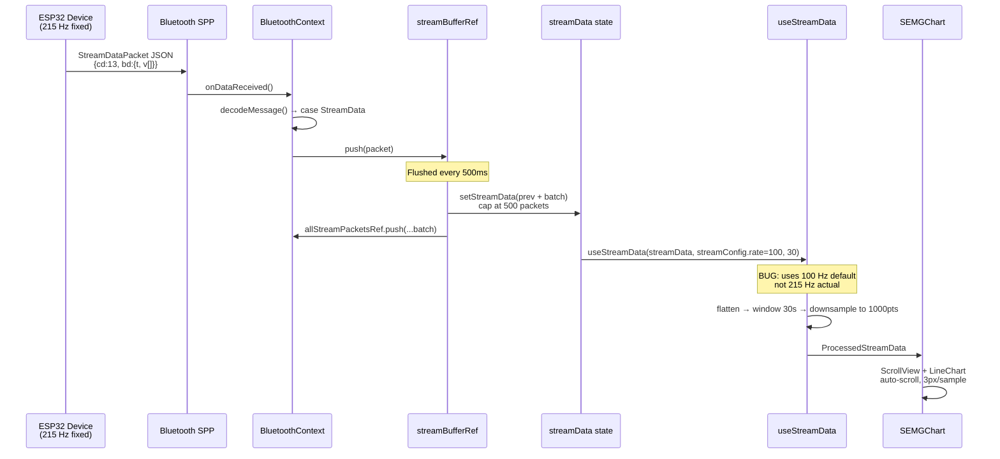
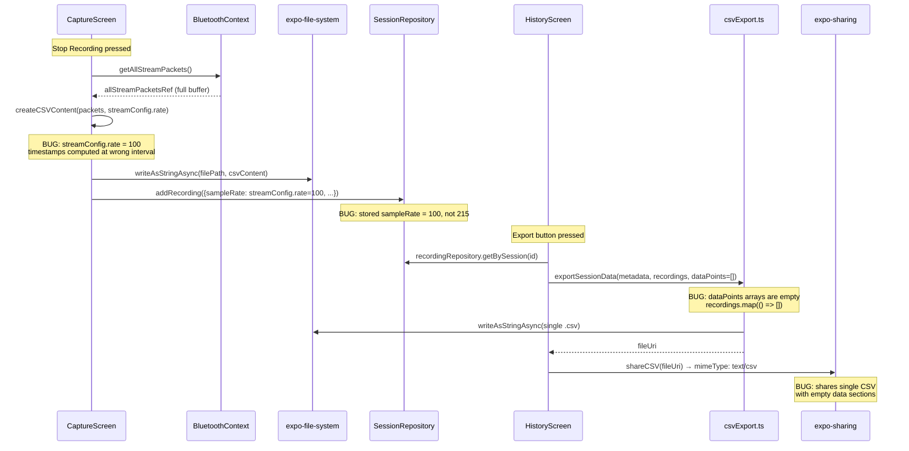
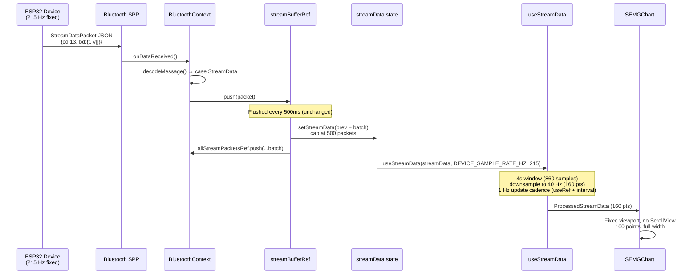
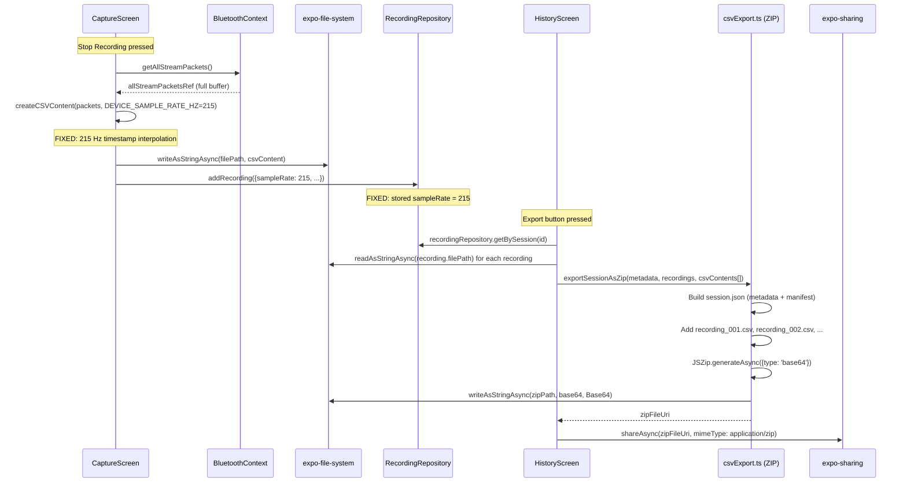

# Architecture: Stream Data Fixes

**Date**: 2026-02-17
**Status**: DRAFT
**Brief**: `docs/PROJECT_BRIEF_STREAM_FIXES.md`
**Backlog**: `agent_docs/backlog/backlog.json` (11 stories, US-001 through US-011)

---

## 1. Current State Analysis

### 1.1 Streaming Data Flow (Current)



### 1.2 Recording & Export Flow (Current)



---

## 2. Target State Architecture

### 2.1 Streaming Data Flow (Fixed)



### 2.2 Recording & Export Flow (Fixed)



---

## 3. Component-Level Change Specifications

### 3.1 WA1: Domain Constants (`packages/domain/src/models/Stream.ts`)

**Stories**: US-001

Add two constants at the top of the file, after the imports (if any):

```typescript
/** Fixed ADC sample rate of the ESP32 sEMG device (860 Hz raw / 4x downsample). */
export const DEVICE_SAMPLE_RATE_HZ = 215;

/** Target display rate for chart rendering (points per second). */
export const CHART_DISPLAY_RATE_HZ = 40;

/** Duration in seconds of the chart sliding window. */
export const CHART_WINDOW_SECONDS = 4;

/** Simulation mode sample rate (Hz). */
export const SIMULATION_SAMPLE_RATE_HZ = 50;
```

The `StreamConfiguration` interface comment should be updated to note that `rate` is informational for real devices (always 215 Hz) and only variable in simulation mode.

No breaking changes to existing interfaces.

### 3.2 WA2: BluetoothContext Rate Fix (`apps/mobile/src/context/BluetoothContext.tsx`)

**Stories**: US-002

**Change 1**: Import the new constant.

```typescript
import {
    // ... existing imports ...
    DEVICE_SAMPLE_RATE_HZ,
    SIMULATION_SAMPLE_RATE_HZ
} from '@iris/domain';
```

**Change 2**: Update the `streamConfig` default initialization (line 57-59).

```typescript
// Before:
const [streamConfig, setStreamConfig] = useState<StreamConfiguration>({
    rate: 100,
    type: 'filtered'
});

// After:
const [streamConfig, setStreamConfig] = useState<StreamConfiguration>({
    rate: DEVICE_SAMPLE_RATE_HZ,
    type: 'filtered'
});
```

**Change 3**: The `configureStream()` function (line 480-497) sends the rate to the device but the device ignores it. The function should still update `streamConfig.type` (user-selected) but force `rate` to `DEVICE_SAMPLE_RATE_HZ` when a device is connected. Since `configureStream` is only called from `StreamConfigScreen`, and the rate picker will be removed, this change ensures correctness regardless:

```typescript
async function configureStream(rate: number, type: StreamType): Promise<void> {
    try {
        const payload: BluetoothProtocolPayload = {
            cd: BluetoothProtocolFunction.ConfigStream,
            mt: BluetoothProtocolMethod.WRITE,
            bd: {
                rate: DEVICE_SAMPLE_RATE_HZ,
                type: type
            }
        };

        setStreamConfig({ rate: DEVICE_SAMPLE_RATE_HZ, type });
        await writeToBluetooth(JSON.stringify(payload));
        console.log(`Stream configured: ${DEVICE_SAMPLE_RATE_HZ}Hz, type: ${type}`);
    } catch (error) {
        console.error("Error configuring stream:", error);
    }
}
```

**Risk R3 mitigation**: Simulation mode in `CaptureScreen` creates its own data at 50 Hz with its own interval. It does not use `streamConfig.rate` for generation — it hardcodes `50` in the simulation interval. The only consumer of `streamConfig.rate` in simulation context is the `calculateMetrics` display, which already branches on `selectedDevice` to use `50`. The `useStreamData` calls pass explicit rate arguments. Therefore changing the default to 215 does not break simulation mode.

### 3.3 WA3: StreamConfigScreen Simplification (`apps/mobile/src/screens/StreamConfigScreen.tsx`)

**Stories**: US-003

**Change 1**: Import the constant.

```typescript
import { StreamType, DEVICE_SAMPLE_RATE_HZ } from '@iris/domain';
```

**Change 2**: Remove the `SAMPLING_RATES` array (line 20) and the `selectedRate` state (line 45). Replace the rate picker section (lines 97-125) with a read-only display:

```tsx
<View style={styles.section}>
    <Text style={styles.sectionTitle}>Sampling Rate</Text>
    <Text style={styles.sectionDescription}>
        Fixed at {DEVICE_SAMPLE_RATE_HZ} Hz by the ESP32 device hardware
    </Text>
    <View style={styles.readOnlyBox}>
        <Text style={styles.readOnlyValue}>{DEVICE_SAMPLE_RATE_HZ} Hz</Text>
        <Text style={styles.readOnlyHint}>Hardware-defined, not configurable</Text>
    </View>
</View>
```

**Change 3**: Update `handleSave()` to always pass `DEVICE_SAMPLE_RATE_HZ`:

```typescript
const handleSave = async () => {
    try {
        await configureStream(DEVICE_SAMPLE_RATE_HZ, selectedType);
        navigation.navigate('Streaming');
    } catch (error) {
        // ... existing error handling
    }
};
```

**Change 4**: Update the Configuration Summary to show fixed 215 Hz. Remove the `requiresHighSpeed` variable and baud rate warning — irrelevant at fixed 215 Hz since the device always uses 115200 baud.

**Change 5**: Add `readOnlyBox` and `readOnlyValue` styles. Remove `pickerContainer`, `picker`, `warningBox`, `warningText` styles.

**Risk R5 mitigation**: The screen is preserved (not removed). Navigation flow intact. Only the rate picker is replaced with a static display.

### 3.4 WA4: CaptureScreen CSV & Recording Fix (`apps/mobile/src/screens/CaptureScreen.tsx`)

**Stories**: US-004

**Change 1**: Import constants.

```typescript
import {
    StreamDataPacket,
    ChartDataPoint,
    NewRecordingData,
    DEVICE_SAMPLE_RATE_HZ,
    SIMULATION_SAMPLE_RATE_HZ
} from '@iris/domain';
```

**Change 2**: In `handleStopRecording()`, replace `streamConfig.rate` usage with the constant (lines 203-204):

```typescript
// Before:
const sampleRate = selectedDevice ? streamConfig.rate : 50;

// After:
const sampleRate = selectedDevice ? DEVICE_SAMPLE_RATE_HZ : SIMULATION_SAMPLE_RATE_HZ;
```

**Change 3**: Similarly, the `recordingData.sampleRate` assignment (line 231) is already derived from `sampleRate` local variable, so no additional change needed — the variable above fixes it.

**Change 4**: The `createCSVContent` function (lines 355-367) accepts `sampleRate` as a parameter and computes `intervalMs = 1000 / sampleRate`. Since the caller now passes `DEVICE_SAMPLE_RATE_HZ` (215), the timestamps will be correctly spaced at ~4.65ms intervals. No change needed to the function body itself.

**Change 5**: In `calculateMetrics()` (line 152), replace:

```typescript
frequency: selectedDevice ? streamConfig.rate : 50,
// with:
frequency: selectedDevice ? DEVICE_SAMPLE_RATE_HZ : SIMULATION_SAMPLE_RATE_HZ,
```

### 3.5 WA5: Chart Visualization Fix

#### 3.5.1 `useStreamData` Hook (`apps/mobile/src/hooks/useStreamData.ts`)

**Stories**: US-005

This is the most significant refactor. The hook currently:
- Uses `useMemo` keyed on `streamData` (re-computes on every flush, ~2x/sec)
- Keeps a 30-second window
- Downsamples to 1000 points max
- Has no update cadence throttling

The target behavior:
- 4-second sliding window (~860 samples at 215 Hz)
- Downsample to 40 Hz output (160 points for 4 seconds)
- 1 Hz update cadence (re-render chart once per second)

**New implementation approach**:

Replace the single `useMemo` with a `useRef`-based approach that throttles output updates to 1 Hz:

```typescript
import { useState, useRef, useEffect, useCallback } from 'react';
import {
    StreamDataPacket,
    ChartDataPoint,
    ProcessedStreamData,
    DEVICE_SAMPLE_RATE_HZ,
    CHART_DISPLAY_RATE_HZ,
    CHART_WINDOW_SECONDS
} from '@iris/domain';

const EMPTY_RESULT: ProcessedStreamData = {
    chartData: [],
    totalSamples: 0,
    minValue: 0,
    maxValue: 0,
    avgValue: 0,
    duration: 0
};

const UPDATE_INTERVAL_MS = 1000; // 1 Hz refresh

export function useStreamData(
    streamData: StreamDataPacket[],
    sampleRate: number = DEVICE_SAMPLE_RATE_HZ
): ProcessedStreamData {
    const [output, setOutput] = useState<ProcessedStreamData>(EMPTY_RESULT);
    const lastUpdateRef = useRef<number>(0);
    const intervalRef = useRef<ReturnType<typeof setInterval> | null>(null);
    const latestDataRef = useRef<StreamDataPacket[]>(streamData);

    // Keep a ref to the latest streamData to avoid stale closures
    latestDataRef.current = streamData;

    const processData = useCallback(() => {
        const data = latestDataRef.current;
        if (data.length === 0) {
            setOutput(EMPTY_RESULT);
            return;
        }

        // Step 1: Flatten all packets into individual samples
        const flatSamples: { timestamp: number; value: number }[] = [];
        const intervalMs = 1000 / sampleRate;

        for (const packet of data) {
            for (let i = 0; i < packet.values.length; i++) {
                flatSamples.push({
                    timestamp: packet.timestamp + i * intervalMs,
                    value: packet.values[i]
                });
            }
        }

        // Step 2: Keep only last 4 seconds worth of samples
        const maxSamples = sampleRate * CHART_WINDOW_SECONDS;
        const windowed = flatSamples.slice(-maxSamples);

        if (windowed.length === 0) {
            setOutput(EMPTY_RESULT);
            return;
        }

        // Step 3: Downsample to CHART_DISPLAY_RATE_HZ (40 Hz)
        // Every Nth sample, where N = sampleRate / displayRate
        const downsampleStep = Math.max(1, Math.round(sampleRate / CHART_DISPLAY_RATE_HZ));
        const baseTimestamp = windowed[0].timestamp;
        const chartData: ChartDataPoint[] = [];

        for (let i = 0; i < windowed.length; i += downsampleStep) {
            chartData.push({
                x: (windowed[i].timestamp - baseTimestamp) / 1000,
                y: windowed[i].value
            });
        }

        // Step 4: Statistics
        const values = windowed.map(s => s.value);
        const minValue = Math.min(...values);
        const maxValue = Math.max(...values);
        const avgValue = values.reduce((s, v) => s + v, 0) / values.length;
        const duration = windowed.length / sampleRate;

        setOutput({
            chartData,
            totalSamples: flatSamples.length,
            minValue,
            maxValue,
            avgValue,
            duration
        });
    }, [sampleRate]);

    // 1 Hz update interval
    useEffect(() => {
        intervalRef.current = setInterval(processData, UPDATE_INTERVAL_MS);
        // Process immediately on mount
        processData();

        return () => {
            if (intervalRef.current) {
                clearInterval(intervalRef.current);
            }
        };
    }, [processData]);

    return output;
}
```

**Key design decisions**:
- `useRef` for latest data avoids stale closures without retriggering effects.
- `setInterval` at 1000ms gives a consistent 1 Hz cadence regardless of incoming data rate.
- `processData` called immediately on mount so chart isn't blank for the first second.
- The `maxBufferSeconds` parameter is removed (was 30, now always 4 via constant).
- The `getYAxisRange` helper function is kept unchanged (still returns [-500, 500]).

**Backward compatibility**: The function signature changes from 3 parameters `(streamData, sampleRate, maxBufferSeconds)` to 2 parameters `(streamData, sampleRate)`. All call sites must be updated:
- `CaptureScreen.tsx` line 51: `useStreamData(streamData, streamConfig.rate, 30)` → `useStreamData(streamData, DEVICE_SAMPLE_RATE_HZ)`
- `CaptureScreen.tsx` line 63: `useStreamData(simulationData, 50, 30)` → `useStreamData(simulationData, SIMULATION_SAMPLE_RATE_HZ)`

#### 3.5.2 `SEMGChart` Component (`apps/mobile/src/components/SEMGChart.tsx`)

**Stories**: US-006

The chart currently uses a horizontal `ScrollView` with auto-scroll and dynamic width (`data.length * spacing`). The target is a fixed-width viewport showing exactly 160 data points (4 seconds at 40 Hz), no scrolling.

**Change 1**: Remove the `ScrollView` wrapper and `scrollViewRef`. The `LineChart` renders directly inside the container `View`.

**Change 2**: Remove auto-scroll `useEffect` (lines 32-45) and related refs (`scrollViewRef`, `previousDataLength`, `lastScrollTime`).

**Change 3**: Remove `autoScroll` prop from the interface — no longer needed.

**Change 4**: Chart width uses full available width (`screenWidth - padding`), not `data.length * spacing`. The `spacing` is computed dynamically: `availableWidth / Math.max(data.length - 1, 1)`.

**Change 5**: Update the sub-header text to reflect new behavior:

```typescript
<Text style={subHeaderTextStyle}>
    {sampleRate} Hz | Last {CHART_WINDOW_SECONDS}s window | {CHART_DISPLAY_RATE_HZ} Hz display
</Text>
```

**Change 6**: Remove the grid info "Auto-scrolling" text.

**Updated props interface**:

```typescript
interface SEMGChartProps {
    data: ChartDataPoint[];
    sampleRate: number;
    dataType: StreamType;
    darkTheme?: boolean;
}
```

#### 3.5.3 CaptureScreen Chart Wiring (`apps/mobile/src/screens/CaptureScreen.tsx`)

**Stories**: US-007

**Change 1**: Update `useStreamData` calls (as detailed in 3.5.1 backward compatibility section).

**Change 2**: Remove `autoScroll` prop from `SEMGChart`:

```tsx
// Before:
<SEMGChart
    data={selectedDevice ? processedData.chartData : simulationProcessedData.chartData}
    sampleRate={selectedDevice ? streamConfig.rate : 50}
    dataType={selectedDevice ? streamConfig.type : 'filtered'}
    autoScroll={true}
    darkTheme={true}
/>

// After:
<SEMGChart
    data={selectedDevice ? processedData.chartData : simulationProcessedData.chartData}
    sampleRate={selectedDevice ? DEVICE_SAMPLE_RATE_HZ : SIMULATION_SAMPLE_RATE_HZ}
    dataType={selectedDevice ? streamConfig.type : 'filtered'}
    darkTheme={true}
/>
```

### 3.6 WA6: ZIP Export from History

#### 3.6.1 New Dependency: `jszip`

**Stories**: US-008

Add `jszip` to `apps/mobile/package.json`:

```bash
cd apps/mobile && npm install jszip
```

**Rationale**: `jszip` is a pure-JavaScript ZIP library that works in React Native without native modules. It supports base64 output, which is needed for writing via `expo-file-system`. Bundle size: ~45 KB gzipped. Alternative `fflate` is smaller (~13 KB) but has less React Native community validation.

**Risk R1 mitigation**: `jszip` tree-shakes well. Only the generation path is needed (no decompression). Import only what's needed.

Also install the type definitions:

```bash
npm install --save-dev @types/jszip
```

Note: `jszip` ships its own types in newer versions (3.10+). Verify if `@types/jszip` is needed or if the package includes `index.d.ts`.

#### 3.6.2 New Export Function (`apps/mobile/src/utils/csvExport.ts`)

**Stories**: US-009

Add a new function `exportSessionAsZip` alongside the existing functions. The existing `exportSessionData` and `shareCSV` functions remain for backward compatibility but will no longer be called by `HistoryScreen`.

**Session JSON schema**:

```typescript
interface SessionJsonMetadata {
    sessionId: string;
    volunteerId: string;
    volunteerName?: string;
    bodyStructure: string;
    laterality: string | null;
    startedAt: string;
    durationSeconds: number;
    sampleRate: number;
    dataType: string;
    exportedAt: string;
    recordings: Array<{
        filename: string;      // e.g., "recording_001.csv"
        originalFilename: string;
        recordedAt: string;
        dataType: string;
        sampleRate: number;
        sampleCount: number;
    }>;
}
```

**Function signature**:

```typescript
export async function exportSessionAsZip(
    metadata: SessionMetadata,
    recordings: RecordingForExport[],
    csvContents: string[]
): Promise<string>
```

**Implementation outline**:

```typescript
import JSZip from 'jszip';

export async function exportSessionAsZip(
    metadata: SessionMetadata,
    recordings: RecordingForExport[],
    csvContents: string[]
): Promise<string> {
    if (recordings.length === 0) {
        throw new Error('No recordings to export');
    }
    if (recordings.length !== csvContents.length) {
        throw new Error('Recordings and csvContents arrays must have the same length');
    }

    const zip = new JSZip();

    // Build session.json
    const sessionJson: SessionJsonMetadata = {
        sessionId: metadata.sessionId,
        volunteerId: metadata.volunteerId,
        volunteerName: metadata.volunteerName,
        bodyStructure: metadata.bodyStructure,
        laterality: metadata.laterality,
        startedAt: metadata.startedAt,
        durationSeconds: metadata.durationSeconds,
        sampleRate: metadata.sampleRate,
        dataType: metadata.dataType,
        exportedAt: new Date().toISOString(),
        recordings: recordings.map((rec, index) => ({
            filename: `recording_${String(index + 1).padStart(3, '0')}.csv`,
            originalFilename: rec.filename,
            recordedAt: rec.recordedAt,
            dataType: rec.dataType,
            sampleRate: rec.sampleRate,
            sampleCount: rec.sampleCount
        }))
    };

    zip.file('session.json', JSON.stringify(sessionJson, null, 2));

    // Add per-recording CSV files
    recordings.forEach((rec, index) => {
        const zipFilename = `recording_${String(index + 1).padStart(3, '0')}.csv`;
        zip.file(zipFilename, csvContents[index]);
    });

    // Generate ZIP as base64
    const base64Zip = await zip.generateAsync({ type: 'base64' });

    // Write to filesystem
    const now = new Date();
    const timestamp = now.toISOString().replace(/[:.]/g, '-').slice(0, -5);
    const zipFilename = `session_${metadata.sessionId.substring(0, 8)}_${timestamp}.zip`;
    const zipPath = `${FileSystem.documentDirectory}${zipFilename}`;

    await FileSystem.writeAsStringAsync(zipPath, base64Zip, {
        encoding: FileSystem.EncodingType.Base64
    });

    return zipPath;
}
```

**New share function**:

```typescript
export async function shareZip(fileUri: string): Promise<void> {
    const isAvailable = await Sharing.isAvailableAsync();
    if (!isAvailable) {
        throw new Error('Sharing is not available on this device');
    }

    await Sharing.shareAsync(fileUri, {
        mimeType: 'application/zip',
        dialogTitle: 'Export Session Data'
    });
}
```

#### 3.6.3 HistoryScreen Wiring (`apps/mobile/src/screens/HistoryScreen.tsx`)

**Stories**: US-010

**Change 1**: Update imports to use new functions:

```typescript
import {
    exportSessionAsZip,
    shareZip,
    type SessionMetadata,
    type RecordingForExport,
} from '@/utils/csvExport';
```

Remove unused imports: `exportSessionData`, `shareCSV`, `RecordingDataPoint`.

**Change 2**: Rewrite `handleExportSession()` to read recording files from disk and call the ZIP export:

```typescript
const handleExportSession = useCallback(async (session: SessionWithClinicalData) => {
    try {
        setExportingSessionId(session.id);
        const recordings = await recordingRepository.getBySession(session.id);

        if (recordings.length === 0) {
            Alert.alert('No Data', 'This session has no recordings to export.');
            return;
        }

        const metadata: SessionMetadata = {
            sessionId: session.id,
            volunteerId: session.volunteerId,
            volunteerName: session.volunteerName,
            bodyStructure: session.clinicalData?.bodyStructureName ?? 'Unknown',
            laterality: session.clinicalData?.laterality ?? 'N/A',
            startedAt: session.startedAt,
            durationSeconds: session.durationSeconds,
            sampleRate: recordings[0]?.sampleRate ?? 215,
            dataType: recordings[0]?.dataType ?? 'raw',
        };

        const recordingsForExport: RecordingForExport[] = recordings.map((rec) => ({
            id: rec.id,
            filename: rec.filename,
            recordedAt: rec.recordedAt,
            dataType: rec.dataType,
            sampleRate: rec.sampleRate,
            sampleCount: rec.sampleCount,
        }));

        // Read CSV file contents from disk
        const csvContents: string[] = [];
        for (const rec of recordings) {
            if (rec.filePath) {
                const fileInfo = await FileSystem.getInfoAsync(rec.filePath);
                if (fileInfo.exists) {
                    const content = await FileSystem.readAsStringAsync(rec.filePath, {
                        encoding: FileSystem.EncodingType.UTF8,
                    });
                    csvContents.push(content);
                } else {
                    csvContents.push('# File not found on disk\n');
                }
            } else {
                csvContents.push('# No file path recorded\n');
            }
        }

        const zipUri = await exportSessionAsZip(metadata, recordingsForExport, csvContents);
        await shareZip(zipUri);
    } catch (error) {
        console.error('[HistoryScreen] Export failed:', error);
        Alert.alert('Export Failed', 'Failed to export session data. Please try again.');
    } finally {
        setExportingSessionId(null);
    }
}, []);
```

**Change 3**: Update button label from "Export CSV" to "Export ZIP":

```tsx
<FileDown size={14} color={theme.colors.primary} />
<Text style={styles.exportButtonText}>Export ZIP</Text>
```

**Change 4**: Add `import * as FileSystem from 'expo-file-system';` (may already be transitively available — verify).

**Risk R2 mitigation**: Recording CSVs are read one at a time (sequential `for` loop, not `Promise.all`) to avoid loading all files simultaneously. For very large recordings, consider chunked reading, but at 215 Hz the CSV size for a 5-minute recording is approximately: `215 * 300 * 20 bytes/line = ~1.3 MB` — well within memory limits.

**Risk R6 mitigation**: `expo-sharing` handles `application/zip` MIME type natively on both Android and iOS. If a specific share target doesn't handle ZIP, the OS share sheet will simply not show that target. No fallback needed.

### 3.7 WA7: Type Safety & Cleanup

**Stories**: US-011

**Checklist**:

1. **Remove dead imports**: `RecordingDataPoint` type from `HistoryScreen.tsx` (no longer used).
2. **Remove dead exports**: `exportSessionData` and `shareCSV` from `csvExport.ts` can be kept (other callers may exist, e.g., `BluetoothContext.exportStreamData`). Mark with `@deprecated` JSDoc if desired.
3. **Verify `@iris/domain` barrel export**: `packages/domain/src/index.ts` already exports `* from './models/Stream'`, so the new constants are automatically available.
4. **Run type-check**: `npm run type-check:all` from the monorepo root.
5. **Verify no `any` types** introduced in modified files.
6. **Check import aliases**: All imports in mobile app use `@/` prefix (never relative `../`).

---

## 4. Interface & Type Changes

### 4.1 New Exports from `@iris/domain`

| Export | Type | Value | Source File |
|--------|------|-------|-------------|
| `DEVICE_SAMPLE_RATE_HZ` | `number` (const) | `215` | `Stream.ts` |
| `CHART_DISPLAY_RATE_HZ` | `number` (const) | `40` | `Stream.ts` |
| `CHART_WINDOW_SECONDS` | `number` (const) | `4` | `Stream.ts` |
| `SIMULATION_SAMPLE_RATE_HZ` | `number` (const) | `50` | `Stream.ts` |

### 4.2 Modified Function Signatures

| Function | Before | After | Breaking? |
|----------|--------|-------|-----------|
| `useStreamData()` | `(streamData, sampleRate=100, maxBufferSeconds=30)` | `(streamData, sampleRate=215)` | Yes — 3rd param removed |
| `SEMGChart` props | `{ data, sampleRate, dataType, autoScroll?, darkTheme? }` | `{ data, sampleRate, dataType, darkTheme? }` | Yes — `autoScroll` removed |
| `configureStream()` | `(rate, type)` — uses user-provided rate | `(rate, type)` — always sends 215 | No (signature same, behavior change) |

### 4.3 New Types in `csvExport.ts`

| Type | Purpose |
|------|---------|
| `SessionJsonMetadata` | Shape of `session.json` inside the ZIP archive |

### 4.4 New Functions in `csvExport.ts`

| Function | Signature | Purpose |
|----------|-----------|---------|
| `exportSessionAsZip` | `(metadata, recordings, csvContents) → Promise<string>` | Build ZIP, write to FS, return URI |
| `shareZip` | `(fileUri) → Promise<void>` | Share via native sheet with ZIP MIME |

---

## 5. Dependency Analysis

### 5.1 New Dependencies

| Package | Version | Purpose | Bundle Impact | Expo Compatible |
|---------|---------|---------|---------------|-----------------|
| `jszip` | `^3.10.1` | ZIP archive creation | ~45 KB gzipped | Yes (pure JS) |

### 5.2 Existing Dependencies Used

| Package | Usage |
|---------|-------|
| `expo-file-system` | Read recording CSVs, write ZIP files |
| `expo-sharing` | Share ZIP via native sheet |
| `react-native-gifted-charts` | SEMGChart rendering (no change to dependency) |

---

## 6. File Change Summary

| File | Work Area | Change Type | Lines Changed (est.) |
|------|-----------|-------------|---------------------|
| `packages/domain/src/models/Stream.ts` | WA1 | Add 4 constants | +12 |
| `apps/mobile/src/context/BluetoothContext.tsx` | WA2 | Default rate, import, configureStream | ~10 |
| `apps/mobile/src/screens/StreamConfigScreen.tsx` | WA3 | Rate picker → read-only display | ~60 (remove+add) |
| `apps/mobile/src/screens/CaptureScreen.tsx` | WA4, WA5, WA7 | Constants, CSV fix, chart params | ~15 |
| `apps/mobile/src/hooks/useStreamData.ts` | WA5 | Full rewrite (4s window, 40 Hz, 1 Hz) | ~80 (rewrite) |
| `apps/mobile/src/components/SEMGChart.tsx` | WA5 | Remove ScrollView, fixed viewport | ~50 (remove+add) |
| `apps/mobile/src/utils/csvExport.ts` | WA6 | New ZIP export functions + types | +80 |
| `apps/mobile/src/screens/HistoryScreen.tsx` | WA6, WA7 | Read files, ZIP export, cleanup | ~40 |
| `apps/mobile/package.json` | WA6 | Add jszip dependency | +1 |

**Total estimated**: ~350 lines changed across 9 files.

---

## 7. Risk Mitigations

| Risk | Mitigation | Implementation |
|------|-----------|----------------|
| R1: jszip bundle size | Pure JS, tree-shakeable, ~45 KB gzipped | Acceptable for the functionality provided |
| R2: Large CSV OOM | Sequential file reads (not parallel), ~1.3 MB per 5-min recording | `for..of` loop in HistoryScreen, not `Promise.all` |
| R3: Sim mode broken by 215 Hz default | Sim mode branches on `selectedDevice` presence, uses explicit `SIMULATION_SAMPLE_RATE_HZ` | All sim mode paths pass 50 Hz explicitly |
| R4: 1 Hz chart feels laggy | 1 Hz is the specified requirement; 160 data points still show smooth waveform | Configurable via `UPDATE_INTERVAL_MS` constant if UX feedback warrants change |
| R5: StreamConfigScreen navigation break | Screen preserved, only rate picker replaced with read-only display | Navigation flow unchanged |
| R6: ZIP MIME not handled | `expo-sharing` handles `application/zip` natively on Android/iOS | No fallback needed |
| R7: Existing recordings have wrong sampleRate | Historical data in SQLite retains 100 Hz value; export uses stored value per-recording | Document in release notes; no data migration |

---

## 8. Implementation Order

The recommended implementation sequence follows dependency ordering:

```
US-001 (domain constants)
  ├─► US-002 (BluetoothContext rate fix)  ─► US-003 (StreamConfigScreen)
  ├─► US-004 (CaptureScreen CSV fix)
  ├─► US-005 (useStreamData refactor)  ─► US-006 (SEMGChart) ─► US-007 (CaptureScreen wiring)
  └─► US-008 (jszip dependency) ─► US-009 (exportSessionAsZip) ─► US-010 (HistoryScreen)

US-011 (type safety) runs last, verifying all modified files.
```

**Parallelizable tracks**:
- Track A: US-001 → US-002 → US-003
- Track B: US-001 → US-004
- Track C: US-001 → US-005 → US-006 → US-007
- Track D: US-008 → US-009 → US-010
- Track E: US-011 (after all others)

US-001 is the sole prerequisite for all other work.

---

## 9. Verification Checklist

| # | Criterion | How to Verify |
|---|----------|---------------|
| SC1 | ZIP contains `session.json` + per-recording CSVs | Export session with 2+ recordings, unzip, inspect |
| SC2 | `session.json` has accurate metadata and CSV references | JSON key inspection |
| SC3 | Per-recording CSVs have real signal data (`timestamp,value`) | Open CSV, verify non-empty rows matching `sampleCount` |
| SC4 | Blob CSV has 215 Hz timestamps | Inspect file in Azurite after sync |
| SC5 | Recording entity `sampleRate` = 215 for real device | Query SQLite after recording |
| SC6 | Chart shows last 4 seconds | Visual during streaming |
| SC7 | Chart renders ~160 points | Log `chartData.length` from useStreamData output |
| SC8 | Chart refreshes at 1 Hz | Profile render frequency or add console.log in processData |
| SC9 | StreamConfigScreen shows 215 Hz fixed | UI inspection |
| SC10 | Simulation mode works at 50 Hz | Launch CaptureScreen without BT device |
| SC11 | Zero new type errors | `npm run type-check:all` |
