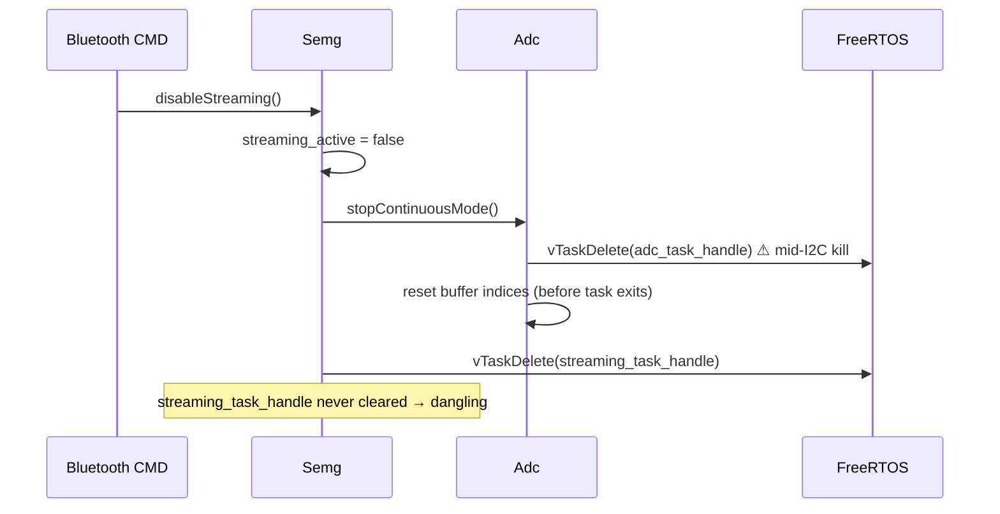
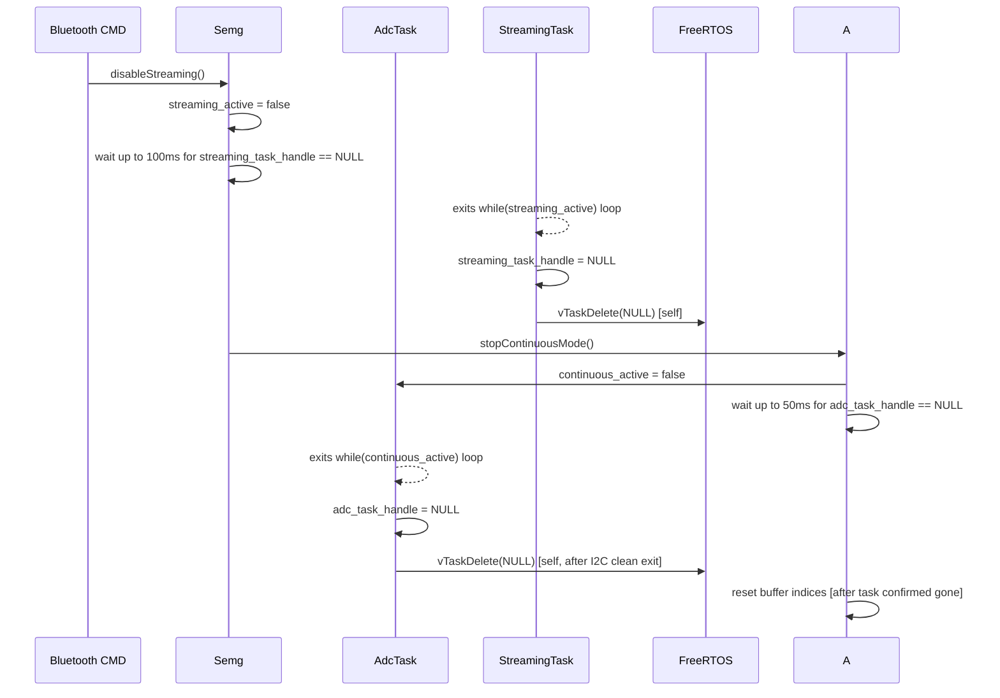
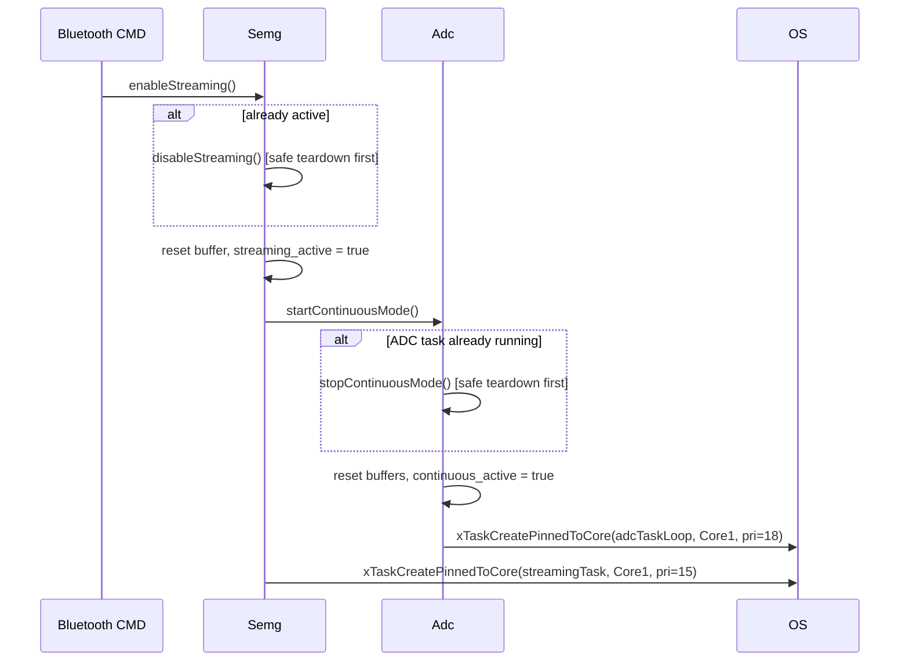

# Architecture: ESP32 Streaming Lifecycle Fix

**Date**: 2026-02-17
**Scope**: `InteroperableResearchsEMGDevice` — Adc and Semg modules

---

## 1. Problem Overview

Three related bugs allow the streaming subsystem to enter a corrupt state across start/stop cycles:

| # | Bug | Risk |
|---|-----|------|
| 1 | `Adc::stopContinuousMode()` calls `vTaskDelete(adc_task_handle)` while the task may be mid-I2C | I2C bus corruption, hung ADC |
| 2 | `Semg::streamingTask()` calls `vTaskDelete(NULL)` without clearing `streaming_task_handle` | Dangling handle; `disableStreaming()` double-deletes on next cycle |
| 3 | `Semg::enableStreaming()` does not check if streaming is already active | Duplicate tasks, buffer index corruption |

---

## 2. Lifecycle Diagrams

### Current (Unsafe) Stop Sequence

### Proposed (Safe) Stop Sequence

### Proposed: Idempotent enableStreaming()

---

## 3. Code Changes Summary

### `Adc.h`
- Add `static volatile bool continuous_active` to private members.

### `Adc.cpp — adcTaskLoop()`
- Replace `while (true)` with `while (continuous_active)`.
- After loop exit: set `adc_task_handle = NULL`, then `vTaskDelete(NULL)`.

### `Adc.cpp — startContinuousMode()`
- Guard at top: `if (adc_task_handle != NULL) stopContinuousMode();`

### `Adc.cpp — stopContinuousMode()`
- Set `continuous_active = false`.
- Poll `adc_task_handle == NULL` for up to 50ms (1ms ticks).
- Force `vTaskDelete` only if task has not self-exited after timeout.
- Move buffer index reset to **after** task exit confirmation.

### `Semg.cpp — streamingTask()`
- Before `vTaskDelete(NULL)`: set `streaming_task_handle = NULL`.

### `Semg.cpp — disableStreaming()`
- After `streaming_active = false`, wait up to 100ms for `streaming_task_handle == NULL` before touching ADC.
- Force `vTaskDelete(streaming_task_handle)` only as timeout fallback.

### `Semg.cpp — enableStreaming()`
- Guard at top: `if (streaming_active || streaming_task_handle != NULL) disableStreaming();`

---

## 4. Thread Safety Analysis

| Task | Core | Priority | Notes |
|------|------|----------|-------|
| `adcTaskLoop` | 1 | 18 | Reads I2C; must not be killed mid-transfer |
| `streamingTask` | 1 | 15 | Polls ADC buffer; lower than ADC task |
| `MessageHandler` | 1 | 20 | Issues start/stop commands; highest on Core 1 |

**`volatile` semantics**: `continuous_active` and `streaming_active` are `volatile bool`. On Xtensa LX6, single-byte reads/writes are atomic; no mutex needed for these flags. Buffer index reset after task exit does not race because the task is confirmed gone before the reset.

**Polling timeout**: Busy-polling with `vTaskDelay(pdMS_TO_TICKS(1))` yields the CPU and allows the target task to run on the same core (Core 1, cooperative at equal/lower priority). The 50ms/100ms windows are generous for a task that only needs to complete its current I2C frame (~1.2ms at 860 Hz).

---

## 5. Rollback Plan

If graceful shutdown introduces hangs in production (e.g., I2C stalls the task loop permanently):

1. Revert `adcTaskLoop` to `while(true)` — remove `continuous_active` check.
2. Revert `stopContinuousMode` to the original `vTaskDelete(adc_task_handle)` pattern.
3. Revert `streamingTask` to `vTaskDelete(NULL)` without clearing the handle.
4. Keep the **idempotency guard** in `enableStreaming()` — this fix has no downside.
5. Keep `streaming_task_handle = NULL` before self-delete in `streamingTask` — low risk, prevents the double-delete.

The idempotency guard (Fix 3) and handle cleanup (Fix 2) are independently safe and should be retained even when rolling back Fix 1.
