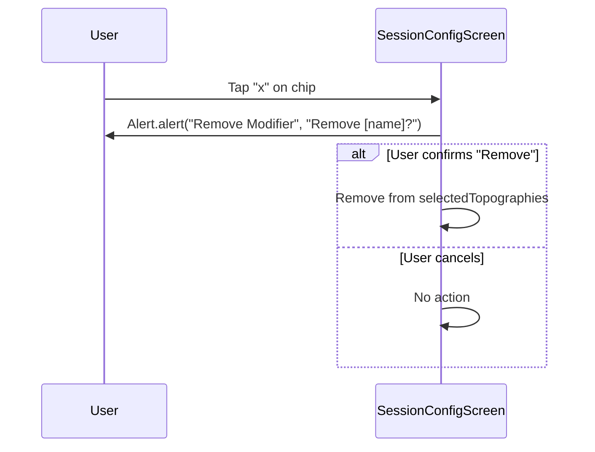
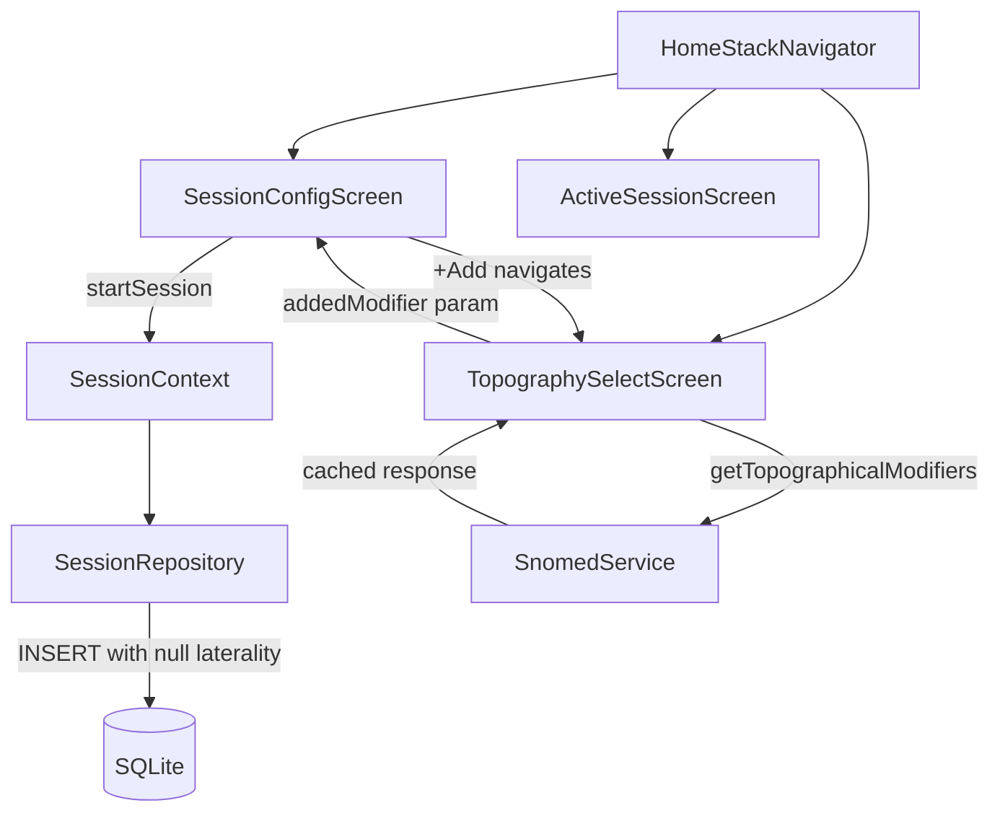
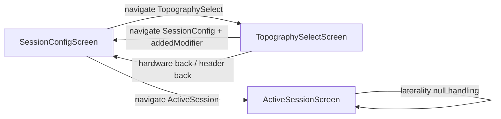

# Architecture: Topography Selection Screen & Laterality Removal

**Document Type**: Technical Architecture
**Date**: 2026-02-16
**Author**: TL (Tech Lead)
**Status**: READY FOR VALIDATION
**Input**: `docs/PROJECT_BRIEF_TOPOGRAPHY_MODAL.md`, `docs/BACKLOG_TOPOGRAPHY_MODAL.md`

---

## 1. Component Architecture

### 1.1 New Component: TopographySelectScreen

A full navigation screen registered in the Home stack. It replaces the inline `FlatList` dropdown currently embedded in `SessionConfigScreen`.

```
TopographySelectScreen
├── Category <Select> dropdown        (filter by category)
├── Search <Input> with Search icon   (filter by displayName, client-side)
└── FlatList of SnomedTopographicalModifier items
    ├── Hidden: items whose snomedCode is in selectedModifiers
    ├── Filtered: items matching selected category + search query
    └── onPress: Alert.alert confirmation → navigate back with addedModifier
```

**Props/Params**: Received via React Navigation `route.params`:

```typescript
// Navigation param type
TopographySelect: {
  selectedModifiers: SelectedModifier[];
};
```

Where `SelectedModifier` is a lightweight pick of the fields needed for filtering:

```typescript
interface SelectedModifier {
  snomedCode: string;
  category: string;
}
```

Passing full `SelectedModifier[]` instead of just `string[]` codes enables the Lateralidade single-selection check without needing to re-fetch or cross-reference the full topography list.

### 1.2 Relationship to SessionConfigScreen

SessionConfigScreen owns the `selectedTopographies: SnomedTopographicalModifier[]` state. The TopographySelectScreen is a stateless selector: it receives the current selection as params, presents filtered choices, and returns a single addition via the navigation param `addedModifier` on the `SessionConfig` route.

### 1.3 Data Source Decision

The TopographySelectScreen will **re-fetch** modifiers from `snomedService.getTopographicalModifiers()` rather than receiving the full list via params. Rationale:

- `SnomedService` has an in-memory cache; the second call returns instantly from cache (zero network cost).
- Passing dozens of `SnomedTopographicalModifier` objects through navigation params increases serialization overhead and risks deep-link breakage in React Navigation.
- Re-fetching keeps the TopographySelectScreen self-contained and testable in isolation.

---

## 2. Navigation Design

### 2.1 Updated HomeStackParamList

```typescript
export type HomeStackParamList = {
  SessionConfig: { addedModifier?: AddedModifier } | undefined;
  TopographySelect: { selectedModifiers: SelectedModifier[] };
  // ... existing routes unchanged
};
```

New types (co-located in `navigation/types.ts`):

```typescript
export interface SelectedModifier {
  snomedCode: string;
  category: string;
}

export interface AddedModifier {
  snomedCode: string;
  displayName: string;
  category: string;
}
```

### 2.2 Param Passing Strategy

**Forward (SessionConfigScreen -> TopographySelectScreen)**:

```typescript
navigation.navigate('TopographySelect', {
  selectedModifiers: selectedTopographies.map(t => ({
    snomedCode: t.snomedCode,
    category: t.category,
  })),
});
```

**Return (TopographySelectScreen -> SessionConfigScreen)**:

```typescript
navigation.navigate('SessionConfig', {
  addedModifier: {
    snomedCode: modifier.snomedCode,
    displayName: modifier.displayName,
    category: modifier.category,
  },
});
```

### 2.3 Return Flow Handling

SessionConfigScreen uses a `useEffect` watching `route.params?.addedModifier`:

```typescript
useEffect(() => {
  const added = route.params?.addedModifier;
  if (!added) return;

  // Deduplicate (defensive — should not happen given hide-selected logic)
  if (!selectedTopographies.find(t => t.snomedCode === added.snomedCode)) {
    setSelectedTopographies(prev => [...prev, {
      snomedCode: added.snomedCode,
      displayName: added.displayName,
      category: added.category,
      description: '', // Not needed for chip display
    }]);
  }

  // Clear param to prevent re-adding on subsequent focus events
  navigation.setParams({ addedModifier: undefined });
}, [route.params?.addedModifier]);
```

### 2.4 HomeStackNavigator Registration

Add the new screen to `HomeStackNavigator.tsx`:

```typescript
import { TopographySelectScreen } from '@/screens/TopographySelectScreen';

// Inside <Stack.Navigator>:
<Stack.Screen
  name="TopographySelect"
  component={TopographySelectScreen}
  options={{ title: 'Select Topography' }}
/>
```

---

## 3. State Management

### 3.1 State Flow Between Screens

```
SessionConfigScreen                 TopographySelectScreen
┌──────────────────────┐           ┌──────────────────────┐
│ selectedTopographies │───param──▶│ route.params         │
│ SnomedTopographical  │           │  .selectedModifiers  │
│ Modifier[]           │           │                      │
│                      │           │ topographies (cache)  │
│                      │◀──param───│  -> filtered list    │
│ useEffect consumes   │           │                      │
│ addedModifier param  │           │ Alert.alert confirm  │
│ + appends to state   │           │ → navigate back      │
└──────────────────────┘           └──────────────────────┘
```

Key invariant: `selectedTopographies` is **only** mutated in SessionConfigScreen. TopographySelectScreen is a pure selector — it reads via params and writes via navigation.

### 3.2 State Removed from SessionConfigScreen

| State Variable | Action |
|---|---|
| `selectedLaterality` | **Removed** — laterality is now a topographical modifier category |
| `showTopographyDropdown` | **Removed** — inline dropdown replaced by navigation |

### 3.3 State Added to TopographySelectScreen

| State Variable | Type | Purpose |
|---|---|---|
| `selectedCategory` | `string` | Currently selected category in the `<Select>` dropdown |
| `searchQuery` | `string` | Current search text for filtering by displayName |
| `topographies` | `SnomedTopographicalModifier[]` | Loaded from `snomedService` on mount |
| `isLoading` | `boolean` | Loading indicator while fetching topographies |

---

## 4. Data Flow Diagram

### 4.1 User Interaction Flow (Sequence Diagram)

```mermaid
sequenceDiagram
    participant User
    participant SessionConfig as SessionConfigScreen
    participant TopographySelect as TopographySelectScreen
    participant SnomedService as snomedService (cache)

    User->>SessionConfig: Tap "+Add" chip
    SessionConfig->>TopographySelect: navigate('TopographySelect', { selectedModifiers })

    TopographySelect->>SnomedService: getTopographicalModifiers()
    SnomedService-->>TopographySelect: SnomedTopographicalModifier[] (from cache)

    TopographySelect->>TopographySelect: Derive categories from data
    TopographySelect->>TopographySelect: Render category <Select>, search, filtered list

    User->>TopographySelect: Select category from dropdown
    TopographySelect->>TopographySelect: Filter list by category

    User->>TopographySelect: Type in search bar
    TopographySelect->>TopographySelect: Further filter by displayName

    User->>TopographySelect: Tap modifier item
    TopographySelect->>TopographySelect: Check Lateralidade constraint
    alt Lateralidade already selected
        TopographySelect->>User: Alert.alert("Laterality Limit", "Only one allowed...")
    else OK to add
        TopographySelect->>User: Alert.alert("Add Modifier", "Add [name]?")
        User->>TopographySelect: Confirm "Add"
        TopographySelect->>SessionConfig: navigate('SessionConfig', { addedModifier })
        SessionConfig->>SessionConfig: useEffect appends to selectedTopographies
    end
```



### 4.2 Chip Removal Flow



---

## 5. Domain Type Changes

### 5.1 ClinicalSession.ts (packages/domain)

**ClinicalData interface** — make `laterality` nullable:

```typescript
// BEFORE
export interface ClinicalData {
    // ...
    laterality: Laterality;
    // ...
}

// AFTER
export interface ClinicalData {
    // ...
    laterality: Laterality | null;
    // ...
}
```

**SessionConfig interface** — make nested `laterality` nullable:

```typescript
// BEFORE
export interface SessionConfig {
    // ...
    clinicalData: {
        // ...
        laterality: Laterality;
        // ...
    };
}

// AFTER
export interface SessionConfig {
    // ...
    clinicalData: {
        // ...
        laterality: Laterality | null;
        // ...
    };
}
```

The `Laterality` type union itself (`'left' | 'right' | 'bilateral'`) is **unchanged**.

---

## 6. SQLite Migration Strategy

### 6.1 Problem

The v1 migration defines:

```sql
laterality TEXT NOT NULL CHECK(laterality IN ('left','right','bilateral'))
```

SQLite does not support `ALTER TABLE ... ALTER COLUMN`. The entire `clinical_data` table must be rebuilt to relax the constraint.

### 6.2 Migration: v3_relax_laterality_constraint.ts

```typescript
export const v3_relax_laterality_constraint = `
-- Step 1: Create temporary table with relaxed constraint
CREATE TABLE clinical_data_new (
    id TEXT PRIMARY KEY,
    session_id TEXT NOT NULL REFERENCES clinical_sessions(id) ON DELETE CASCADE,
    body_structure_snomed_code TEXT NOT NULL,
    body_structure_name TEXT NOT NULL,
    laterality TEXT CHECK(laterality IS NULL OR laterality IN ('left','right','bilateral')),
    topography_codes TEXT DEFAULT '[]',
    topography_names TEXT DEFAULT '[]'
);

-- Step 2: Copy all existing data (preserves non-null laterality values)
INSERT INTO clinical_data_new SELECT * FROM clinical_data;

-- Step 3: Drop original table
DROP TABLE clinical_data;

-- Step 4: Rename new table
ALTER TABLE clinical_data_new RENAME TO clinical_data;

-- Step 5: Recreate the index
CREATE INDEX IF NOT EXISTS idx_clinical_data_session ON clinical_data(session_id);
`;
```

### 6.3 Registration in database.ts

```typescript
import { v3_relax_laterality_constraint } from './migrations/v3_relax_laterality_constraint';

const MIGRATIONS: Migration[] = [
    { version: 1, name: 'v1_initial', sql: v1_initial },
    { version: 2, name: 'v2_add_research_columns', sql: v2_add_research_columns },
    { version: 3, name: 'v3_relax_laterality_constraint', sql: v3_relax_laterality_constraint },
];
```

The `DatabaseManager.runMigrations()` already handles incremental application — only version 3 runs on existing databases; fresh installs run all three sequentially.

---

## 7. Filtering Logic

### 7.1 Three-Stage Filter Chain

The TopographySelectScreen applies three filters in order:

```
All Topographies (from snomedService cache)
  │
  ├─ Stage 1: Hide Selected
  │   topographies.filter(t => !selectedCodes.has(t.snomedCode))
  │
  ├─ Stage 2: Category Filter
  │   .filter(t => t.category === selectedCategory)
  │
  └─ Stage 3: Search Filter
      .filter(t => t.displayName.toLowerCase().includes(searchQuery.toLowerCase()))
```

### 7.2 Implementation

```typescript
const filteredTopographies = useMemo(() => {
  const selectedCodes = new Set(
    route.params.selectedModifiers.map(m => m.snomedCode)
  );

  let filtered = topographies.filter(t => !selectedCodes.has(t.snomedCode));

  if (selectedCategory) {
    filtered = filtered.filter(t => t.category === selectedCategory);
  }

  if (searchQuery.trim()) {
    const query = searchQuery.toLowerCase();
    filtered = filtered.filter(t => t.displayName.toLowerCase().includes(query));
  }

  return filtered;
}, [topographies, route.params.selectedModifiers, selectedCategory, searchQuery]);
```

### 7.3 Category Derivation

Categories are derived dynamically from the full (pre-filtered) topography list:

```typescript
const categories = useMemo(() => {
  const seen = new Set<string>();
  const result: string[] = [];
  for (const t of topographies) {
    if (!seen.has(t.category)) {
      seen.add(t.category);
      result.push(t.category);
    }
  }
  return result;
}, [topographies]);
```

This preserves insertion order from the data while deduplicating, matching the client decision that categories appear in data-derived order.

### 7.4 Empty State

When `filteredTopographies.length === 0` and a category is selected, show: "All modifiers in this category are already selected" or "No modifiers match your search."

When no category is selected, show: "Select a category to view modifiers."

---

## 8. Lateralidade Single-Selection Enforcement

### 8.1 Detection

The Lateralidade category name is `"Lateralidade"` (derived from backend SNOMED data). The TopographySelectScreen checks whether the already-selected modifiers include one with `category === 'Lateralidade'`:

```typescript
const hasLateralidade = route.params.selectedModifiers.some(
  m => m.category === 'Lateralidade'
);
```

### 8.2 Prevention

When the user taps a modifier from the "Lateralidade" category and `hasLateralidade` is `true`:

```typescript
if (modifier.category === 'Lateralidade' && hasLateralidade) {
  Alert.alert(
    'Laterality Limit',
    'Only one laterality modifier is allowed. Remove the existing one first.',
    [{ text: 'OK' }]
  );
  return;
}
```

When `hasLateralidade` is `false`, the normal confirmation flow applies.

### 8.3 Why Not Hide Lateralidade Items Entirely?

If the user already has a Lateralidade modifier, we still **show** the Lateralidade category and its items in the list. This is intentional: hiding the entire category would be confusing (the user wouldn't know why items disappeared). Showing them but blocking with an error alert provides clear feedback.

However, the specific modifier that is already selected IS hidden (by the Stage 1 filter). So if the user has "Left" selected and browses Lateralidade, they see "Right" and "Bilateral" — but tapping either shows the limit error.

---

## 9. Downstream Consumer Updates

### 9.1 ActiveSessionScreen (line 160)

**Current code**:
```typescript
{clinicalData?.bodyStructureName || 'Unknown'} ({clinicalData?.laterality?.[0]?.toUpperCase() || '-'})
```

**Problem**: When laterality is `null`, `?.[0]?.toUpperCase()` returns `undefined`, falling through to `'-'`. This shows "Biceps (-)" which is misleading.

**Fix**: Conditionally render the parenthetical:

```typescript
{clinicalData?.bodyStructureName || 'Unknown'}
{clinicalData?.laterality ? ` (${clinicalData.laterality[0].toUpperCase()})` : ''}
```

### 9.2 csvExport.ts (SessionMetadata)

**Current type**: `laterality: string`

**Fix**: Change to `laterality: string | null`. At the CSV write site (line 196), use:

```typescript
lines.push(`Laterality,${metadata.laterality ?? 'N/A'}`);
```

### 9.3 HistoryScreen.tsx (line 202)

**Current code**: `laterality: session.clinicalData?.laterality ?? 'Unknown'`

**Fix**: Change fallback to `'N/A'`:

```typescript
laterality: session.clinicalData?.laterality ?? 'N/A',
```

### 9.4 SyncService.mappers.ts

**No code change needed**. `JSON.stringify` naturally serializes `null` as `null` in the JSON string. The `ClinicalContext` blob on the backend is free-form. The function signature already accepts `ClinicalData` — after making `laterality` nullable in the domain type, the existing code compiles cleanly because `JSON.stringify({ laterality: null })` produces `"laterality":null`.

### 9.5 SyncService.test.ts

**No code change needed**. The mock fixture at line 71 uses `laterality: 'left'`, which remains a valid value for `Laterality | null`. The `as unknown` cast in `createMockSessionRepo()` means the type system does not enforce the fixture shape against the domain type.

### 9.6 SessionRepository.ts

**ClinicalDataRow interface**: Change `laterality: string` to `laterality: string | null`.

**mapRowToClinicalData** (line 301): Change cast from `row.laterality as 'left' | 'right' | 'bilateral'` to `row.laterality as Laterality | null`.

**create()**: No code change needed. Line 162 passes `config.clinicalData.laterality` directly, which will be `null` for new sessions. SQLite accepts `null` natively via the parameterized query.

---

## 10. File Change Matrix

### 10.1 New Files

| File | Purpose |
|---|---|
| `apps/mobile/src/screens/TopographySelectScreen.tsx` | New full navigation screen: category dropdown, search bar, filtered list, confirmation modals, Lateralidade constraint |
| `apps/mobile/src/data/migrations/v3_relax_laterality_constraint.ts` | SQLite table rebuild to make `laterality` nullable |

### 10.2 Modified Files

| File | Exact Changes |
|---|---|
| **`packages/domain/src/models/ClinicalSession.ts`** | `ClinicalData.laterality`: `Laterality` -> `Laterality \| null`. `SessionConfig.clinicalData.laterality`: `Laterality` -> `Laterality \| null`. |
| **`apps/mobile/src/navigation/types.ts`** | Add `SelectedModifier` and `AddedModifier` interfaces. Add `TopographySelect: { selectedModifiers: SelectedModifier[] }` to `HomeStackParamList`. Change `SessionConfig: undefined` to `SessionConfig: { addedModifier?: AddedModifier } \| undefined`. |
| **`apps/mobile/src/navigation/HomeStackNavigator.tsx`** | Import `TopographySelectScreen`. Add `<Stack.Screen name="TopographySelect" ... />` registration. |
| **`apps/mobile/src/data/database.ts`** | Import `v3_relax_laterality_constraint`. Add version 3 entry to `MIGRATIONS` array. |
| **`apps/mobile/src/data/repositories/SessionRepository.ts`** | `ClinicalDataRow.laterality`: `string` -> `string \| null`. `mapRowToClinicalData` cast: `as 'left' \| 'right' \| 'bilateral'` -> `as Laterality \| null` (add `Laterality` import). |
| **`apps/mobile/src/screens/SessionConfigScreen.tsx`** | Remove `selectedLaterality` state + `showTopographyDropdown` state. Remove Laterality `<Select>` JSX (lines 315-326). Remove inline topography `FlatList` (lines 350-366). "+Add" chip navigates to `TopographySelect`. `useEffect` consumes `route.params?.addedModifier`. `handleRemoveTopography` wrapped in `Alert.alert`. `isFormValid` removes `selectedLaterality` check. `handleStartSession` passes `laterality: null`. Accept `route` from props (`{ navigation, route }`). |
| **`apps/mobile/src/screens/ActiveSessionScreen.tsx`** | Line 160: Conditionally render laterality parenthetical — hide when `null`. |
| **`apps/mobile/src/screens/HistoryScreen.tsx`** | Line 202: Change fallback from `'Unknown'` to `'N/A'`. |
| **`apps/mobile/src/utils/csvExport.ts`** | `SessionMetadata.laterality`: `string` -> `string \| null`. Line 196: `metadata.laterality ?? 'N/A'`. |

### 10.3 No Changes Required (Verified)

| File | Reason |
|---|---|
| `packages/domain/src/models/Snomed.ts` | `SnomedTopographicalModifier` already has `category: string` |
| `apps/mobile/src/services/SnomedService.ts` | Already fetches all modifiers with cache; no changes needed |
| `apps/mobile/src/services/SyncService.mappers.ts` | `JSON.stringify(null)` works natively; type compiles after domain change |
| `apps/mobile/src/services/SyncService.test.ts` | Fixture uses `'left'` which is valid for `Laterality \| null`; `as unknown` cast bypasses strict check |
| `apps/mobile/src/context/SessionContext.tsx` | Calls `sessionRepository.create(config)` — repository handles the data |
| Backend (`InteroperableResearchNode`) | `ClinicalContext` is a free-form JSON blob |

---

## Component Hierarchy Diagram



## Navigation Flow Diagram



---

## Implementation Notes

### Screen Layout (TopographySelectScreen)

From top to bottom:
1. **Category `<Select>`** — `label="Category"`, `placeholder="Select a category..."`, options derived from data.
2. **Search `<Input>`** — `leftIcon={<Search />}`, `placeholder="Search modifiers..."`, filters by displayName within selected category.
3. **`<FlatList>`** — renders filtered modifier items. Each item is a `<TouchableOpacity>` showing `displayName` and `category` subtitle. `onPress` triggers confirmation or Lateralidade limit alert.
4. **Empty state** — contextual message based on filter state.

### Alert.alert Patterns

All confirmation and error alerts use `Alert.alert()` from React Native for consistency with the existing `ActiveSessionScreen` end-session confirmation pattern:

- **Add modifier**: Title "Add Modifier", Message "Add {displayName}?", Buttons: Cancel (style: 'cancel') + Add (style: 'default')
- **Remove modifier**: Title "Remove Modifier", Message "Remove {displayName}?", Buttons: Cancel (style: 'cancel') + Remove (style: 'destructive')
- **Lateralidade limit**: Title "Laterality Limit", Message "Only one laterality modifier is allowed. Remove the existing one first.", Button: OK

### Form Validation Change

```typescript
// BEFORE
const isFormValid = (): boolean => {
  return !!(selectedVolunteer && selectedBodyStructure && selectedLaterality && selectedTopographies.length > 0 && selectedDeviceId);
};

// AFTER
const isFormValid = (): boolean => {
  return !!(selectedVolunteer && selectedBodyStructure && selectedTopographies.length > 0 && selectedDeviceId);
};
```

### Laterality Payload Change

```typescript
// BEFORE
clinicalData: {
  laterality: selectedLaterality as Laterality,
  // ...
}

// AFTER
clinicalData: {
  laterality: null,
  // ...
}
```
