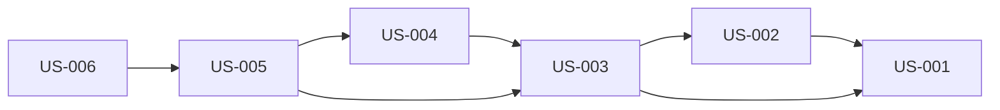

<!-- AGENT NOTICE: This file is auto-generated and for HUMAN reading only.
     DO NOT read this file to query backlog data. Use the backlog_manager.py script instead:
     - Overview: python {script} stats {backlog_path}
     - List:     python {script} list {backlog_path} --format summary
     - Detail:   python {script} get {backlog_path} --id US-XXX
     Reading this file wastes context tokens and may contain stale data. -->

# Product Backlog

> Auto-generated from `backlog.json` — 2026-02-18 03:09 UTC

## Summary

| Status | Count |
|--------|-------|
| Ready | 6 |
| **Total** | **6** |

## User Stories

### Feature Area: Data Migration

#### US-001: Add blob_url column to recordings table via SQLite v5 migration

**Priority:** Must | **Status:** Ready

> As a *mobile app*, I want *a v5 SQLite migration that adds a blob_url TEXT column (DEFAULT NULL) to the recordings table and retroactively repairs existing synced recordings by moving any file_path value that starts with http:// or https:// into the new blob_url column and setting file_path to NULL*, so that *the schema cleanly separates local filesystem paths from remote blob storage URLs, and recordings synced under the old behavior immediately become exportable once the app updates*.

**Acceptance Criteria:**

- **AC-1:** Given *the app is starting up on a device with schema version 4*, when *the migration runner processes v5*, then *it executes ALTER TABLE recordings ADD COLUMN blob_url TEXT DEFAULT NULL without error*
- **AC-2:** Given *existing recordings where file_path starts with http:// or https://*, when *the v5 retroactive UPDATE runs*, then *blob_url is set to the former file_path value and file_path is set to NULL*
- **AC-3:** Given *existing recordings where file_path starts with file:/// or is NULL*, when *the v5 retroactive UPDATE runs*, then *those rows are not modified*
- **AC-4:** Given *the migration file exists at apps/mobile/src/data/migrations/v5_add_blob_url.ts*, when *database.ts is inspected*, then *the v5 migration is registered and will run on app startup before any user interaction*

---

### Feature Area: Domain Model

#### US-002: Add blobUrl field to Recording domain type

**Priority:** Must | **Status:** Ready

> As a *developer*, I want *an optional blobUrl field added to the Recording interface and NewRecordingData interface in packages/domain/src/models/Recording.ts*, so that *the TypeScript type system distinguishes between local filesystem paths and remote blob URLs throughout the entire codebase, preventing the kind of conflation that caused the original bug*.

**Acceptance Criteria:**

- **AC-1:** Given *the Recording interface in packages/domain/src/models/Recording.ts*, when *it is inspected*, then *it contains an optional blobUrl?: string field alongside the existing filePath field*
- **AC-2:** Given *the NewRecordingData interface*, when *it is inspected*, then *it also contains an optional blobUrl?: string field*
- **AC-3:** Given *the domain package change is applied*, when *npm run type-check:all is executed*, then *TypeScript strict mode compilation succeeds with no type errors*

**Depends on:** US-001

---

### Feature Area: Data Access

#### US-003: Update RecordingRepository to map and persist blob_url column

**Priority:** Must | **Status:** Ready

> As a *mobile app*, I want *the RecordingRepository to read blob_url from the database into the blobUrl domain field, and to support writing blobUrl in both create() and update() operations*, so that *all layers above the repository can store and retrieve the blob URL without direct SQL knowledge, and updates to blobUrl are persisted correctly alongside other recording fields*.

**Acceptance Criteria:**

- **AC-1:** Given *the RecordingRow interface in RecordingRepository.ts*, when *it is inspected*, then *it includes a blob_url: string | null field*
- **AC-2:** Given *a row is read from the database with blob_url = NULL*, when *mapRowToRecording() processes it*, then *the returned Recording has blobUrl as undefined*
- **AC-3:** Given *a row is read from the database with a blob_url value*, when *mapRowToRecording() processes it*, then *the returned Recording has blobUrl set to that string value*
- **AC-4:** Given *recordingRepo.update() is called with { blobUrl: someUrl }*, when *the dynamic field builder runs*, then *the SQL includes blob_url = ? with the correct value*
- **AC-5:** Given *recordingRepo.create() is called with a NewRecordingData that includes blobUrl*, when *the INSERT is executed*, then *the blob_url column is populated correctly*

**Depends on:** US-001, US-002

---

### Feature Area: Sync

#### US-004: Fix SyncService to store blob URL separately and clear local file path

**Priority:** Must | **Status:** Ready

> As a *researcher*, I want *the sync service to store the uploaded blob URL in the new blobUrl field instead of overwriting filePath, delete the local CSV file after successful upload, and set filePath to null*, so that *device storage is reclaimed after sync while the blob URL is preserved for future exports, and the two concerns of local storage and remote storage are no longer conflated in a single field*.

**Acceptance Criteria:**

- **AC-1:** Given *SyncService.syncRecordings() completes a successful file upload*, when *it processes the uploadResponse.fileUrl*, then *it calls recordingRepo.update(recording.id, { blobUrl: uploadResponse.fileUrl }) to store the blob URL*
- **AC-2:** Given *the blob URL has been stored*, when *the local file is processed*, then *the local CSV file is deleted from the device filesystem*
- **AC-3:** Given *the local file has been deleted*, when *the filePath is updated*, then *recordingRepo.update(recording.id, { filePath: null }) is called, clearing the local path*
- **AC-4:** Given *the old single update({ filePath: uploadResponse.fileUrl }) pattern*, when *SyncService.ts is inspected*, then *it no longer exists*
- **AC-5:** Given *a file upload fails*, when *error handling runs*, then *neither blobUrl nor filePath is modified for that recording*
- **AC-6:** Given *the sync cycle runs after this change*, when *sessions, annotations, and other entities are processed*, then *they continue to sync correctly with no change in behavior*

**Depends on:** US-003

---

### Feature Area: Export

#### US-005: Fix HistoryScreen export to fetch CSV from blob URL for synced recordings

**Priority:** Must | **Status:** Ready

> As a *researcher*, I want *the ZIP export on HistoryScreen to download CSV content from the blob URL when the local file is absent, producing a valid ZIP with actual sEMG data for synced recordings*, so that *exported ZIPs always contain real signal data regardless of whether the recording was synced, eliminating the silent corruption that makes exported data unusable for analysis*.

**Acceptance Criteria:**

- **AC-1:** Given *a recording where rec.filePath is set and FileSystem.getInfoAsync() returns exists: true*, when *handleExportSession() runs*, then *the CSV content is read from local disk (unchanged behavior)*
- **AC-2:** Given *a recording where rec.blobUrl is set and the local file is absent*, when *handleExportSession() runs*, then *FileSystem.downloadAsync() downloads the CSV to a temp file, the content is read, and the temp file is deleted*
- **AC-3:** Given *a recording where neither filePath nor blobUrl is set*, when *handleExportSession() runs*, then *the recording entry in the ZIP contains the text: # No recording data available*
- **AC-4:** Given *a fully synced session (all recordings have blobUrl, no local files)*, when *the user taps Export ZIP*, then *the resulting ZIP contains actual CSV data rows, not placeholder text*
- **AC-5:** Given *csvExport.ts*, when *it is inspected after this change*, then *exportSessionAsZip() is unchanged*

**Depends on:** US-003, US-004

---

#### US-006: Handle offline export gracefully when blob URL is unreachable

**Priority:** Must | **Status:** Ready

> As a *researcher*, I want *the ZIP export to produce an informative per-recording placeholder when a blob URL fetch fails due to network unavailability, instead of crashing or silently producing an empty entry*, so that *researchers using the app offline understand that synced recordings require network access to export, rather than receiving a corrupt ZIP with no explanation*.

**Acceptance Criteria:**

- **AC-1:** Given *FileSystem.downloadAsync() throws or returns an error for a blob URL*, when *handleExportSession() handles the failure*, then *the recording entry in the ZIP contains: # Recording data is on server (offline)*
- **AC-2:** Given *one or more blob URL fetches failed during export*, when *the ZIP is complete*, then *a user-facing alert is shown listing the failed recordings and explaining that network access is required*
- **AC-3:** Given *a mix of local and blob URL recordings in the same session*, when *one blob fetch fails during export*, then *recordings with local files are still included in the ZIP successfully*
- **AC-4:** Given *blob URL returns an HTTP error status code (e.g. 404, 500)*, when *the export handler processes the response*, then *it is treated as a failure and the offline placeholder is used*
- **AC-5:** Given *the export runs while the device is offline*, when *the network request times out*, then *the app does not crash and the user receives the informative alert*

**Depends on:** US-005

---

## Story Dependency Map

