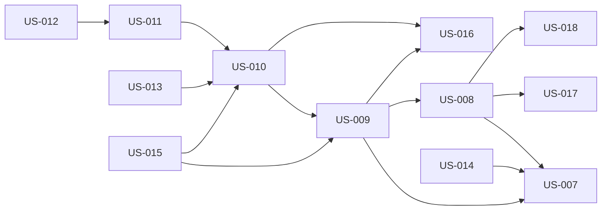

<!-- AGENT NOTICE: This file is auto-generated and for HUMAN reading only.
     DO NOT read this file to query backlog data. Use the backlog_manager.py script instead:
     - Overview: python {script} stats {backlog_path}
     - List:     python {script} list {backlog_path} --format summary
     - Detail:   python {script} get {backlog_path} --id US-XXX
     Reading this file wastes context tokens and may contain stale data. -->

# Product Backlog

> Auto-generated from `backlog.json` — 2026-02-19 00:22 UTC

## Summary

| Status | Count |
|--------|-------|
| Done | 12 |
| **Total** | **12** |

## User Stories

### Feature Area: Backend - Sync Infrastructure

#### US-007: Add SyncLog entity and EF Core migration for sync infrastructure

**Priority:** Must | **Status:** Done

> As a *backend developer*, I want *a SyncLog table that records RemoteNodeId, StartedAt, CompletedAt, Status, LastSyncedAt, EntitiesReceived, and ErrorMessage per sync operation, along with an EF Core migration that creates the sync_logs table*, so that *the SyncImportService can track sync history per remote node and use the LastSyncedAt watermark to drive incremental delta queries on subsequent syncs*.

**Acceptance Criteria:**

- **AC-1:** Given *the backend solution is built and EF Core migrations are applied*, when *the sync_logs table is inspected*, then *it contains columns: Id (UUID PK), RemoteNodeId (UUID FK → research_nodes.id), StartedAt (UTC NOT NULL), CompletedAt (UTC nullable), Status (string: in_progress / completed / failed / rolled_back), LastSyncedAt (UTC nullable), EntitiesReceived (JSONB nullable), ErrorMessage (TEXT nullable)*
- **AC-2:** Given *a SyncLog row is created with status=in_progress at the start of ImportAsync*, when *ImportAsync commits successfully*, then *the same row is updated in the same transaction to status=completed with CompletedAt=UtcNow, LastSyncedAt=payload.ManifestGeneratedAt, and EntitiesReceived populated as a JSON object with per-entity-type counts*
- **AC-3:** Given *ImportAsync throws during the main transaction and rolls back*, when *a separate follow-up transaction runs*, then *a new SyncLog row is written with status=failed and ErrorMessage containing the exception message*
- **AC-4:** Given *all syncable entities (Research, Volunteer, RecordSession, Record, RecordChannel, TargetArea, SessionAnnotation, SnomedBodyRegion, SnomedBodyStructure, etc.)*, when *the codebase is inspected*, then *each entity already carries an UpdatedAt column via BaseEntity — no new column migration is needed; this AC is a verification step, not a schema change*
- **AC-5:** Given *the migration AddSyncLog is applied to a database with existing data*, when *the migration completes*, then *no existing records are lost or corrupted and the sync_logs table is empty (no seeded data)*

---

#### US-014: Add SyncLog query endpoint GET /api/sync/log to support desktop sync history display

**Priority:** Must | **Status:** Done

> As a *backend developer*, I want *a paginated GET endpoint that returns SyncLog entries for a given connectionId, ordered by StartedAt descending*, so that *the desktop can display accurate last-sync timestamps and status without storing sync history locally in a separate store*.

**Acceptance Criteria:**

- **AC-1:** Given *a valid remoteNodeId (UUID) is provided*, when *GET /api/sync/log?remoteNodeId={uuid}&page=1&pageSize=10 is called by an authenticated session*, then *a paginated list of SyncLog entries ordered by startedAt descending is returned*
- **AC-2:** Given *no SyncLog entries exist for the remoteNodeId*, when *the endpoint is called*, then *it returns 200 with an empty data array*
- **AC-3:** Given *a missing or invalid (non-UUID) remoteNodeId is provided*, when *the endpoint is called*, then *it returns 400 Bad Request with a descriptive error*
- **AC-4:** Given *an unauthenticated request reaches the endpoint*, when *the middleware processes it*, then *it returns 401 Unauthorized*
- **AC-5:** Given *a valid response is returned*, when *the response body is inspected*, then *each SyncLog entry contains: id, remoteNodeId, startedAt, completedAt, status, lastSyncedAt, entitiesReceived (Record<string,number> or null), errorMessage (string or null)*

**Depends on:** US-007

---

### Feature Area: Backend - Sync Export

#### US-008: Implement SyncExportService and SyncController export endpoints (pull model)

**Priority:** Must | **Status:** Done

> As a *backend developer*, I want *a SyncExportService with per-entity export methods and a SyncController that exposes six export endpoints so that a requesting node can pull SNOMED catalogs, volunteers, research, sessions, and recording files from this node through the encrypted channel*, so that *the requesting node can pull exactly the records it needs using incremental since-filtering and pagination, without receiving redundant data or exceeding memory limits*.

**Acceptance Criteria:**

- **AC-1:** Given *POST /api/sync/manifest is called with an optional since timestamp in the request body*, when *SyncExportService.GetManifestAsync(since) runs*, then *it returns a SyncManifest containing nodeId, nodeName, generatedAt, lastSyncedAt, and per-entity counts (snomed, volunteers, research, sessions, recordings) filtered by UpdatedAt > since when since is provided, or all records when since is null*
- **AC-2:** Given *GET /api/sync/snomed/{entityType}?since=ISO8601&page=1&pageSize=100 is called*, when *SyncExportService.GetSnomedEntitiesAsync runs for the given entityType*, then *it returns a paginated response { data, page, pageSize, totalRecords, totalPages } containing only records with UpdatedAt > since; supported entityType values are: body-regions, body-structures, topographical-modifiers, lateralities, clinical-conditions, clinical-events, medications, allergy-intolerances, severity-codes*
- **AC-3:** Given *GET /api/sync/volunteers?since=ISO8601&page=1&pageSize=100 is called*, when *SyncExportService.GetVolunteersAsync runs*, then *it returns paginated VolunteerSyncDTOs each including nested VitalSigns, ClinicalConditions, Medications, and AllergyIntolerances, filtered by Volunteer.UpdatedAt > since*
- **AC-4:** Given *GET /api/sync/research?since=ISO8601&page=1&pageSize=100 is called*, when *SyncExportService.GetResearchAsync runs*, then *it returns paginated ResearchSyncDTOs each including nested Applications, ResearchDevices (with Device and Sensors), and ResearchResearchers, filtered by Research.UpdatedAt > since*
- **AC-5:** Given *GET /api/sync/sessions?since=ISO8601&page=1&pageSize=100 is called*, when *SyncExportService.GetSessionsAsync runs*, then *it returns paginated SessionSyncDTOs each including nested Records (with RecordChannels), SessionAnnotations, and TargetAreas, filtered by RecordSession.UpdatedAt > since*
- **AC-6:** Given *GET /api/sync/recordings/{id:guid}/file is called for a valid recording ID*, when *SyncExportService.GetRecordingFileAsync runs*, then *it returns the binary file content with appropriate Content-Type and Content-Disposition headers; if the file does not exist it returns 404*
- **AC-7:** Given *any of the six endpoints is called*, when *the request reaches the controller*, then *both [PrismEncryptedChannelConnection] and [PrismAuthenticatedSession(RequiredCapability = NodeAccessTypeEnum.ReadWrite)] must be satisfied; a missing or invalid channel/session returns 401, an insufficient capability returns 403*
- **AC-8:** Given *since is null on any paginated endpoint*, when *the query runs*, then *all records (no UpdatedAt filter) are returned in ascending UpdatedAt order*
- **AC-9:** Given *since is provided on any paginated endpoint*, when *the query runs*, then *only records with UpdatedAt strictly greater than since are returned in ascending UpdatedAt order*
- **AC-10:** Given *SyncController does not use BaseController or HandleQueryParameters()*, when *pagination parameters are inspected*, then *page and pageSize are received directly as [FromQuery] parameters and forwarded to SyncExportService; the since parameter is also received directly as [FromQuery] DateTime?*

**Depends on:** US-007, US-017, US-018

---

### Feature Area: Backend - Sync Import

#### US-009: Implement SyncImportService and POST /api/sync/import endpoint for transactional upsert

**Priority:** Must | **Status:** Done

> As a *backend developer*, I want *a SyncImportService that receives a SyncImportPayload (collected by the middleware after pulling all entities from the remote node) and persists all entities within a single EF Core transaction using newer-wins conflict resolution in dependency order, plus a POST /api/sync/import endpoint that invokes it*, so that *all pulled data is atomically committed or rolled back together so no partial sync state ever persists on the requesting node, satisfying the no-partial-data requirement from the project brief*.

**Acceptance Criteria:**

- **AC-1:** Given *POST /api/sync/import is called with a SyncImportPayload containing { snomed[], volunteers[], research[], sessions[], recordings[], manifestGeneratedAt }*, when *the request reaches SyncImportService.ImportAsync(payload, remoteNodeId)*, then *it opens a single EF Core transaction via PrismDbContext.Database.BeginTransactionAsync() before touching any entity*
- **AC-2:** Given *ISyncImportService is implemented*, when *the class is inspected*, then *it injects PrismDbContext directly — it does NOT inject BaseRepository<T,K> — because bulk upsert within a shared transaction requires direct DbContext access*
- **AC-3:** Given *the transaction is open*, when *entities are processed*, then *upsert order is strictly: SNOMED entities first, then Volunteers (with clinical sub-entities), then Research (with Applications, Devices, Researchers), then Sessions (with Records, RecordChannels, SessionAnnotations, TargetAreas), then recording files last; this order prevents FK constraint violations*
- **AC-4:** Given *an entity in the payload has the same primary key as an existing local record and the incoming UpdatedAt is strictly newer*, when *upsert runs for that entity*, then *_context.Entry(existingEntity).CurrentValues.SetValues(incomingEntity) is called to overwrite all columns*
- **AC-5:** Given *an entity in the payload has the same primary key as an existing local record and the incoming UpdatedAt is equal or older*, when *upsert runs for that entity*, then *the existing record is kept unchanged (no update issued)*
- **AC-6:** Given *an entity in the payload has no matching primary key in the local database*, when *upsert runs for that entity*, then *_context.Add(entity) is called to insert it as a new record*
- **AC-7:** Given *Research or Volunteer entities are being upserted*, when *the ResearchNodeId FK is set*, then *it is set to the local node own ID — the remote nodes ResearchNodeId is discarded to preserve data ownership semantics*
- **AC-8:** Given *SNOMED entities are being upserted*, when *matching is performed*, then *matching uses SnomedCode (string natural key) not the GUID surrogate key*
- **AC-9:** Given *SaveChangesAsync is called*, when *inspecting the implementation*, then *SaveChangesAsync() is called once after each entity type batch (after all SNOMEDs, after all Volunteers, etc.) within the still-open transaction; this pattern releases EF Core change tracker memory for large batches while keeping the transaction boundary intact*
- **AC-10:** Given *all entity batches and file storage succeed*, when *the final SaveChangesAsync completes*, then *the SyncLog row is updated (status=completed, CompletedAt=UtcNow, LastSyncedAt=payload.ManifestGeneratedAt, EntitiesReceived=JSON counts) and the transaction is committed; SyncResult { status: completed, entitiesReceived } is returned*
- **AC-11:** Given *any step throws an exception*, when *the catch block runs*, then *the main transaction is rolled back; a new separate transaction writes a SyncLog row with status=failed and ErrorMessage; SyncResult { status: rolled_back, errorMessage } is returned*
- **AC-12:** Given *the same SyncImportPayload is submitted twice*, when *both calls complete*, then *the second call produces identical database state with no duplicates (idempotent upsert by primary key)*
- **AC-13:** Given *a node with ReadOnly access level calls POST /api/sync/import*, when *the request is processed*, then *403 Forbidden is returned and no data is written*

**Depends on:** US-007, US-008, US-016

---

### Feature Area: Desktop - Sync Service

#### US-010: Implement NodeSyncService in @iris/middleware to orchestrate pull-based node sync

**Priority:** Must | **Status:** Done

> As a *desktop developer*, I want *a NodeSyncService class in packages/middleware/src/sync/ that orchestrates the full pull-sync flow: fetch manifest from remote, pull all entity types via paginated GET endpoints in dependency order, collect all data in memory, then submit a single POST /api/sync/import to the local backend, with progress callbacks throughout*, so that *the desktop sync button has a concrete, tested implementation that drives accurate UI feedback while ensuring the local backend handles all persistence in a single atomic transaction*.

**Acceptance Criteria:**

- **AC-1:** Given *NodeSyncService.pull(since?) is invoked with an optional watermark timestamp*, when *the service starts*, then *it calls POST /api/sync/manifest on the remote node via middleware.invoke() with { since } in the body and returns a SyncManifest for the caller to show in the confirmation dialog; no entity data is fetched yet*
- **AC-2:** Given *the user confirms sync and executePull() begins*, when *SNOMED entities are fetched*, then *the service iterates all 9 SNOMED sub-types (body-regions, body-structures, topographical-modifiers, lateralities, clinical-conditions, clinical-events, medications, allergy-intolerances, severity-codes) via GET /api/sync/snomed/{entityType}?since=&page=N&pageSize=100*
- **AC-3:** Given *fetchAllPages() is called for any entity endpoint*, when *it iterates pages*, then *it calls GET {path}?page=N&pageSize=100&since=X, accumulates response.data into a local array, and continues until page > response.totalPages; all pages are collected before returning*
- **AC-4:** Given *SNOMED fetching completes*, when *the service continues*, then *it fetches Volunteers via GET /api/sync/volunteers, then Research via GET /api/sync/research, then Sessions via GET /api/sync/sessions, in that dependency order*
- **AC-5:** Given *session data has been collected*, when *recording file references are extracted*, then *the service calls GET /api/sync/recordings/{id}/file for each recording ID that has a file reference, accumulating binary data in memory*
- **AC-6:** Given *all entities and files are collected in memory*, when *the import step runs*, then *the service submits a single POST /api/sync/import to the LOCAL backend (not the remote node) with the complete SyncImportPayload; it does not send incremental batches*
- **AC-7:** Given *progress events are emitted*, when *each page or file is fetched*, then *the onProgress callback receives { phase: manifest | snomed | volunteers | research | sessions | recordings, current: number, total: number, entityType: string } matching the SyncProgress interface in @iris/domain*
- **AC-8:** Given *the connection nodeAccessLevel is READ_ONLY*, when *pull() is called*, then *the service rejects immediately with a clear error message before making any network call*
- **AC-9:** Given *any page fetch fails with a network error or non-2xx response*, when *the error is caught*, then *no data has been written to the database (all collection was in-memory); the error propagates to the caller and the user can retry the entire sync*
- **AC-10:** Given *NodeSyncService is used from the desktop*, when *the service file is inspected*, then *it is located at packages/middleware/src/sync/NodeSyncService.ts and its types (SyncManifest, SyncProgress, SyncResult) are re-exported from packages/middleware/src/index.ts*

**Depends on:** US-009, US-016

---

### Feature Area: Desktop - Sync Trigger

#### US-011: Wire the Sync button on NodeConnectionsScreen to invoke NodeSyncService.synchronize()

**Priority:** Must | **Status:** Done

> As a *desktop developer*, I want *the existing Sync button on NodeConnectionsScreen.tsx to call NodeSyncService.synchronize(connectionId) and open the sync progress modal*, so that *users can trigger sync with a single click without navigating away from the connections list*.

**Acceptance Criteria:**

- **AC-1:** Given *the user clicks the Sync button on a valid Authorized ReadWrite connection*, when *the click handler fires*, then *NodeSyncService.synchronize(connectionId) is called and the SyncProgressModal opens*
- **AC-2:** Given *a connection has accessLevel === ReadOnly*, when *the Sync button is rendered*, then *it is visually disabled and unclickable*
- **AC-3:** Given *a connection has status !== Authorized*, when *the Sync button is rendered*, then *it is visually disabled and unclickable*
- **AC-4:** Given *a sync is already in progress for a connection*, when *the Sync button is rendered*, then *it is disabled until the sync completes or fails*
- **AC-5:** Given *the user clicks Sync*, when *the sync operation starts*, then *the user remains on the NodeConnectionsScreen (no page navigation occurs)*

**Depends on:** US-010

---

### Feature Area: Desktop - Sync Progress UI

#### US-012: Build SyncProgressModal with in-progress counts, success confirmation, and error display

**Priority:** Must | **Status:** Done

> As a *desktop developer*, I want *a modal that opens when sync starts and shows real-time progress (e.g., 'Syncing 12/48 records...'), a success summary, or an actionable error message when sync fails*, so that *users have clear, real-time visibility into the sync operation and know exactly what happened without inspecting logs*.

**Acceptance Criteria:**

- **AC-1:** Given *a sync operation starts*, when *the SyncProgressModal opens*, then *it shows an animated spinner and text 'Syncing N/M records...' that updates as progress events arrive*
- **AC-2:** Given *the sync completes successfully*, when *the modal updates its state*, then *it displays 'Sync complete. N records sent.' along with the completion timestamp*
- **AC-3:** Given *the sync fails*, when *the modal updates its state*, then *it displays a human-readable error message mapped from the SyncError code and a Retry button*
- **AC-4:** Given *the user clicks Retry in the error state*, when *the retry is triggered*, then *NodeSyncService.synchronize() is called again and the modal returns to in-progress state*
- **AC-5:** Given *a sync is in progress*, when *the user attempts to close the modal*, then *the close button is absent or disabled; modal cannot be dismissed mid-sync*
- **AC-6:** Given *the sync completes or fails*, when *the user closes the modal*, then *the modal closes and the connections table reflects the updated sync history*
- **AC-7:** Given *the modal opens*, when *accessibility tools inspect the DOM*, then *focus is trapped inside the modal and success/error state changes are announced via aria-live*

**Depends on:** US-011

---

### Feature Area: Desktop - Sync History

#### US-013: Display last sync timestamp and status on each connection row in the connections table

**Priority:** Must | **Status:** Done

> As a *desktop developer*, I want *each connection row in NodeConnectionsScreen to show 'Last synced: <relative time>' (e.g., '2 hours ago') and a coloured status badge (Success / Failed / Never)*, so that *admins can instantly see which connections are up-to-date and which need attention without opening each connection*.

**Acceptance Criteria:**

- **AC-1:** Given *a connection has at least one SyncLog entry with status=Success*, when *the connection row is rendered*, then *the 'Last Sync' column shows a relative timestamp (e.g., '2 hours ago') and a green badge*
- **AC-2:** Given *a connection's most recent SyncLog entry has status=Failed*, when *the connection row is rendered*, then *the 'Last Sync' column shows the relative timestamp and a red badge*
- **AC-3:** Given *a connection has no SyncLog entries*, when *the connection row is rendered*, then *the 'Last Sync' column shows 'Never' with a grey badge*
- **AC-4:** Given *the user hovers over the relative timestamp*, when *the tooltip appears*, then *it shows the full ISO-8601 UTC datetime of the last sync*
- **AC-5:** Given *a sync operation completes or fails*, when *the modal closes*, then *the 'Last Sync' column for that connection refreshes without a full page reload*

**Depends on:** US-010

---

### Feature Area: Testing

#### US-015: Write integration tests validating the end-to-end sync flow between NodeA and NodeB

**Priority:** Must | **Status:** Done

> As a *QA engineer*, I want *automated integration tests that spin up the two Docker nodes, push research data from NodeA to NodeB, and assert the data appears correctly on NodeB*, so that *regressions in the sync pipeline are caught before merge without manual Docker setup*.

**Acceptance Criteria:**

- **AC-1:** Given *NodeA has research data and NodeB has none*, when *a full sync is triggered from NodeA to NodeB*, then *all records appear correctly on NodeB after sync with no data loss or corruption*
- **AC-2:** Given *a prior sync established a LastSyncedAt watermark at time T and new records were created after T on NodeA*, when *a delta sync is triggered using T as the since parameter*, then *only the records with UpdatedAt > T are fetched from NodeA and imported into NodeB*
- **AC-3:** Given *an identical SyncImportPayload is submitted twice to POST /api/sync/import*, when *both requests complete*, then *NodeB contains no duplicate records (idempotent upsert by primary key)*
- **AC-4:** Given *a ReadOnly connection is used*, when *sync is attempted via NodeSyncService*, then *the service rejects with a clear permission error and no network calls are made to the remote node*
- **AC-5:** Given *a non-Authorized connection is used*, when *sync is attempted*, then *the service rejects before any handshake with a clear error and no data is transmitted*
- **AC-6:** Given *the sync transaction fails mid-import (e.g., network error during file download or FK constraint violation)*, when *the exception propagates to SyncImportService*, then *the entire EF Core transaction is rolled back on the requesting node — zero entity rows are persisted; a SyncLog entry with status=failed is written in a separate follow-up transaction; retrying the sync restarts from the last successful LastSyncedAt watermark*
- **AC-7:** Given *tests run*, when *the test setup executes*, then *Docker Compose (docker-compose.application.yml) is used with a clean database state per test run; NodeA and NodeB start with no SyncLog entries for each other*

**Depends on:** US-009, US-010

---

### Feature Area: Domain - Shared Types

#### US-016: Add NodeSync domain types to @iris/domain package

**Priority:** Must | **Status:** Done

> As a *developer*, I want *a new NodeSync.ts file in packages/domain/src/models/ containing all shared TypeScript interfaces for the sync protocol (SyncManifest, SyncEntitySummary, SyncRecordingSummary, SyncProgress, SyncResult, SyncLogEntry, PaginatedSyncResponse<T>) plus an extension to the existing ResearchNodeConnection interface*, so that *all layers (middleware, desktop, tests) share a single source of truth for sync-related types under strict TypeScript, preventing the type drift that caused schema mismatches in the original backlog*.

**Acceptance Criteria:**

- **AC-1:** Given *packages/domain/src/models/NodeSync.ts is created*, when *the file is inspected*, then *it exports: SyncManifest (nodeId, nodeName, generatedAt, lastSyncedAt, entities: { snomed, volunteers, research, sessions, recordings }), SyncEntitySummary (count, latestUpdate), SyncRecordingSummary (count, totalSizeBytes), SyncProgress (phase: manifest|snomed|volunteers|research|sessions|recordings, current, total, entityType), SyncResult (status: completed|failed|rolled_back, startedAt, completedAt, entitiesReceived, errorMessage?), SyncLogEntry (id, remoteNodeId, startedAt, completedAt, status, lastSyncedAt, entitiesReceived, errorMessage), PaginatedSyncResponse<T> (data, page, pageSize, totalRecords, totalPages)*
- **AC-2:** Given *the ResearchNodeConnection interface in packages/domain/src/models/Research.ts*, when *it is inspected*, then *it contains two new optional fields: lastSyncedAt?: string and lastSyncStatus?: string*
- **AC-3:** Given *packages/domain/src/index.ts*, when *it is inspected*, then *it exports all types from NodeSync.ts so consumers can import directly from @iris/domain*
- **AC-4:** Given *the domain package change is applied*, when *npm run type-check:all is executed from the IRIS monorepo root*, then *TypeScript strict mode compilation succeeds with zero type errors*

---

### Feature Area: Backend - Channel Infrastructure

#### US-017: Extend NodeChannelClient with InvokeAsync<T> and InvokeStreamAsync for post-handshake authenticated requests

**Priority:** Must | **Status:** Done

> As a *backend developer*, I want *two new methods on INodeChannelClient — InvokeAsync<TResponse> for JSON requests through the encrypted channel and InvokeStreamAsync for binary file streaming — so the desktop backend can make arbitrary authenticated API calls to a remote node after the 4-phase handshake completes*, so that *the SyncImportService and any future server-to-server features can reuse the existing channel infrastructure (channelStore, encryptionService, httpClientFactory) without duplicating HTTP and encryption logic*.

**Acceptance Criteria:**

- **AC-1:** Given *INodeChannelClient is inspected*, when *the interface is updated*, then *it declares Task<TResponse> InvokeAsync<TResponse>(string channelId, string sessionToken, HttpMethod method, string path, object? body = null) as a new method*
- **AC-2:** Given *NodeChannelClient.InvokeAsync<TResponse> is called with a valid channelId and sessionToken*, when *the method executes*, then *it retrieves the channel context from _channelStore, adds X-Channel-Id and X-Session-Id headers to the HTTP request, encrypts body using _encryptionService when body is not null, sends the request via _httpClientFactory, decrypts the response envelope, and returns the deserialized TResponse*
- **AC-3:** Given *the channel is not found in _channelStore (expired or unknown channelId)*, when *InvokeAsync is called*, then *it throws InvalidOperationException with the message Channel {channelId} not found or expired*
- **AC-4:** Given *the remote node returns a non-success HTTP status code*, when *InvokeAsync processes the response*, then *it reads the error body, extracts the message, and throws a typed exception including the status code and error detail*
- **AC-5:** Given *INodeChannelClient is inspected*, when *the interface is updated*, then *it also declares Task<Stream> InvokeStreamAsync(string channelId, string sessionToken, string path) for binary file downloads*
- **AC-6:** Given *InvokeStreamAsync is called for a recording file endpoint*, when *the response arrives*, then *it returns a raw Stream of the response content without JSON deserialization; the caller is responsible for reading and disposing the stream*
- **AC-7:** Given *a recording file larger than 10 MB is requested via InvokeStreamAsync*, when *the download completes*, then *the full binary content is received correctly without truncation; a test using a synthetic 12 MB byte array validates this*

---

### Feature Area: Backend - Security/Rate Limiting

#### US-018: Add PrismSyncEndpointAttribute and elevate rate limit to 600 req/min for sync endpoints

**Priority:** Must | **Status:** Done

> As a *backend developer*, I want *a new PrismSyncEndpointAttribute marker attribute and a targeted modification to PrismAuthenticatedSessionAttribute so that sync endpoints use 600 requests/minute instead of the standard 60, without changing the rate limit for any other endpoint*, so that *a paginated sync pulling 100 records per page across 5 entity categories can complete without hitting the standard rate limit, while all existing non-sync endpoints remain protected at 60 req/min with no regression*.

**Acceptance Criteria:**

- **AC-1:** Given *Bioteca.Prism.InteroperableResearchNode/Middleware/PrismSyncEndpointAttribute.cs is created*, when *the file is inspected*, then *it defines [AttributeUsage(AttributeTargets.Method | AttributeTargets.Class)] public class PrismSyncEndpointAttribute : Attribute { } with no additional members*
- **AC-2:** Given *PrismAuthenticatedSessionAttribute.OnActionExecutionAsync is modified*, when *it runs for a sync endpoint*, then *it checks context.ActionDescriptor.EndpointMetadata for the presence of PrismSyncEndpointAttribute and uses rateLimit = 600 when found, rateLimit = 60 otherwise*
- **AC-3:** Given *SyncController is decorated with [PrismSyncEndpoint]*, when *any sync endpoint is called*, then *the 600 req/min limit applies to that request*
- **AC-4:** Given *any non-sync controller endpoint (e.g., /api/session/whoami, /api/research, /api/volunteer)*, when *it is called*, then *the standard 60 req/min limit still applies — no change in behavior*
- **AC-5:** Given *the 73+ existing tests that exercise PrismAuthenticatedSessionAttribute*, when *tests run after this change*, then *all previously passing tests continue to pass with no regression*

---

## Story Dependency Map

