# Middleware Flow Diagrams

**Visual representation of middleware architecture and data flows**

---

## 1. Authentication Flow (Sequence Diagram)

Shows the complete flow from user login to authenticated API call.

---

## 2. 4-Phase Handshake Flow

Detailed breakdown of the cryptographic handshake protocol.

---

## 3. Component Integration Architecture

Shows how middleware integrates with the application layers.

---

## 4. Data Flow: Login to First API Call

Shows data and message flow in detail.

---

## 5. Storage Architecture (Platform-Specific)

Shows how tokens are stored securely on each platform.

---

## 6. Token Lifecycle and Auto-Refresh

Timeline showing token refresh behavior.

```mermaid
graph LR
    subgraph Login["Login (T=0)"]
        L1["User logs in"]
        L2["Token: valid<br/>Expires: T+60min"]
        L1 -->|Obtain token| L2
    end

    subgraph Early["T+0 to T+55min"]
        E1["Token in use"]
        E2["✅ Refreshes scheduled<br/>for T+55min"]
        E1 --> E2
    end

    subgraph Refresh["T+55min (Auto-Refresh)"]
        R1["5min before expiry"]
        R2["Auto-refresh triggered"]
        R3["New token obtained"]
        R4["Old token discarded"]
        R5["New refresh scheduled<br/>for T+115min"]
        R1 --> R2 --> R3 --> R4 --> R5
    end

    subgraph Continue["T+55min to T+115min"]
        C1["User continues with<br/>refreshed token"]
        C2["✅ Process repeats<br/>indefinitely"]
        C1 --> C2
    end

    subgraph Expiry["T+60min (If no refresh)"]
        EX1["Without refresh:<br/>Token expires"]
        EX2["❌ User must re-login"]
        EX1 --> EX2
    end

    Login --> Early
    Early --> Refresh
    Refresh --> Continue
    Continue -.->|If not refreshed| Expiry
    Continue -.->|If refreshed| Refresh

    style Login fill:#90EE90
    style Refresh fill:#FFB6C1
    style Expiry fill:#FF6347
```

---

## 7. Error Handling Flow

How errors are handled and propagated through the system.

---

## 8. Channel Lifecycle

Shows channel creation, reuse, and expiration cycle.

---

## 9. Integration Points with Apps

Shows where middleware integrates into Desktop and Mobile apps.

---

## Legend

### Colors

- 🟢 **Green**: Success state
- 🔵 **Blue**: Processing
- 🟡 **Yellow**: Warning/In progress
- 🔴 **Red**: Error state

### Symbols

- `→` Input/Output flow
- `--→` Encrypted channel
- `✅` Success
- `❌` Failure
- `...` Repeating process

---

## See Also

- **CLAUDE.md** - Architecture overview
- **IMPLEMENTATION_SUMMARY.md** - Implementation details
- **MIDDLEWARE_API.md** - Complete API reference
- **MIGRATION_GUIDE_AUTH.md** - Integration guide

